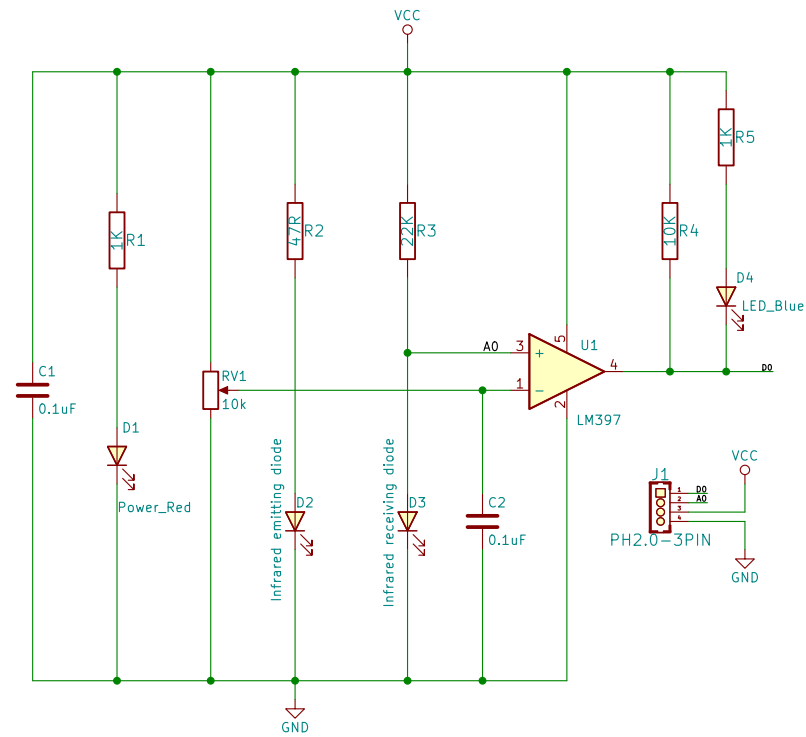

# 红外避障传感器模块

## 实物图


## 概述

红外避障传感器是一种传感器装置，广泛应用与机器人避障、避障小车、流水线计数等众多场合。该传感器模块对环境光线适应能力强，其具有一堆红外发射与接收管， 发射管发射出一定频率的红外线，当检测方向遇到障碍物（反射面）时，红外线反射回来被接收管接收，经过比较器电路处理之后，蓝色指示灯会亮起，同时信号输出接口输出数字信号（一个低电平信号），可通过电位器旋钮调节检测距离，有效距离范围2～30cm，工作电压为3.3V-5V。该传感器的探测距离可以通过电位器调节、具有干扰小、便于装配、使用方便等特点。

## 原理图

<a href="zh-cn/ph2.0_sensors/sensors/infrared_obstacle_avoidance_module/InfraredObstacleAvoidance_schematic.pdf" target="_blank">查看原理图</a>



## 模块参数

| 引脚名称 |     描述     |
| :------: | :----------: |
|    G     |     GND      |
|    V     |     VCC      |
|    A     | 模拟信号引脚 |
|    D     | 数字信号引脚 |

- 供电电压:3v3/5V

- 连接方式:4PIN防反接杜邦线

- 模块尺寸:40 x 22.5 mm

- 安装方式:M4螺钉兼容乐高插孔固定

## 机械尺寸


## Arduino示例程序

<a href="zh-cn/ph2.0_sensors/sensors/infrared_obstacle_avoidance_module/InfraredObstacleAvoidanceModule.zip" download>下载示例程序</a>

```c++
#define DIGITAL_PIN 7  // 定义红外避障模块数字引脚
#define ANALOG_PIN A0  // 定义红外避障模块模拟引脚

int analog_value = 0;   // 定义数字变量,读取红外避障模块模拟值
int digital_value = 0;  // 定义数字变量,读取红外避障模块数字值

void setup() {
  Serial.begin(9600);          // 设置串口波特率
  pinMode(DIGITAL_PIN, INPUT);  // 设置红外避障模块数字引脚为输入
  pinMode(ANALOG_PIN, INPUT);   // 设置红外避障模块模拟引脚为输入
}

void loop() {
  analog_value = analogRead(ANALOG_PIN);     // 读取红外避障模块模拟值
  digital_value = digitalRead(DIGITAL_PIN);  // 读取红外避障模块数字值
  Serial.print("InfraredObstacleAvoidanceModuleAnalog Data:");
  Serial.print(analog_value);  // 打印红外避障模块模拟值
  Serial.print("InfraredObstacleAvoidanceModuleDigital Data:");
  Serial.println(digital_value);  // 打印红外避障模块数字值
  delay(200);
}
```

## MicroPython示例程序

### Esp32 MicroPython示例程序

```python
from machine import ADC,Pin
import time

analog_pin = 15  # 定义红外避障模块模拟接口引脚
digital_pin = 14  # 定义红外避障模块数字接口引脚

p1 = ADC(analog_pin)
p2 = Pin(digital_pin, Pin.IN)  
        
while True:
    analog_value = p1.read_u16()  # 读取红外避障模块模拟值
    print("InfraredObstacleAvoidanceModuleAnalog Data:", analog_value)  # 打印红外避障模块模拟值
    print("InfraredObstacleAvoidanceModuleDigital Data:", p2.value())  # 打印红外避障模块数字值
    time.sleep_ms(200)
```

### micro:bit MicroPython示例程序

```python
from microbit import *

analog_pin = pin1  # 定义红外避障模块模拟接口引脚
digital_pin = pin0  # 定义红外避障模块数字接口引脚

while True:
    analog_value = analog_pin.read_analog()  # 读取红外避障模块模拟值
    print("Analog Data:", analog_value)  # 打印红外避障模块模拟值
    print("Digital Data:", digital_pin.read_digital())  # 打印红外避障模块数字值
    sleep(0.2)
```

## MakeCode示例程序

<a href="https://makecode.microbit.org/_9zWVg7hvCJHy" target="_blank">动手试一试</a>
