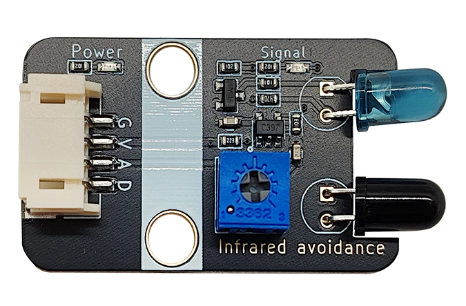
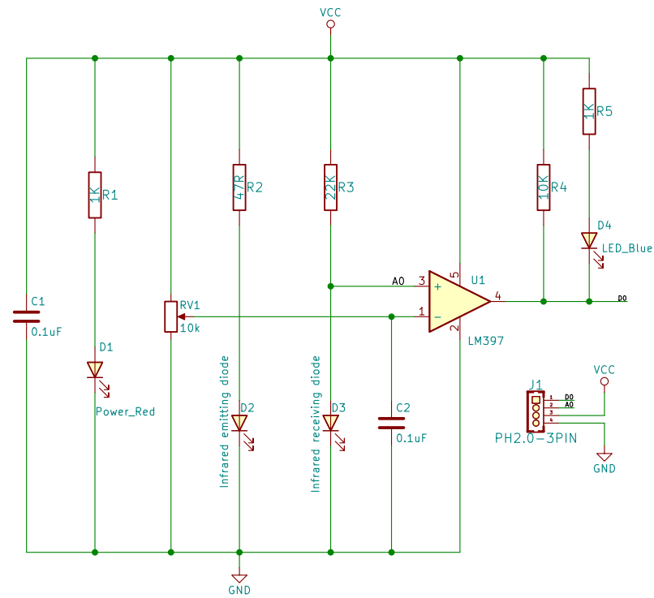
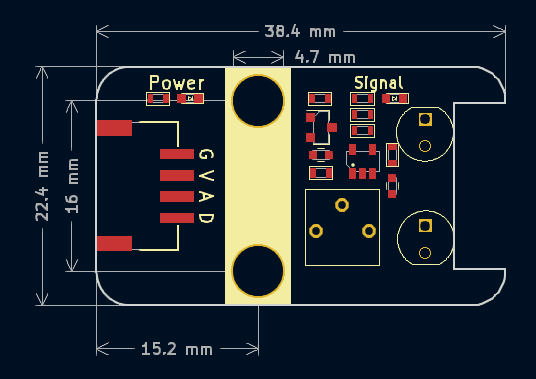

# 红外避障传感器模块




## 概述

红外避障传感器是将红外发射管和红外线接收二极管配合在一起使用组成的。红外发射管持续发射出的红外线，当检测方向遇到障碍物（反射面）时，红外线反射回来被红外接收管接收，经过比较器电路处理之后，蓝色指示灯会亮起，同时信号输出接口输出数字信号（低电平信号），可通过电位器旋钮调节检测距离，有效距离范围2～30cm，工作电压为3~5V。具有干扰小、便于装配、使用方便等特点。广泛应用与机器人避障、避障小车、流水线计数等众多场合。

## 原理图



## 模块参数

| 引脚名称 |     描述     |
| :------: | :----------: |
|    G     |     GND      |
|    V     |    3 ~ 5V    |
|    A     | 模拟信号引脚 |
|    D     | 数字信号引脚 |

- 供电电压：3 ~ 5V
- 连接方式：3Pin-PH2.0防反接
- 模块尺寸：38.4*22.4mm
- 检测距离：2~15cm
- 功耗：50mA
- 安装方式：M4螺钉兼容乐高插孔

## 机械尺寸



<a href="zh-cn/ph2.0_sensors/sensors/infrared_obstacle_avoidance_module/infrared_obstacle_avoidance_3d.zip" download>点击下载2D和3D文件</a>

## Arduino示例程序

```c++
#define DIGITAL_PIN 7  // 定义红外避障模块数字引脚
#define ANALOG_PIN A0  // 定义红外避障模块模拟引脚

int analog_value = 0;   // 定义数字变量,读取红外避障模块模拟值
int digital_value = 0;  // 定义数字变量,读取红外避障模块数字值

void setup() {
  Serial.begin(9600);          // 设置串口波特率
  pinMode(DIGITAL_PIN, INPUT);  // 设置红外避障模块数字引脚为输入
  pinMode(ANALOG_PIN, INPUT);   // 设置红外避障模块模拟引脚为输入
}

void loop() {
  analog_value = analogRead(ANALOG_PIN);     // 读取红外避障模块模拟值
  digital_value = digitalRead(DIGITAL_PIN);  // 读取红外避障模块数字值
  Serial.print("InfraredObstacleAvoidanceModuleAnalog Data:");
  Serial.print(analog_value);  // 打印红外避障模块模拟值
  Serial.print("InfraredObstacleAvoidanceModuleDigital Data:");
  Serial.println(digital_value);  // 打印红外避障模块数字值
  delay(200);
}
```
