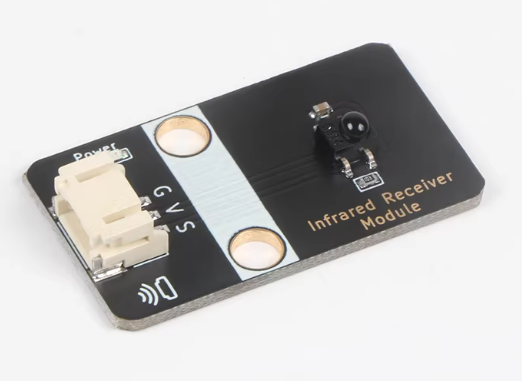
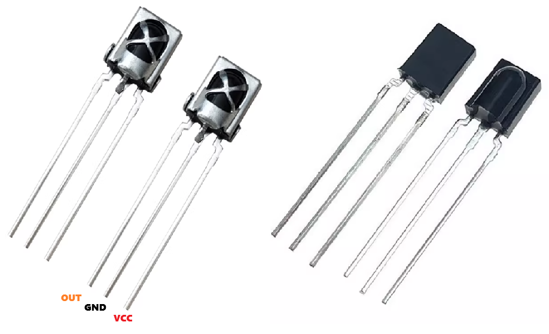
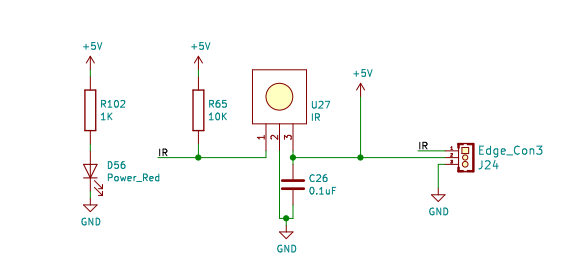
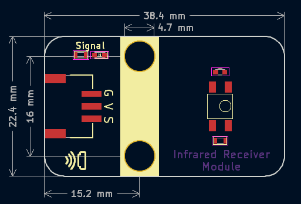
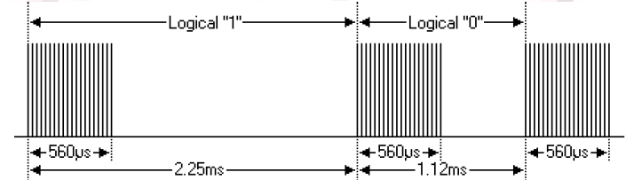
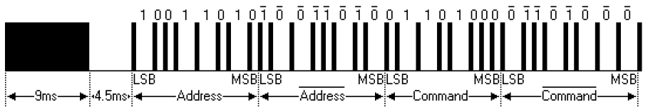
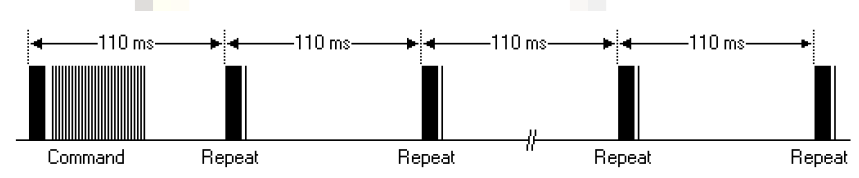
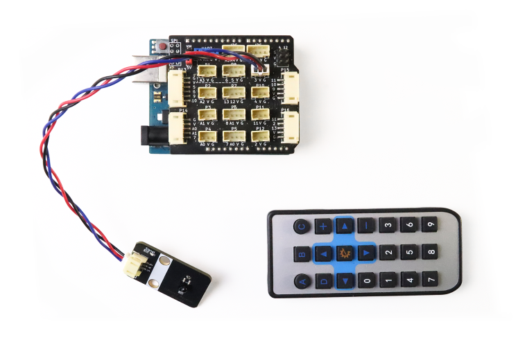
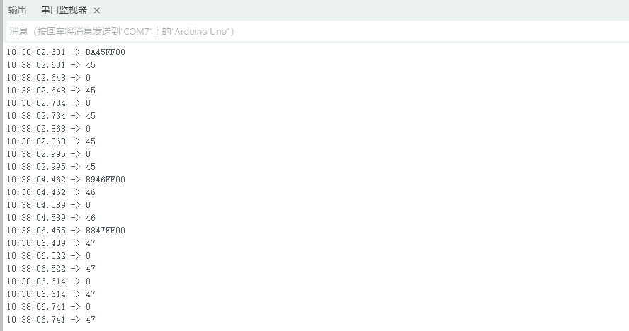

# 红外遥控接收模块



## 概述

​	红外接收管是直接将电能转化为近红外光的器件，属于二极管类。它的结构和原理与一般的发光二极管相似，只是半导体材料有所不同。本模块用的不是红外接收管，而是红外遥控接收头， 能够接收850-1100nm波段（以940nm为主）的红外光信号，通过接收、放大、滤波、解调等处理，内部集成电路已完成解调，输出是数字信号。红外接收头由IC和PD两部分组成。IC是接收头的处理元件，主要由硅晶体和电路组成。它是一个高度集成的设备。PD是一种光电二极管，主要功能是接收光信号。红外发射二极管发出调制信号，红外接收头经过接收、解码、滤波等一系列操作后恢复信号。常见的一体化红外遥控接收头插件常见有VS1838B ，HX1838B。本模块使用的贴片红外接收头<a href="zh-cn/ph2.0_sensors/actuators/infrared_receiver/ IRM-H638T_datesheet" target="_blank"> IRM-H638T</a>  。



## 原理图



## 模块参数

- 供电电压：3 ~ 5V
- 中心频率：38KHZ
- 接收角度：45°
- 接收距离：1.5m

* 连接方式：3pin-PH2.0防反接接口
* 模块尺寸：38.4*22.4mm
* 安装方式：M4螺钉兼容乐高插孔

| 引脚名称 | 描述         |
| -------- | ------------ |
| V        | 3~5V电源引脚 |
| G        | GND 地线     |
| S        | 信号引脚     |

## 机械尺寸



<a href="zh-cn/ph2.0_sensors/actuators/infrared_receiver/infrared_receiver_3d.zip" download>点击下载2D和3D文件</a>

## Arduino IDE实验

### 实验目标

通过Arduino解码NEC协议的红外遥控器，并且在串口中打印出来解码出来的红外键码值

### 实验原理                         

红外一体化接收头，是可以直接解码38KHZ载波频率的红外信号输出数字编码信号。我们通过单片机去读取数字编码信号就可以获取红外遥控编码值。要深入彻底了解并解码它，则需要首先学习遥控器的通信协议。常见的红外通信协议有NEC协议、索尼 SIRC协议、RC5协议、Philips RC-6协议

### 标准NEC协议

#### 特点

- 8个地址位，8个命令位
- 地址位和命令位发送两次，以确保可靠性
- 基于PMW（脉冲宽度调制）编码
- 载波频率为38kHz
- 每位持续1.125ms或2.25ms

| 特性       | NEC协议                                                      | 其他协议 |
| ---------- | ------------------------------------------------------------ | -------- |
| 载波频率   | 38KHz                                                        | 基本相同 |
| 调制方式   | 逻辑1和逻辑0通过不同的脉冲宽度表示                           | 可能不同 |
| 数据帧结构 | 9ms载波+4.5ms无载波+8位地址码+8位地址反码+8位命令码+8位命令反码 | 可能不同 |
| 校验方式   | 地址反码和命令反码                                           | 可能不同 |

### 逻辑0和1的定义如下



逻辑1为2.25ms，脉冲时间560us。

逻辑0为1.12ms，脉冲时间560us。根据脉冲时间长短来解码。推荐载波占空比为1/3至1/4                               

### NEC协议完整格式

   

NEC协议中，消息从9ms高电平开始，然后是4.5ms低电平，接下来8bit地址码（从低有效位开始发）和命令代码。 而后是8bit的地址码的反码（主要是用于校验是否出错）。然后是8bit 的命令码（也是从低有效位开始发），而后也是8bit 的命令码的反码。 总共32bit，4个字节。

### 按下按钮持续一段时间的传输脉冲

 

 以上是一个完整指令码的序列，但当您长时间按住遥控按钮 ，该命令也只发送一次。 当按下按钮时，第一个110ms脉冲与上面相同，然后每110ms发送相同的代码。 下一个重复代码包括9ms高电平脉冲，2.25ms低电平脉冲和560μs高电平脉冲。

**注意**：上面图示解释的是红外发射的波形，发射的时候发的是高店铺，红外一体接收头接收到脉冲后，解码出的数字信号给到单片机接收到时是低电平。 我们可以通过示波器或者逻辑分析仪看到接收器的完整脉冲，并通过波形了解程序。

### Arduino 接线实物图




### Aruino Uno示例程序

验证测试程序之前首先需要在Arduino IDE安装库[**IRremote**](https://github.com/Arduino-IRremote/Arduino-IRremote) ，版本V4.5.0

```cpp
#include <Arduino.h>
#include <IRremote.h>
#define IR_RECEIVE_PIN 3

void irreceiver_received();

void setup() {
  	IrReceiver.begin(IR_RECEIVE_PIN);
  	Serial.begin(115200);
}

void loop() {
  	irreceiver_received();
}

void irreceiver_received() {
  	bool received = IrReceiver.decode();
  	IrReceiver.resume();
  	if (!received || IrReceiver.decodedIRData.protocol == UNKNOWN) return;
  	Serial.println(IrReceiver.decodedIRData.decodedRawData, HEX);
  	Serial.println(IrReceiver.decodedIRData.command, HEX);
}
```

### 实验结果如下：

分别长按红外遥控器A ， B ，C按键串口打印如下结果



注意：IrReceiver.decodedIRData.decodedRawData 为红外接收原始值，长按的时候，只打印一次，后面是重复吗，再长按时解码出来所以为0值。

## micro:bit示例程序

<a href="https://makecode.microbit.org/_eAv9yiUC2VV3" target="_blank">点击打开micro:bit示例</a>

### ESP32 micropython示例

<a href="zh-cn/ph2.0_sensors/actuators/infrared_receiver/infrared_receiver_esp32_micropython.zip" download>点击下载ESP32 micropython库和示例</a>