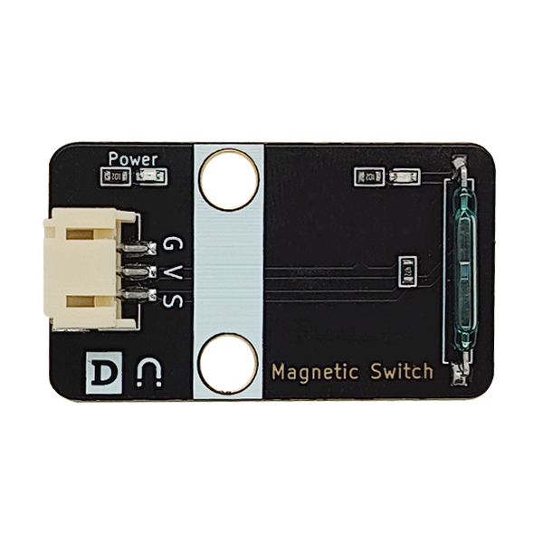
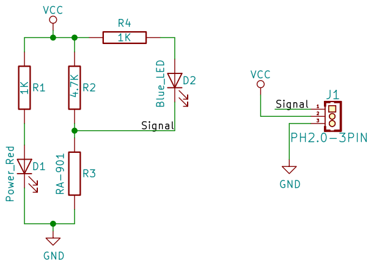

# 磁簧开关模块规格书

## 实物图



## 概述

​  磁簧开关的工作原理非常简单，两片端点处重叠的可磁化的簧片（通常由铁和镍这两种金属所组成的）密封于一玻璃管中，两簧片呈交迭状且间隔有一小段空隙（仅约几个微米），这两片簧片上的触点上镀有很硬的金属，通常都是铑和钌，这层硬金属大大提升了切换次数及产品寿命。玻璃管中装填有高纯度的惰性气体（如氮气），部份干簧开关为了提升其高压性能，更会把内部做成真空状态。 簧片的作用相当于一个磁通导体。在尚未操作时，两片簧片并未接触；在通过永久磁铁或电磁线圈产生的磁场时，外加的磁场使两片簧片端点位置附近产生不同的极性，当磁力超过簧片本身的弹力时，这两片簧片会吸合导通电路；当磁场减弱或消失后，干簧片由于本身的弹性而释放，触面就会分开从而打开电路。磁簧开关在没有磁场时是常开的，当足够强度的磁场产生时，两个簧片会吸合。

## 原理图



[查看原理图](zh-cn/ph2.0_sensors/sensors/magnetic_switch_sensor/magnetic_switch_sensor_schematic.pdf ':ignore')

## 模块参数

| 引脚名称 |                             描述                             |
| :------: | :----------------------------------------------------------: |
|    G     |                             GND                              |
|    V     |                             VCC                              |
|    S     | 当有磁铁在传感器上时输出低电平，当没有磁铁在传感器时输出高电平 |

- 供电电压:3v3/5V

- 连接方式:3PIN防反接杜邦线

- 模块尺寸:40 x 22.5 mm

- 安装方式:M4螺钉兼容乐高插孔固定

## 机械尺寸图


## Arduino示例程序

```c++
#define DigitalPin  7//定义红外避障模块数字引脚

int  DigitalValue = 0 ;//定义数字变量,读取红外避障模块数字值

void setup()
{
  Serial.begin(9600);//设置串口波特率
  pinMode(DigitalPin, INPUT);//设置红外避障模块数字引脚为输入
}
void loop()
{
  DigitalValue = digitalRead(DigitalPin);//读取红外避障模块数字值
  Serial.print("InfraredObstacleAvoidanceModuleDigital Data:");
  Serial.println(DigitalValue);//打印红外避障模块数字值
  delay(200);
}
```

## MicroPython示例程序

### Esp32 MicroPython示例程序

```python
from machine import Pin
import time

DigitalPin = 14  # 定义红外避障模块数字接口引脚

p2 = Pin(DigitalPin, Pin.IN)  
        
while True:
    AnalogValue = p1.read_u16()  # 读取红外避障模块模拟值
    print("InfraredObstacleAvoidanceModuleDigital Data:", p2.value())  # 打印红外避障模块数字值
    time.sleep_ms(200)
```

### micro:bit MicroPython示例程序

```python
from microbit import *

DigitalPin = pin0  # 定义红外避障模块数字接口引脚

while True:
    AnalogValue = AnalogPin.read_analog()  # 读取红外避障模块模拟值
    print("Digital Data:", DigitalPin.read_digital())  # 打印红外避障模块数字值
    sleep(0.2)
```

## micro:bit示例程序

<a href="https://makecode.microbit.org/S65722-49364-86942-21338" target="_blank">动手试一试</a>
