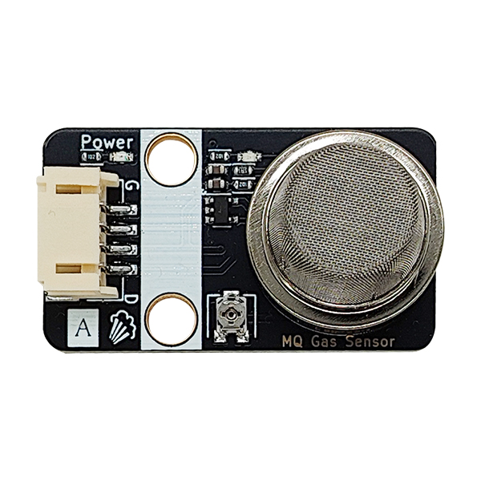
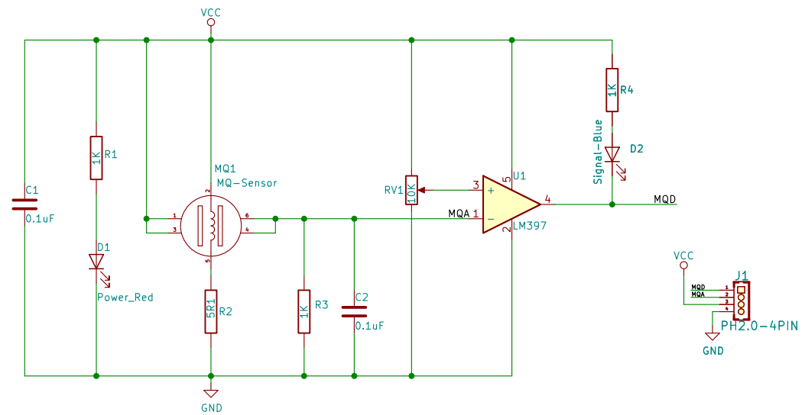
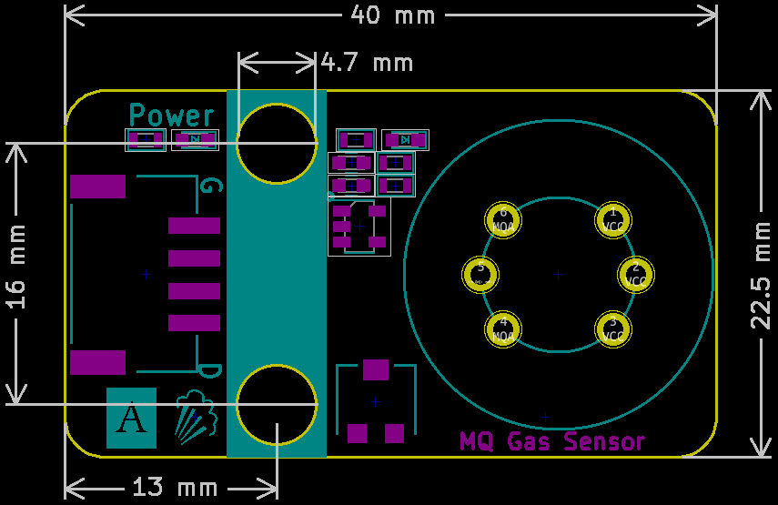
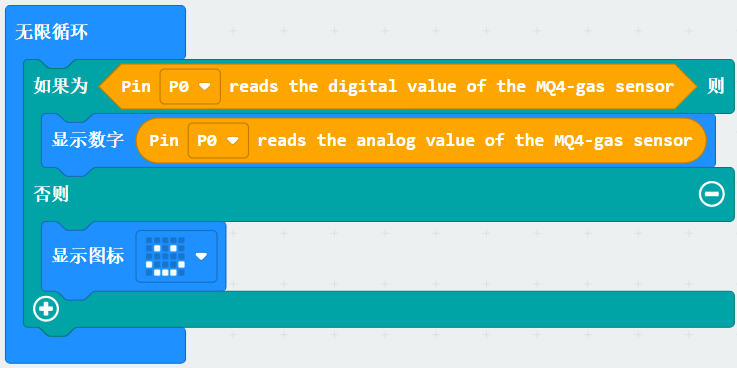

# MQ-4气体传感器规格书

##  实物图



## 概述

MQ-4天然气传感器所使用的气敏材料是在清洁空气中电导率较低的二氧化锡(SnO2)。当传感器所处环境中存在可燃气体时，传感器的电导率随空气中可燃气体浓度的增加而增大。使用简单的电路即可将电导率的变化转换为与该气体浓度相对应的输出信号。MQ-4天然气检测传感器对甲烷的灵敏度高，对丙烷、丁烷也有较好的灵敏度。这种传感器可检测多种可燃性气体，特别是天然气，是一款适合多种应用的低成本传感器。

## 原理图

[查看原理图](zh-cn\ph2.0_sensors\sensors\mq_gas_sensor\mq_gas_sensor_schematic.pdf ':ignore' ) 


## 模块参数

| 引脚名称 |     描述     |
| :------: | :----------: |
|    G     |     GND      |
|    V     |     VCC      |
|    A     | 模拟信号引脚 |
|    D     | 数字信号引脚 |

- 供电电压:3v3/5V

- 连接方式:4PIN防反接杜邦线

- 模块尺寸:40 x 22.5 mm

- 安装方式:M4螺钉兼容乐高插孔固定

## 机械尺寸图



## Arduino示例程序

 [下载示例程序](zh-cn\ph2.0_sensors\sensors\mq_gas_sensor\mq_gas_sensor.zip ':ignore')

```c++
#include "Buzzer.h"

#define GaslDigitalPin  7//定义气体传感器数字引脚
#define GasAnalogPin   A0//定义气体传感器模拟引脚
#define BuzzerPin A3//定义无源蜂鸣器块引脚

Buzzer buzzer(BuzzerPin) ;
int  GasAnalogValue = 0 ;//定义数字变量,读取模拟值
int  GasDigitalValue = 0 ;//定义数字变量,读取数字值

void setup()
{
    Serial.begin(9600); //设置串口波特率为9600
    pinMode(GasDigitalPin, INPUT);//设置气体传感器数字引脚为输入
   pinMode(GasAnalogPin, INPUT);//设置气体传感器模拟引脚为输入
   pinMode(BuzzerPin, OUTPUT);//设置无源蜂鸣器模块引脚为输出
}

void loop()
{ 
    buzzer.noTone();//蜂鸣器停止
    GasAnalogValue = analogRead(GasAnalogPin);
    GasDigitalValue = digitalRead(GaslDigitalPin)
    Serial.print("GasAnalog Data:  ");
    Serial.print(GasAnalogValue);//打印气体传感器模拟值
    Serial.print("       GasDigital Data:  ");
    Serial.println(GasDigitalValue);//打印气体传感器数字值
 if (GasDigitalValue == 0) {//判断气体传感器是否检测到有害气体,是则蜂鸣器报警 
     for(int i = 200; i <= 800; i++)
     {
       buzzer.tone(i, 10);
     }
     for(int i= 800; i >= 200; i--)
     {
        buzzer.tone(i, 10);
     }
  }
}
```

## Micropython示例程序

### Esp32 Micropython示例程序

```python
from machine import ADC,Pin
import time

AnalogPin = 15  # 定义气体传感器模拟接口引脚
DigitalPin = 14  # 定义气体传感器数字接口引脚

p1 = ADC(AnalogPin)
p2 = Pin(DigitalPin, Pin.IN)  
buzzer_pin = Pin(2, Pin.OUT)  # 定义蜂鸣器引脚

def alarm():
    for i in range(100):
        # 设置频率声音
        buzzer_pin.on()
        time.sleep_ms(1)
        buzzer_pin.off()
        time.sleep_ms(1)
        
while True:
    AnalogValue = p1.read_u16()  # 读取气体传感器模拟值
    print("Analog Data:", AnalogValue)  # 打印气体传感器模拟值
    print("Digital Data:", p2.value())  # 打印气体传感器数字值
    if p2.value() == 0:	# 判断气体传感器是否检测到有害气体，是则蜂鸣器报警 
        alarm()
    else:
        buzzer_pin.off()
    time.sleep_ms(200)


```

### micro:bit示例程序

```python
from microbit import *

AnalogPin = pin1  # 定义气体传感器模拟接口引脚
DigitalPin = pin0  # 定义气体传感器数字接口引脚

buzzer_pin = pin2  # # 定义蜂鸣器引脚

def alarm():
    for i in range(100):
        # 设置频率声音
        buzzer_pin.write_digital(1)
        sleep(1)
        buzzer_pin.write_digital(0)
        sleep(1)

while True:
    AnalogValue = AnalogPin.read_analog()  # 读取气体传感器模拟值
    print("Analog Data:", AnalogValue)  # 打印气体传感器模拟值
    print("Digital Data:", DigitalPin.read_digital())  # 打印气体传感器数字值
    if DigitalPin.read_digital() == 0:
        alarm()  # 如果气体传感器值为高电平则调用警报函数
    else:
        buzzer_pin.write_digital(0)  # 如果气体传感器值为高电平则蜂鸣器输出低电平
    sleep(0.2)
```

## Makecode示例程序

<a href="https://makecode.microbit.org/_A9cLTEb0o49g" target="_blank">动手试一试</a>

