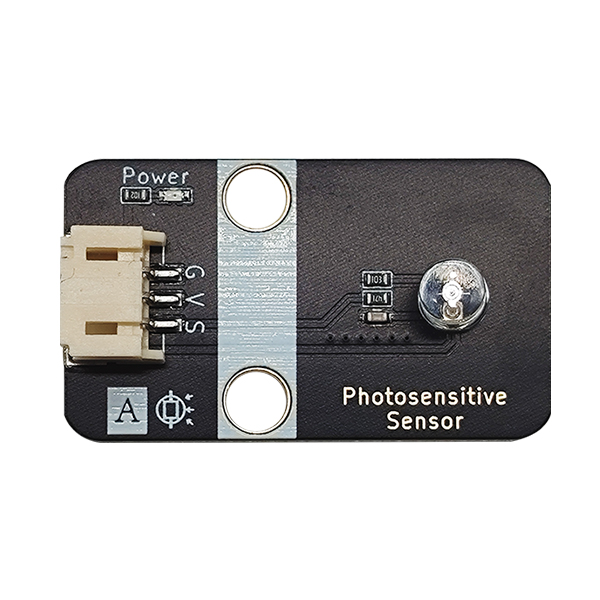
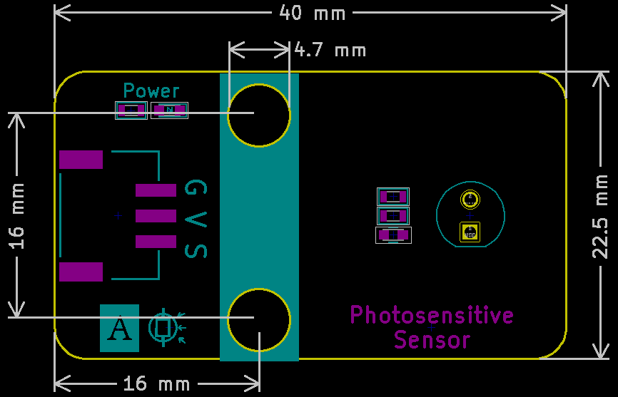

# 光敏传感器



## 概述

​	众所周知，走廊中的语音控制灯除了语音控制外还有一个传感器，即光敏传感器（Photovaristor），能检测光变化的感光元器件常见的有光敏电阻Light-Dependent Resistor（缩写为LDR）、光敏二极管、光敏三极管，本光敏传感器模块采用的是光敏三极管作为感光元器件。它们的工作原理都类似，当入射光上升时，电阻阻值会降低；入射光减弱，阻值会增加。光敏传感器常用于光测量，控制和转换（光与电之间的变化）会发生变化（光变为电），它也可广泛应用于各种光控电路，比如控制和调节灯以及光开关。 光敏传感器模块对环境光线最敏感，一般用来检测周围环境的光线的亮度，触发单片机或继电器模块等。

**光敏电阻 Photoresistor**

```
光敏电阻是一种对光敏感的电阻器，当光线照射到它时，其电阻会发生变化,光敏电阻的电阻值随光线强度变化。光强度越强，电阻值越小；光强度越弱，电阻值越大。它的主要作用包括：

光感应：用来检测环境光强度的变化。
光控开关：在自动化控制中，根据光强变化实现开关动作。
测光仪器：用于相机、光度计等设备中。

优缺点：
优点：结构简单、成本低、使用方便。
缺点：响应速度较慢，线性度差，对温度敏感
```
**光敏二极管Photodiode**


```
光敏二极管是一种将光信号转换为电信号的半导体器件，工作原理是光敏二极管在正向偏置时，光子照射到PN结上产生光生电流。在反向偏置时，光照强度越大，产生的反向电流越大。主要应用包括：

光电检测：用于光学传感器和光电检测仪器中。
光通信：作为接收端，将光信号转化为电信号。
测光设备：用于测量光强度。

优缺点：
优点：响应速度非常快，线性度好。
缺点：输出信号较弱，需要后续放大处理。
```

**光敏三极管Phototransistor**


```
光敏三极管是一种能够根据光照强度变化而改变其电流的半导体器件，工作原理是光敏三极管在没有光照时，其基极电流很小；当光照射到基极区时，光生电子对增加，导致基极电流增加，从而放大了集电极电流。主要应用包括：

光电开关：用于检测光的有无。
光通信：在光纤通信和红外通信中作为接收器件。
位置和速度检测：用于工业自动化和机器人技术中。

优缺点：
- 优点：灵敏度高、响应速度快。
- 缺点：结构相对复杂，成本较高。
```

**符号图：**


```
工作原理：
光敏电阻依赖光照改变电阻值。
光敏二极管通过光生电流转换光信号为电信号。
光敏三极管通过光照改变基极电流，从而改变集电极电流。
响应速度：
光敏电阻响应速度慢。
光敏三极管和光敏二极管响应速度快，光敏二极管最快。
灵敏度：
光敏电阻灵敏度低。
光敏三极管灵敏度高。
光敏二极管灵敏度高，且线性度好。
应用场景：
光敏电阻多用于简单的光检测和光控电路。
光敏三极管多用于需要高灵敏度和快速响应的光电开关和光通信中。
光敏二极管广泛应用于光检测和高速光通信中。

```

### 主要特性

- 感光器件：模块感光器件为光敏三极管作

- 光谱响应：通常对可见光和红外光敏感
- 暗电阻：无光照时的测量ADC值接近0
- 亮电阻：强光照射时测量ADC值接近单片机量程满值
- 响应时间：从暗到亮或从亮到暗的变化需要一定时间（通常毫秒级）
- 温度系数：温度变化会影响其灵敏度

## 原理图


## 模块参数

| 引脚名称 |            描述             |
| :------: | :-------------------------: |
|    G     |             GND             |
|    V     |        3~5V电源输入         |
|    S     | 光线强时,读取的模拟值则越大 |

- 供电电压：3~5V
- 连接方式：3Pin-PH2.0接口
- 模块尺寸：38.4 x 22.4mm
- 安装方式：M4螺钉兼容乐高插孔

## 机械尺寸图




<a href="zh-cn/ph2.0_sensors/sensors/photo_sensitive_sensor/photo_sensitive_sensor_3d.zip" target="_blank">点击下载2D和3D文件</a>

## Arduino示例程序

<a href="zh-cn/ph2.0_sensors/sensors/photo_sensitive_sensor/photo_sensitive_sensor.zip" download>下载示例程序</a>

```c++
#define PHOTOSENSITIVE_PIN A3  // 定义光敏传感器模块引脚

int photosensitive_value = 0;  // 定义变量,读取光敏值

void setup() {
  Serial.begin(9600);                 // 设置串口波特率
  pinMode(PHOTOSENSITIVE_PIN, INPUT);  // 设置光敏传感器模块引脚为输入
}
void loop() {
  photosensitive_value = analogRead(PHOTOSENSITIVE_PIN);  // 读取光敏值
  Serial.print("Photosensitive Data:  ");
  Serial.println(photosensitive_value);  // 打印光敏值
}
```

无光照的时候：打印值大概为10以下

正常自然光强，读取模拟值大概100-200左右

强光照时，读取模拟值在1000以上。