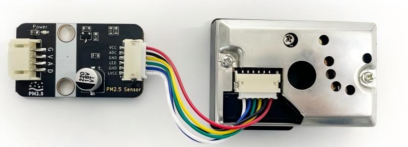
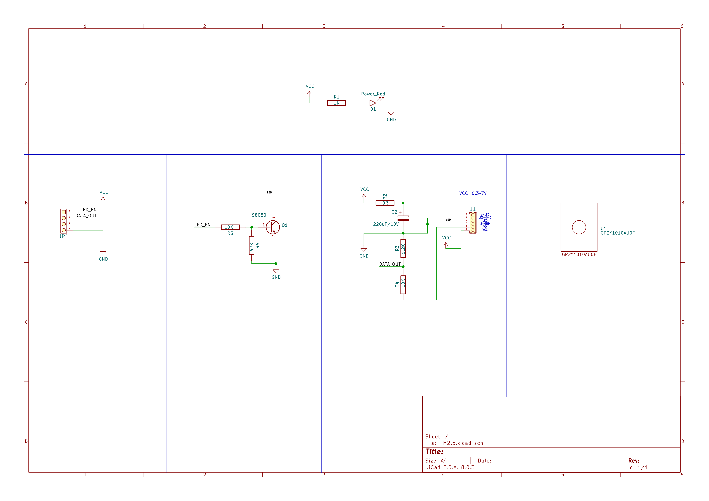
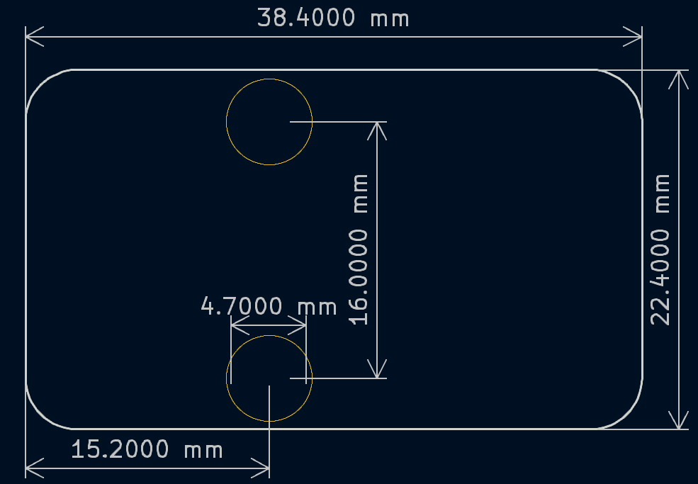
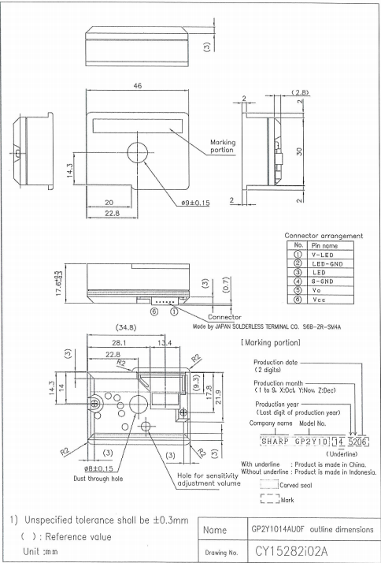
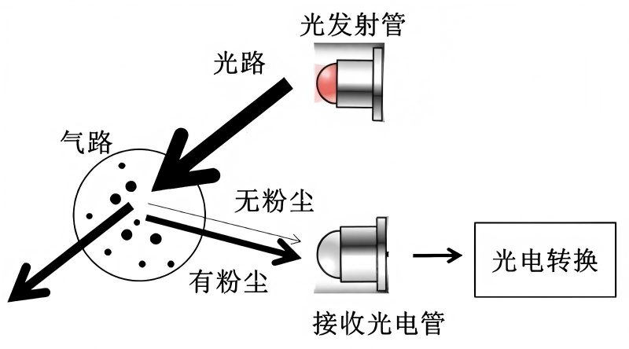
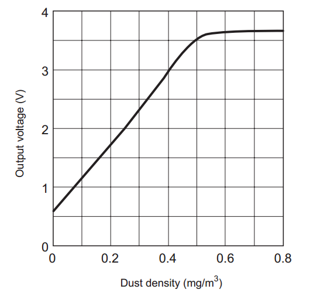

# PM2.5粉尘传感器

## 模块实物图

## 概述

PM2.5 粉尘传感器是用来检测空气中的PM2.5颗粒物浓度的模块，并包含为其专门设计的信号转接板。

传感器作为检测核心，基于红外光散射原理工作，可检测空气中直径大于0.8微米的悬浮颗粒物（如灰尘、烟雾）。传感器在其中间有一个洞，空气可以自由流通，传感器内部邻角位置安装有红外发光二极管和光电晶体管，红外发光二极管定向发送红外光，当空气中有颗粒物阻碍红外线时，红外线发生漫反射，光电晶体管接收到红外光线，信号输出引脚电压会随之发生变化。该电压值在一定范围内与粉尘浓度成线性关系，因此在使用过程中，需要使用 ADC 采集该电压信号，并通过该电压值计算出空气中的粉尘浓度。

转接板作为关键适配器，其作用是将传感器复杂的接口和必需的外围驱动电路进行集成与优化，并且将传感器细小的引脚转换为标准的、带防反插功能的PH2.0接口。

## 转接板原理图

<a href="zh-cn/ph2.0_sensors/sensors/PM2.5_dust_sensor/resource/pm2.5.pdf" target="_blank">点击此处查看原理图</a>

## 模块参数

- 工作电压：5V

- 消耗电流：最大20mA

- 工作原理：红外光散射

- 最小粒子检出值：0.8微米

- 灵敏度：0.5V(0.1mg/m3)

- 接 口：PH2.0间距接口

- 连接方式：PH2.0 4PIN防反接杜邦线

- 工作温度：-10~65℃

- 通气孔尺寸：9mm

- 传感器尺寸：46\*34\*17.6mm

- 转接板尺寸：38.4\*22.4mm，兼容乐高积木和M4螺丝固定孔

| 转接板引脚  | 描述                  |
| ---------- | --------------------- |
| G          | GND地线               |
| V          | 5v电源引脚             |
| A          | 电压模拟量输出引脚      |
| D          | 红外发光二极管控制引脚  |

## 传感器数据手册

<a href="zh-cn/ph2.0_sensors/sensors/pm2.5_dust_sensor/resource/datasheet.pdf" target="_blank">点击此处查看数据手册</a>

## 转接板机械尺寸图

## 传感器尺寸标注图

## 工作原理

传感器内部对角安放着红外线发光二极管和光电晶体管，它们的光轴相交，当带粉尘的气流通过光轴相交的交叉区域，粉尘对红外光反射，反射的光强与粉尘浓度成正比。光电晶体管能够探测到空气中尘埃反射光，尘埃浓度越高，反射光越多，从而输出模拟电压值越高，通过ADC将模拟值转化为数字电压值，利用比例关系式，最终得到尘埃浓度。

### 测量过程

1. 通过设置模块红外发光二极管控制引脚为高电平，从而打开传感器内部红外发光二极管。
2. 等待0.28ms，外部控制器采样模块电压模拟量输出引脚的电压值。这是因为传感器内部红外二极管在开启之后0.28ms，输出波形才能达到稳定。
3. 采样持续0.04ms之后，再设置模块红外发光二极管控制引脚为低电平，从而关闭内部红外二极管。
4. 根据电压与浓度关系即可计算出当前空气中的粉尘浓度。

>输出的电压经过了分压处理，要将测量得到的放大11倍才是实际传感器输出的电压。

## 传感器输出特性

传感器输出电压与粉尘浓度关系在 0 到 0.5mg/m3 范围内成线性关系，如下图所示：

## 空气污染指数

| PM2.5浓度均值(μg/m3)  | 空气质量AQI  | 空气质量级别  | 空气质量指数类别  |
| -------------------- | ------------ | ------------ | --------------- |
| 0-35                 | 0-50         | 一级         | 优               |
| 35-75                | 51-100       | 二级         | 良               |
| 75-115               | 101-150      | 三级         | 轻度污染          |
| 115-150              | 151-200      | 四级         | 中度污染          |
| 150-250              | 201-300      | 五级         | 重度污染          |
| 250以上              | ≥300         | 六级         | 严重污染          |

---

## Arduino示例程序（C/C++）

<a href="https://gh-proxy.com/https://github.com/emakefun-arduino-library/em_pm25_sensor/archive/refs/tags/v1.0.0.zip" download>点击下载Arduino库以及示例程序</a>

## MicroPython 示例程序

### ESP32 MicroPython示例程序

待补充

### micro:bit MicroPython示例程序

待补充

## micro:bit MakeCode示例程序

待补充
