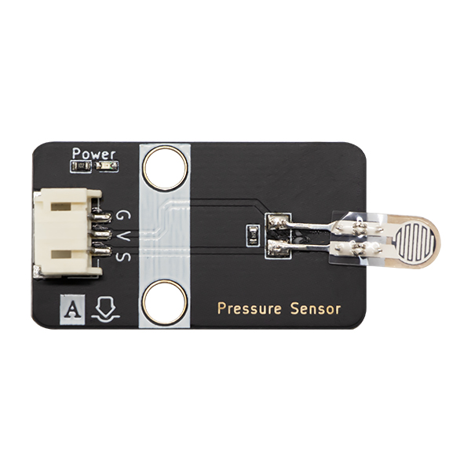
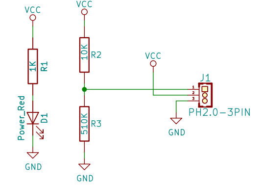
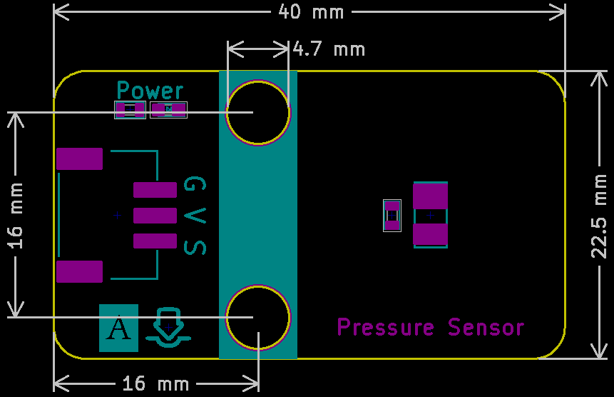

# 压力传感器

## 实物图



## 概述

压力传感器是一种用于测量液体或气体压力的装置，通过将压力转换为电信号输出。它们具有高精度、响应速度快和稳定性好等特点，广泛应用于汽车、航空、医疗、工业控制等领域，用于监测压力变化，保障系统的正常运行和安全。

## 原理图



<a href="zh-cn/ph2.0_sensors/sensors/pressure_sensor/Pressure_Sensor.pdf" target="_blank">点击此处查看原理图</a>

## 尺寸图



## 模块参数

| 引脚名称| 描述 |
|:--: |:--:|
| G | GND |
| V | VCC |
| S | 信号线 |

- 供电电压：3v3/5V

- 连接方式：3PIN防反接杜邦线

- 模块尺寸：56 x 22mm

- 安装方式： M3螺钉固定

## Arduino示例程序

```c++
void setup() {
  Serial.begin(9600);  // 初始化串口通信
  pinMode(A3, INPUT);  // 设置传感器引脚为输入
}

void loop() {
  Serial.print(analogRead(A3));  // 打印传感器模拟值
  delay(200);                    // 延时200毫秒
}
```

## MicroPython示例程序

### Esp32 MicroPython示例程序

```python
from machine import ADC,Pin
import time

analog_pin = 15  # 定义传感器模拟接口引脚

p1 = ADC(analog_pin)
      
while True:
    analog_value = p1.read_u16()  # 读取传感器模拟值
    print("Analog Data:", analog_value)  # 打印传感器模拟值
    time.sleep_ms(200)
```

### micro:bit MicroPython示例程序

```python
from microbit import *

analog_pin = pin1  # 定义传感器模拟接口引脚

while True:
    analog_value = analog_pin.read_analog()  # 读取传感器模拟值
    print( analog_value)  # 打印传感器模拟值
    sleep(0.2)
```

## MakeCode示例程序

<a href="https://makecode.microbit.org/_e1XeY08vy2kx" target="_blank">动手试一试</a>
