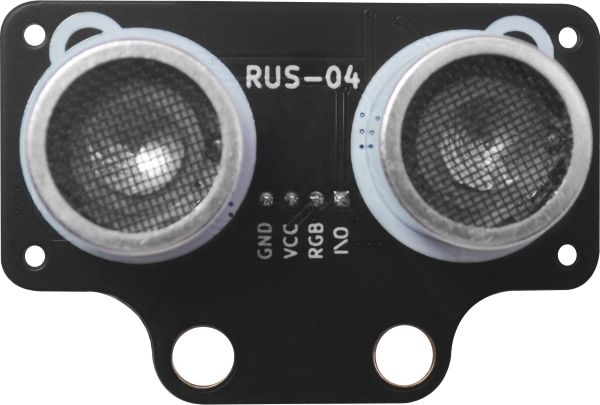

# 概述

| RUS-04(黑色款)                             | RUS-04蓝色款                               |
|:---------------------------------------:|:---------------------------------------:|
|  |  |

## 产品简介

  RUS-04是一款内置rgb彩灯，单总线超声波测距模块。RUS-04传感器收发信号都为同个IO引脚，所以使用的时候，只需要一个IO引脚就可以读取到距离，大大节约了主板的IO资源。每个探头内部集成3颗WS2812彩灯，可通程序控制 rgb彩灯，模块在测距的同时，探头也能显示各种颜色。特别应用于玩具超声测距，机器人等应用。 2CM 超小盲区，4M 典型最远测距。采用自研超声波测距解调芯片，单总线，外围更加简洁，芯片内置高精度振荡器，无需额外晶振。驱动采用扫频技术，减少探 头本身一致性对模块灵敏度的影响。

## 模块结构图

### RUS-04（蓝色款）尺寸图

​ 

### RUS-04黑色款尺寸图

# 模块原理介绍

## 超声波部分测量操作

  外部 MCU 初始设置为输出，给模块 I/O 脚一个大于 10uS 的高电平脉冲；输出脉冲信号后，MCU 设置 为输入模式，等待模块给出的一个与距离等比的高电平脉冲信号；测量结束后 MCU 设置为输出模式，进行下次测量。声速可根据脉宽时间“T”算出：

### 距离=T（从发送信号至接收到信号的时间）*340/2 （ 340m/s是声音在空气中的传播速度）

## RUS-04 WS2812B LED灯介绍

  RUS-04为了使用方便采用了直接集成了LED驱动控制芯片的WS2812B-2020RGB灯珠，控制芯片内部包含了智能数字接口，数据锁存信号，整形放大驱动电路，还包含有高精度的内部振荡器和15V高压可编程定电流输出驱动器。

  RUS-04收发探头分别各集成了3个RGB灯珠。只需一条信号线来控制各个RGB灯发光。
Arduino需要控制探头的发光，需要专门的RGB库支持。

### 详情可以看<a href="zh-cn/ph2.0_sensors/sensors/rus_04/WS2812B.PDF" target="_blank">WS2812B规格书</a>

### 应用注意

- 供电必须要要在4.5~5V之间否则 rgb灯控制不对
- 测量周期时间在60ms以上
- 在测量距离时，手或者其他金属物体不可接触探头，否则影响发射和接收波形从而导致距离测量错误。

### Arduino示例程序

<a href="zh-cn/ph2.0_sensors/sensors/rus_04/RGBUltrasonicModule.zip" download>点击下载Arduino系列示例</a>

<a href="zh-cn/ph2.0_sensors/sensors/rus_04/ESP32_RGBUltrasonicModule.zip" download>点击下载ESP32系列示例</a>

### Mixly示例

[Mixly2.0云端导入PH2.0 Sensors库](https://docs.emakefun.com/#/zh-cn/software/mixly/mixly)，导入成功后，点击EmakefunSensors库，如下图

<a href="zh-cn/ph2.0_sensors/sensors/rus_04/rus_04_mixly.zip" download>点击下载Mixly示例程序</a>

### Mind+示例

mind+ 软件arduino uno、esp32库为同一个，使用时，在用户库输入以下链接：https://gitee.com/emakefun_midplus_lib/ultrasonic

[点击查看导入方法](https://mindplus.dfrobot.com.cn/extensions-user-libraries)

[点击下载Mind+案例](https://gitee.com/emakefun_midplus_lib/ultrasonic/releases/download/V0.0.1/mindplusExample.zip)

### MicroPython示例程序

<a href="zh-cn/ph2.0_sensors/sensors/rus_04/rgb_ultrasonic_esp32_micropython.zip" download>点击下载ESP32 MicroPython示例程序</a>

## micro:bit MakeCode示例程序

<a href="https://makecode.microbit.org/_PtqVy7dDj4PJ" target="_blank">动手试一试</a>
