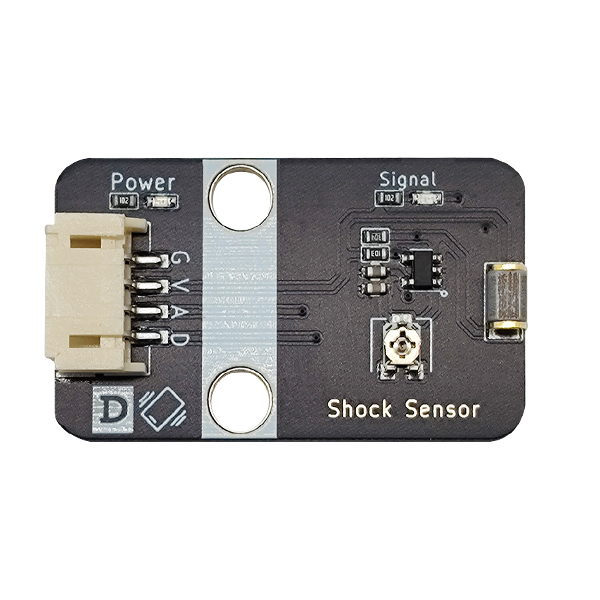

# 震动传感器

## 实物图



## 概述

震动传感器模块实质是一个开关,其内部是一个金属片和一个弹簧, 产品不震动时，震动开关呈断开状态，输出端输出高电平；产品震动时，震动开关由于弹簧和金属片瞬间导通，输出端输出低电平；输出端可以与单片机直接相连，通过单片机来检测高低电平，由此来检测环境是否有震动，起到报警作用。

## 原理图

<a href="zh-cn/ph2.0_sensors/sensors/shock_sensor/shock_sensor_schematic.pdf" target="_blank">查看原理图</a>


## 模块参数

| 引脚名称 |     描述     |
| :------: | :----------: |
|    G     |     GND      |
|    V     |     VCC      |
|    A     | 模拟信号引脚 |
|    D     |  数字信号脚  |

- 供电电压:3v3/5V

- 连接方式:4PIN防反接杜邦线

- 模块尺寸:40 x 22.5 mm

- 安装方式:M4螺钉兼容乐高插孔固定

## 机械尺寸图


## Arduino示例程序

<a href="zh-cn/ph2.0_sensors/sensors/shock_sensor/shock_sensor.rar" download>下载示例程序</a>

```c++
#define SHOCK_ANALOG_PIN A0  // 定义震动传感器模拟引脚
#define SHOCK_DIGITAL_PIN 7  // 定义震动传感器数字引脚

void setup() {
  Serial.begin(9600);               // 初始化串口通信
  pinMode(SHOCK_ANALOG_PIN, INPUT);   // 设置震动传感器模拟引脚为输入
  pinMode(SHOCK_DIGITAL_PIN, INPUT);  // 设置震动传感器数字引脚为输入
}

void loop() {
  Serial.println("Shock Analog Data: ");
  Serial.println(analogRead(SHOCK_ANALOG_PIN));    // 打印震动传感器模拟数据
  Serial.println("Shock Digital Data: ");
  Serial.println(digitalRead(SHOCK_DIGITAL_PIN));  // 打印震动传感器数字数据
  delay(1000);                                   // 延时1秒
}
```

## MicroPython示例程序

### Esp32 MicroPython示例程序

```python
from machine import ADC,Pin
import time

analog_pin = 15  # 定义震动传感器模拟接口引脚
digital_pin = 14  # 定义震动传感器数字接口引脚

p1 = ADC(analog_pin)
p2 = Pin(digital_pin, Pin.IN)  
       
while True:
    analog_value = p1.read_u16()  # 读取震动传感器模拟值
    print("Analog Data:", analog_value)  # 打印震动传感器模拟值
    print("Digital Data:", p2.value())  # 打印震动传感器数字值
    time.sleep_ms(200)

```

### micro:bit MicroPython示例程序

```python
from microbit import *

analog_pin = pin1  # 定义震动传感器模拟接口引脚
digital_pin = pin0  # 定义震动传感器数字接口引脚

while True:
    analog_value = analog_pin.read_analog()  # 读取震动传感器模拟值
    print("Analog Data:", analog_value)  # 打印震动传感器模拟值
    print("Digital Data:", digital_pin.read_digital())  # 打印震动传感器数字值
    sleep(0.2)
```

## MakeCode示例程序

<a href="https://makecode.microbit.org/_0Jy1249E9U4K" target="_blank">动手试一试</a>
