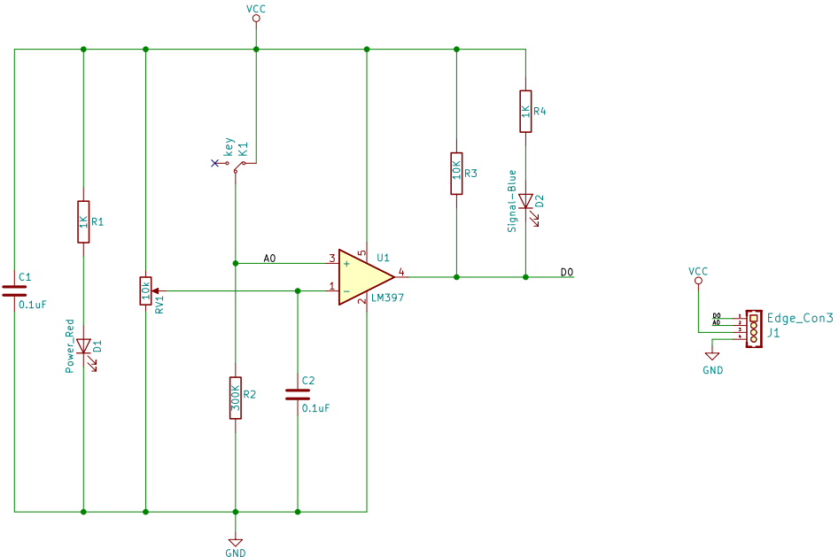
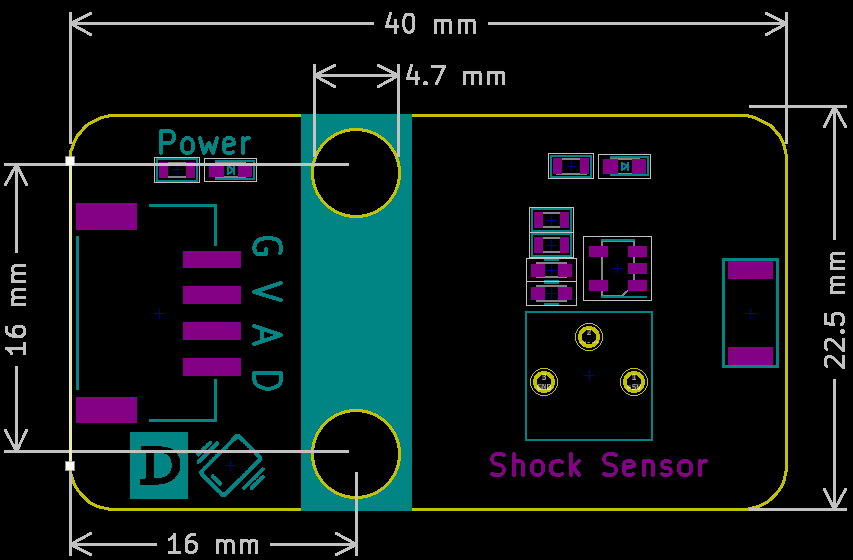

# 震动传感器

## 实物图


## 概述

震动传感器模块实质是一个开关,其内部是一个金属片和一个弹簧, 产品不震动时，震动开关呈断开状态，输出端输出高电平；产品震动时，震动开关由于弹簧和金属片瞬间导通，输出端输出低电平；输出端可以与单片机直接相连，通过单片机来检测高低电平，由此来检测环境是否有震动，起到报警作用。

## 原理图
 [查看原理图](zh-cn\ph2.0_sensors\sensors\shock_sensor\shock_sensor_schematic.pdf ':ignore') 


## 模块参数

| 引脚名称 |     描述     |
| :------: | :----------: |
|    G     |     GND      |
|    V     |     VCC      |
|    A     | 模拟信号引脚 |
|    D     |  数字信号脚  |

- 供电电压:3v3/5V

- 连接方式:4PIN防反接杜邦线

- 模块尺寸:40 x 22.5 mm

- 安装方式:M4螺钉兼容乐高插孔固定

## 机械尺寸图



## Arduino示例程序

[下载示例程序](zh-cn\ph2.0_sensors\sensors\shock_sensor\shock_sensor.rar ':ignore') 

```c++
#include "Buzzer.h"

#define ShockAnalogPin A0  // 定义震动传感器模拟引脚
#define ShockDigitalPin 7  // 定义震动传感器数字引脚
#define BuzzerPin A3  // 定义蜂鸣器引脚
Buzzer buzzer(BuzzerPin);

void setup()
{
    Serial.begin(9600);  // 初始化串口通信
    pinMode(ShockAnalogPin, INPUT);  // 设置震动传感器模拟引脚为输入
    pinMode(ShockDigitalPin, INPUT);  // 设置震动传感器数字引脚为输入
}

void loop()
{
    buzzer.noTone();  // 停止蜂鸣器音调
    Serial.println("Shock Analog Data: ");
    Serial.println(analogRead(ShockAnalogPin));  // 打印震动传感器模拟数据
    if (digitalRead(ShockDigitalPin) == 0) {  // 如果震动传感器数字值为低电平
        for (int i = 200; i <= 800; i++)
        {
            buzzer.tone(i, 10);  // 播放升调音调
        }
        for (int i = 800; i >= 200; i--)
        {
            buzzer.tone(i, 10);  // 播放降调音调
        }
    } 
    delay(1000);  // 延时1秒
}
```

## Micropython示例程序

### Esp32 Micropython示例程序

```python
from machine import ADC,Pin
import time

AnalogPin = 15  # 定义震动传感器模拟接口引脚
DigitalPin = 14  # 定义震动传感器数字接口引脚

p1 = ADC(AnalogPin)
p2 = Pin(DigitalPin, Pin.IN)  
buzzer_pin = Pin(2, Pin.OUT)  # 定义蜂鸣器引脚

def alarm():
    for i in range(100):
        # 设置频率声音
        buzzer_pin.on()
        time.sleep_ms(1)
        buzzer_pin.off()
        time.sleep_ms(1)
        
while True:
    AnalogValue = p1.read_u16()  # 读取震动传感器模拟值
    print("Analog Data:", AnalogValue)  # 打印震动传感器模拟值
    print("Digital Data:", p2.value())  # 打印震动传感器数字值
    if p2.value() == 0:
        alarm()# 如果震动传感器值为低电平则调用警报函数
    else:
        buzzer_pin.off() # 如果震动传感器值为高电平则蜂鸣器输出低电平
    time.sleep_ms(200)


```

### micro:bit示例程序

```python
from microbit import *

AnalogPin = pin1  # 定义震动传感器模拟接口引脚
DigitalPin = pin0  # 定义震动传感器数字接口引脚

buzzer_pin = pin2  # # 定义蜂鸣器引脚

def alarm():
    for i in range(100):
        # 设置频率声音
        buzzer_pin.write_digital(1)
        sleep(1)
        buzzer_pin.write_digital(0)
        sleep(1)

while True:
    AnalogValue = AnalogPin.read_analog()  # 读取震动传感器模拟值
    print("Analog Data:", AnalogValue)  # 打印震动传感器模拟值
    print("Digital Data:", DigitalPin.read_digital())  # 打印震动传感器数字值
    if DigitalPin.read_digital() == 0:
        alarm()  # 如果震动传感器值为高电平则调用警报函数
    else:
        buzzer_pin.write_digital(0)  # 如果震动传感器值为高电平则蜂鸣器输出低电平
    sleep(0.2)
```

## Makecode示例程序

<a href="https://makecode.microbit.org/_fCchCF8pUWdR" target="_blank">动手试一试</a>

