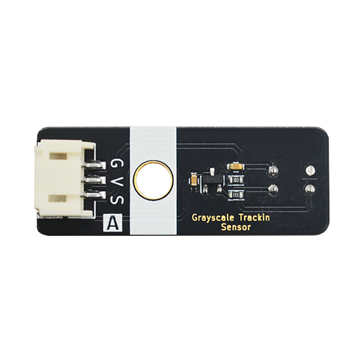

# 单路灰度循迹模块

## 实物图



## 概述

单路灰度循迹模块是基础型轨道检测传感器，内置单个红外发射-接收对管，通过识别地面反射光强度差异实现黑白线二值化检测。模块输出数字开关信号（高/低电平），实时判定探头是否覆盖轨道黑线，具备结构紧凑、响应迅速和低成本优势。适用于简易巡线机器人、避障小车及自动化设备的基础路径检测场景，可快速搭建基础循迹系统，满足教育实验和轻量化应用需求。

## 引脚定义

| 引脚名称 | 描述       |
| ---- | -------- |
| V    | 3~5V电源引脚 |
| G    | GND 地线   |
| S  | 信号引脚  |

## Arduino示例程序

<a href="zh-cn/ph2.0_sensors/sensors/water_depth_sensor/water_depth_sensor.zip" download>下载示例程序</a>

```c++
void setup() {
  Serial.begin(9600);  // 初始化串口通信
  pinMode(A3, INPUT);  // 设置水深传感器引脚为输入
}

void loop() {
  Serial.print(analogRead(A3));  // 打印水深传感器模拟值
  delay(200);                    // 延时200毫秒
}
```

## MicroPython示例程序

### Esp32 MicroPython示例程序

```python
from machine import ADC,Pin
import time

analog_pin = 15  # 定义水深传感器模拟接口引脚

p1 = ADC(analog_pin)
      
while True:
    analog_value = p1.read_u16()  # 读取水深传感器模拟值
    print("Analog Data:", analog_value)  # 打印水深传感器模拟值
    time.sleep_ms(200)
```

### micro:bit MicroPython示例程序

```python
from microbit import *

analog_pin = pin1  # 定义水深传感器模拟接口引脚

while True:
    analog_value = analog_pin.read_analog()  # 读取水深传感器模拟值
    print( analog_value)  # 打印水深传感器模拟值
    sleep(0.2)
```

## MakeCode示例程序

<a href="https://makecode.microbit.org/_e1XeY08vy2kx" target="_blank">动手试一试</a>
