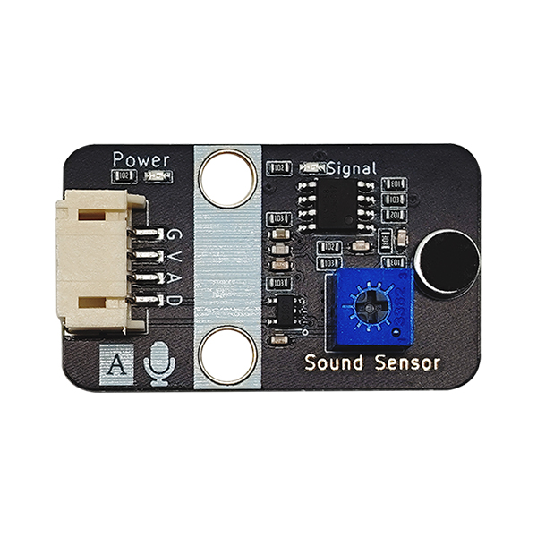

# 声音传感器模块规格书

## 实物图



## 概述

声音传感器模块的作用相当于一个话筒(麦克风)。它用来接收声波，显示声音的振动图象，但不能对噪声的强度进行测量。该传感器内置一个对声音敏感的电容式驻极体话筒。声波使话筒内的驻极体薄膜振动，导致电容的变化，而产生与之对应变化的微小电压。这一电压随后被转化成0-5V的电压，经过A/D转换被数据采集器接受，并传送给主控芯片。

## 原理图
 [查看原理图](zh-cn\ph2.0_sensors\sensors\sound_sensor\sound_sensor_schematic.pdf ':ignore') 


## 模块参数

| 引脚名称 |     描述     |
| :------: | :----------: |
|    G     |     GND      |
|    V     |     VCC      |
|    A     | 模拟信号引脚 |
|    D     | 数字信号引脚 |

*  供电电压:5V
*  连接方式:3PIN防反接杜邦线
*  模块尺寸:40 x 22.5 mm
*  安装方式:M4螺钉兼容乐高插孔固定

## 机械尺寸图


## Arduino示例程序

[下载示例程序](zh-cn\ph2.0_sensors\sensors\sound_sensor\sound_sensor.zip ':ignore')

```c++
#define AnalogPin 15//定义声音传感器模拟接口引脚
#define DigitalPin 14//定义声音传感器数字接口引脚
int AnalogValue=0;
byte DigitalValue=0;

void setup()
{
  Serial.begin(9600);//设置串口波特率
  pinMode(AnalogPin, INPUT);//将声音传感器模拟接口引脚设置为输入
  pinMode(DigitalPin,INPUT);//将声传感器音数字接口引脚设置为输入
}

void loop() {
    AnalogValue= analogRead(AnalogPin);//读取声音传感器模拟值
    DigitalValue=digitalRead(DigitalPin);//读取声音传感器数字值
    Serial.print("Analog Data:");
    Serial.println(AnalogValue);//打印声音传感器模拟值
    Serial.print("Digital Data:");
    Serial.println(DigitalValue);//打印声音传感器数字值
    delay(200);
}
```

可通过调整声音传感器上电阻阻值，调整传感器阈值。

## MicroPython示例程序

### Esp32 MicroPython示例程序

```python
from machine import ADC,Pin
import time

AnalogPin = 15  # 定义声音传感器模拟接口引脚
DigitalPin = 14  # 定义声音传感器数字接口引脚

p1 = ADC(AnalogPin)
p2 = Pin(DigitalPin, Pin.IN)     # create input pin on GPIO2

while True:
    AnalogValue = p1.read_u16()  # 读取声音传感器模拟值
    print("Analog Data:", AnalogValue)  # 打印声音传感器模拟值
    print("Digital Data:", p2.value())  # 打印声音传感器数字值
    time.sleep_ms(200)

```

### micro:bit MicroPython示例程序

```python
from microbit import *

while True:
    p1 = pin1.read_analog() # 读取声音传感器模拟值
    p2 = pin2.read_digital() # 读取声音传感器数字值
    print("Analog Data:", p1)  # 打印声音传感器模拟值
    print("Digital Data:", p2)  # 打印声音传感器数字值
    sleep(1000)
```

## MakeCode示例程序

<a href="https://makecode.microbit.org/_FaF5Xx1C2Tvb">动手试一试</a>

