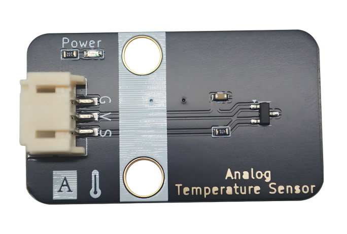
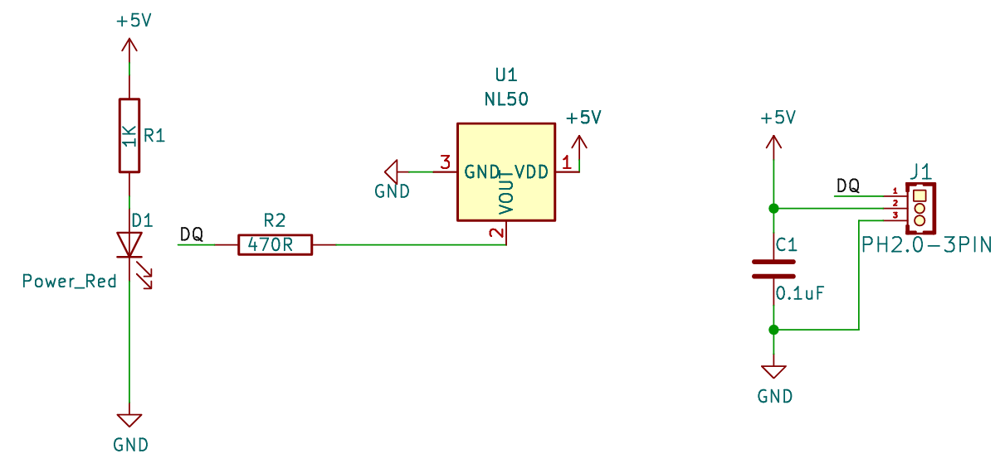
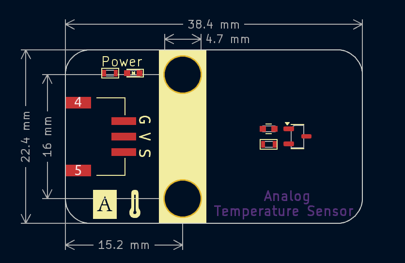
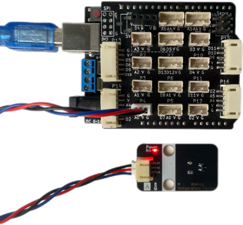
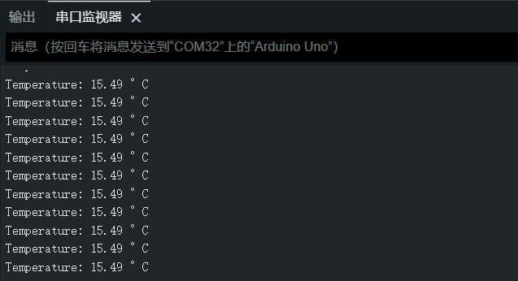
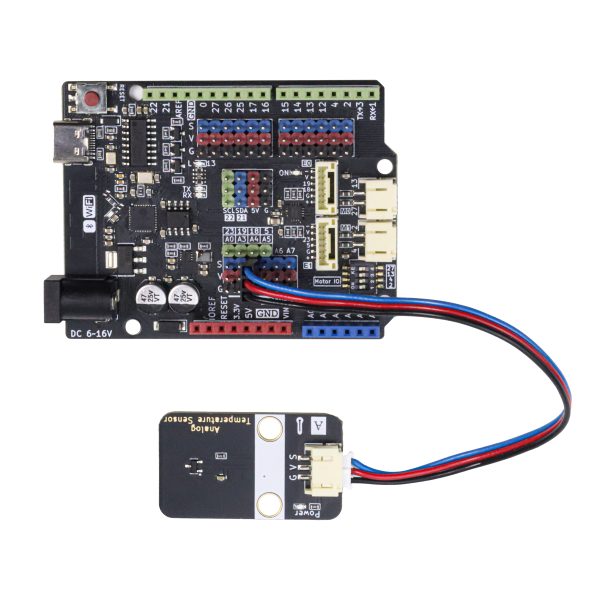

# NL50模拟温度传感器



​	NL50是一款高精度的线性模拟温度传感器集成电路，其输出电压与温度成正比，非常适合用于各种模拟温度测量和温度监控应用。在 0℃ 至 +70℃ 的温度范围内，NL50的典型精度达到 ±0.5℃，这一精度优于市场上其他引脚兼容的同类产品。在 -40℃ 至 +100℃ 的宽温度范围内，NL50 精度为 ±2.5℃，能够产生每摄氏度 10mV 的正输出斜率，并且由3V至5.5V的单电源供电。

NL50提供了低至 7.5μA（典型值）的静态电流和 420μs（典型值）的启动时间，这些节能特性使其成为电池供电应用的理想选择。其输出级采用 AB 类设计，具有最大 500μA 的输出驱动能力，足以驱动 1000pF 的电容负载，非常适合与模数转换器ADC的输入级相连。与传统的无源热敏电阻相比，NL50模拟输出温度传感器凭借其高精度和强大的线性输出驱动器，提供了一种经济高效的解决方案。

因此NL50传感器具有精确度高，连接方式简单等优点，是热敏电阻替代产品。

### 原理图




### 测温原理

NL50在测量-40 ~ 100℃温度时，温度测量公式如下：
$$
T_℃=\frac{V-0.5}{0.01}
$$

通过上面的公式测试到100℃是，ADC最大测量电压为1.5V，为了提高测量精度，尽可能设置ADC参考电压足够稳定且精准，测量量程不要过大。

### 尺寸图



<a href="zh-cn/ph2.0_sensors/sensors/temperature_sensor_nl50/nl50_3d.zip" download>下载NL50模拟温度传感器3D文件</a>

## 模块参数

- 供电电压：3 ~  5.5V
- 宽温度测量范围：-40℃至+100℃
- 连接方式：PH2.0-3pin接口
- 模块尺寸：38.4*22.4mm
- 安装方式：M4螺钉兼容乐高插孔
- 温度斜率：0.01V / ℃
- 精度：0~70℃范围内 ±0.5℃，其他温度范围 ±2.5℃

## 引脚定义

| 引脚名称 |         描述         |
| :------- | :------------------- |
|    G     |         GND          |
|    V     |         3~5.5V         |
|    S     | 信号线（模拟输出） |

### Arduino IDE示例代码

<a href="zh-cn/ph2.0_sensors/sensors/temperature_sensor_nl50/nl50_arduino_demo.zip" download>点击下载ArduinoIDE示例程序</a>

**Uno R3示例程序**

| 支持开发板系列    |
| :---------------- |
| Arduino UNO R3    |
| Arduino Nano      |
| Arduino Mega 2560 |



```c++
int pin = A0;  //定义传感器引脚

float NL50_read_temperature() {
    int raw_value = analogRead(pin);
    float voltage = (raw_value / 1023.0) * 5.0; // 5V电源 读取ADC值
    float temperature = (voltage - 0.5) * 100; //  减去0.5V偏置电压 10mV/℃
    return temperature;
}

void setup() {
    Serial.begin(115200);
    Serial.println("Temperature sensor setup");
}

void loop() {
    float temp = NL50_read_temperature();
    Serial.print("Temperature: ");
    Serial.print(temp);
    Serial.println(" °C");
    delay(100);
}

```

#### 实验现象




**ESP32 Arduino IDE示例代码**

ESP32主板时，一定要注意，使用独立ADC1，对应通道GPIO32~39（共8个引脚），但GPIO36~39仅支持衰减0db（0~1.1V），GPIO32~33支持全档衰减（0~3.3V）。在针对NTC电阻，温度传感器等场景下，衰减挡位绝对不是“越大越好”，而是“够用即止”

| 衰减挡位  | 量程   | 最大输入电压 | 额外噪声（LSB） | 适合场景                             |
| --------- | ------ | ------------ | --------------- | ------------------------------------ |
| ADC_0db   | 0~1.1V | 大约1V       | ≈0.8            | 精密信号（桥式传感器，微弱信号）     |
| ADC_2_5db | 0~1.5V | 大约1.4V     | ≈1.5            | 中等幅度信号（运放输出）             |
| ADC_6db   | 0~2.2V | 大约1.9V     | ≈2.2            | 中等电平（分压测量）                 |
| ADC_11db  | 0~3.3V | 大约3V       | ≈3              | 查看电压变化趋势（电位器、电池电压） |

那么针对NL50传感器，如果量程为3.3V测试结果 误差特别大，几乎不准，为ADC_2_5db精度有保障，但是测量范围太小，最大温度不能到100 ℃，最终选定ADC_6db作为衰减挡位。



```c++
int adc_pin = 34;  //定义传感器引脚

float NL50_read_temperature() {
    float calibrate_mv = analogReadMilliVolts(adc_pin);
    float temperature = (calibrate_mv - 500) / 10; //  减去0.5V偏置电压 10mV/℃
    return temperature;
}

void setup() {
    Serial.begin(115200);
    analogSetAttenuation(ADC_6db); //对于这种热敏传感器衰减挡位越低越好 ADC_6db 对应量程2.2V
    Serial.println("Temperature sensor setup");
}

void loop() {
    float temp = NL50_read_temperature();
    Serial.print("Temperature: ");
    Serial.print(temp);
    Serial.println(" °C");
    delay(100);
}
```

## ESP32 Microython示例程序

<a href="zh-cn/ph2.0_sensors/sensors/temperature_sensor_nl50/nl50_esp32_micropython.zip" download>点击下载Micropython库和示例程序</a>


