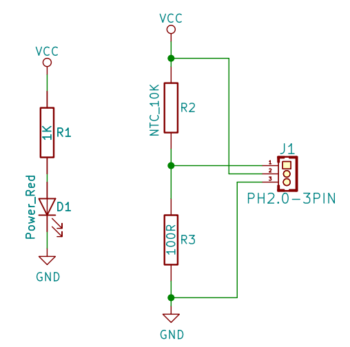

# 热敏传感器

## 实物图


## 概述

热敏电阻器是敏感元件的一类，按照温度系数不同分为正温度系数热敏电阻器(PTC)和负温度系数热敏电阻器(NTC)。热敏电阻器的典型特点是对温度敏感，不同的温度下表现出不同的电阻值。正温度系数热敏电阻器(PTC)在温度越高时电阻值越大，负温度系数热敏电阻器(NTC)在温度越高时电阻值越低，它们同属于半导体器件。  

## 原理图

[查看原理图](zh-cn\ph2.0_sensors\sensors\thermal_sensor\thermal_sensor_schematic.pdf ':ignore')


## 模块参数

| 引脚名称 |             描述              |
| :------: | :---------------------------: |
|    G     |              GND              |
|    V     |              VCC              |
|    S     | 温度越高时,读取的模拟值则越大 |

- 供电电压:3v3/5V

- 连接方式:3PIN防反接杜邦线

- 模块尺寸:40 x 22.5 mm

- 安装方式:M4螺钉兼容乐高插孔固定

## 机械尺寸图


## Arduino示例程序

<a href="zh-cn\ph2.0_sensors\sensors\thermal_sensor\thermal_sensor.zip" download>下载示例程序</a>

```c++
#define ThermalePin  A3//定义热敏传感器模块引脚

int  ThermalValue = 0 ;//定义变量,读取热敏值

void setup()
{
  Serial.begin(9600);//设置串口波特率
  pinMode(ThermalePin, INPUT);//设置热敏传感器模块引脚为输入
}
void loop()
{
  ThermalValue = analogRead(ThermalePin);//读取热敏值，并赋值给ThermalValue
  Serial.print("Thermal Data:  ");
  Serial.println(ThermalValue);//打印热敏值
  delay(200);
}
```

## MicroPython示例程序

### Esp32 MicroPython示例程序

```python
from machine import ADC,Pin
import time

AnalogPin = 15  # 定义热敏传感器模拟接口引脚

p1 = ADC(AnalogPin)
    
while True:
    AnalogValue = p1.read_u16()  # 读取热敏传感器模拟值
    print(AnalogValue)  # 打印热敏传感器模拟值
    time.sleep_ms(200)
```

### micro:bit  MicroPython示例程序

```python
from microbit import *

AnalogPin = pin1  # 定义热敏传感器模拟接口引脚

while True:
    AnalogValue = AnalogPin.read_analog()  # 读取热敏传感器模拟值
    print("Analog Data:", AnalogValue)  # 打印热敏传感器模拟值
    sleep(0.2)
```

## MakeCode示例程序

<a href="https://makecode.microbit.org/_LTdekc9H3b9u">动手试一试</a>
