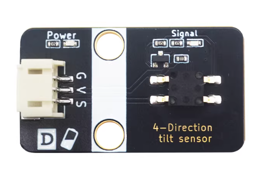
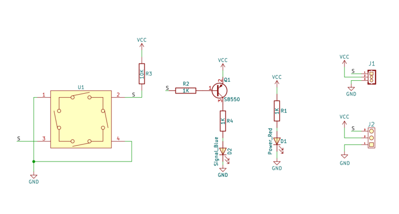
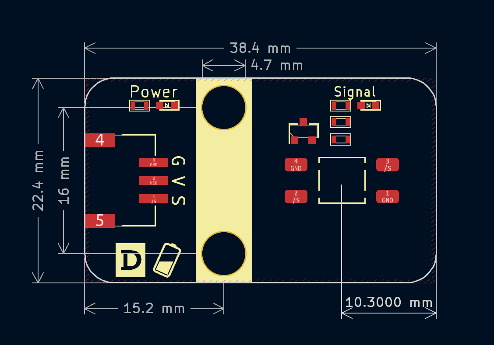

# 四向倾斜开关




## 概述

​	倾斜开关模块也称为珠形开关，钢球开关，实际上是一种振动开关。它有不同的名称，但工作原理保持不变。滚珠通过与金属板接触或不接触来控制电路的连接或断开。简单地说，就像打开或关闭灯一样，如果开关接触内部的金属板，灯将亮，当开关离开时，灯将熄灭。与金属端子接触或在开关中用小珠子改变光的行进路径将能够产生传导效应。

四向倾斜传感器故名思意是可以检测上下左右4个方向倾斜的开关，当倾斜开关往四个方向任意角度倾斜时，模块都输出低电平，板载Signal灯亮起，水平防止时输出高电平，板载Signal灯熄灭。

## 原理图



## 模块参数

| 引脚名称 | 描述                                           |
| -------- | ---------------------------------------------- |
| G        | GND                                            |
| V        | 3 ~ 5V                                         |
| S        | 倾斜时，模块都输出低电平，水平放置时输出高电平 |

- 供电电压：3 ~ 5V
- 连接方式：PH2.0-3pin接口

- 模块尺寸：38.4x22.4mm

- 安装方式：M4螺钉兼容乐高插孔

## 机械尺寸



<a href="zh-cn/ph2.0_sensors/sensors/tilt_switch_sensor_3d.zip" download>下载倾斜开关3D文件</a>

## Arduino示例程序

```c++
#define DIGITAL_PIN 7  // 定义倾斜传感器数字引脚

int digital_value = 0;  // 定义数字变量,读取倾斜传感器数字值

void setup() {
  Serial.begin(9600);          // 设置串口波特率
  pinMode(DIGITAL_PIN, INPUT);  // 设置倾斜传感器数字引脚为输入
}

void loop() {
  digital_value = digitalRead(DIGITAL_PIN);  // 读取倾斜传感器是否倾斜，低电平代表倾斜
  Serial.print("Digital Data:  ");
  Serial.println(digital_value);  // 打印倾斜传感器数字值
  delay(200);
}
```


