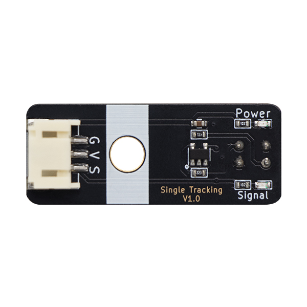
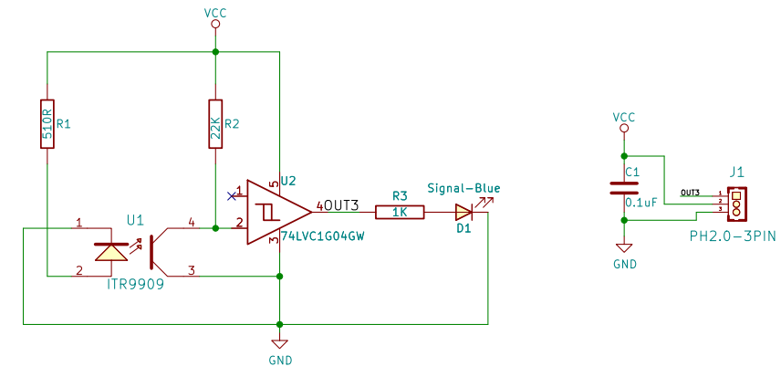
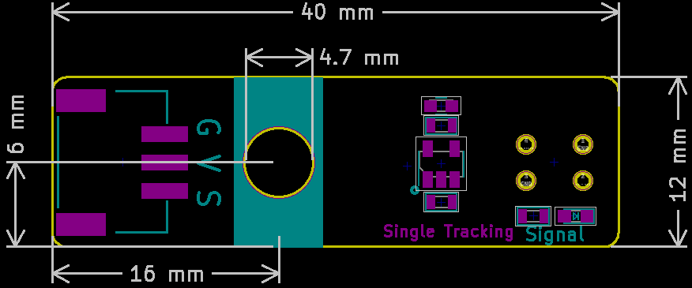

# 红外循迹传感器

## 实物图



## 概述

​        红外循迹模块本质上是一个红外线收发装置，是具有一对红外线发射与接收管，发射管发射出一定频率的红外线，当检测方向遇到反射面时，红外线反射回来被接收管接收，经过比较器电路处理之后，指示灯会亮起，同时信号输出接口输出数字信号（一个低电平信号）。

## 原理图



<a href="zh-cn/ph2.0_sensors/sensors/tracking_sensor/infrared_tracking_schematic.pdf" target="_blank">查看原理图</a>

## 模块参数

| 引脚名称 |                       描述                       |
| :------: | :----------------------------------------------: |
|    G     |                       GND                        |
|    V     |                       VCC                        |
|    S     | 当遇到黑色时输出高电平当没有遇到黑色时输出低电平 |

- 供电电压:3v3/5V

- 连接方式:3PIN防反接杜邦线

- 模块尺寸:40 x 22.5 mm

- 安装方式: M4螺钉兼容乐高插孔固定

## 机械尺寸图



## Arduino示例程序

```c++
#define DIGITAL_PIN 7  // 定义红外避障模块数字引脚

int digital_value = 0;  // 定义数字变量,读取红外避障模块数字值

void setup() {
  Serial.begin(9600);          // 设置串口波特率
  pinMode(DIGITAL_PIN, INPUT);  // 设置红外避障模块数字引脚为输入
}

void loop() {
  digital_value = digitalRead(DigitalPin);  // 读取红外避障模块数字值
  Serial.print("InfraredObstacleAvoidanceModuleDigital Data:");
  Serial.println(digital_value);  // 打印红外避障模块数字值
  delay(200);
}
```

## MicroPython示例程序

### Esp32 MicroPython示例程序

```python
from machine import Pin
import time

digital_pin = 14  # 定义红外避障模块数字接口引脚

p2 = Pin(digital_pin, Pin.IN)  
        
while True:
    analog_value = p1.read_u16()  # 读取红外避障模块模拟值
    print("InfraredObstacleAvoidanceModuleDigital Data:", p2.value())  # 打印红外避障模块数字值
    time.sleep_ms(200)
```

### micro:bit MicroPython示例程序

```python
from microbit import *

analog_pin = pin0  # 定义红外避障模块数字接口引脚

while True:
    analog_value = analog_pin.read_analog()  # 读取红外避障模块模拟值
    print("Digital Data:", digital_pin.read_digital())  # 打印红外避障模块数字值
    sleep(0.2)
```

## micro:bit示例程序

<a href="https://makecode.microbit.org/S65722-49364-86942-21338" target="_blank">动手试一试</a>
