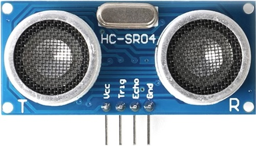
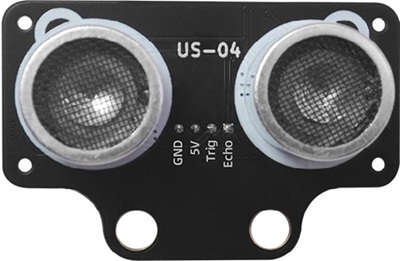
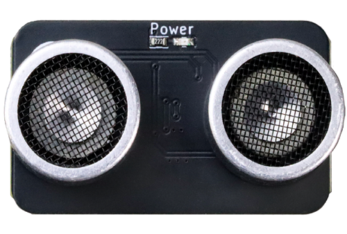
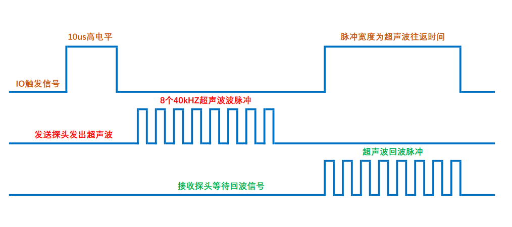
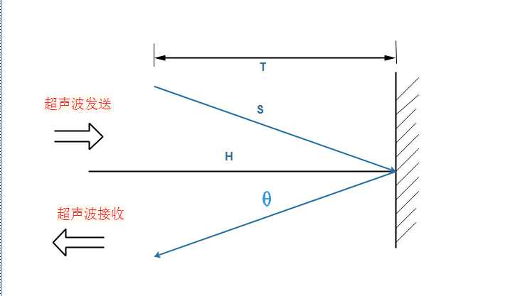
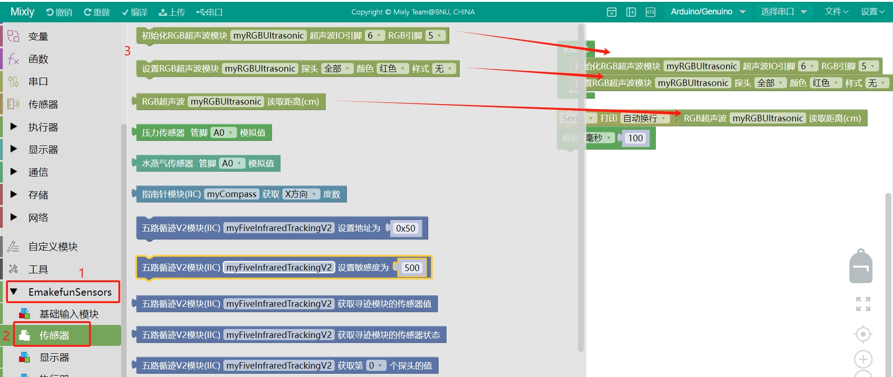

# US-04/US-03/HC-SR04三四线超声波

## 概述

| HC-SR04(蓝色款)             | US-04                    | US-03                    |
|:------------------------:|:------------------------:|:------------------------:|
|  |  |  |

        人耳朵能听到的声波频率为20～20000Hz，当声波的振动频率大于20000Hz时，人耳无法听到。超声波因其频率下限大约等于人的听觉上限而得名。因此，我们把频率高于20000Hz的声波称为“超声波”。超声波测距的原理是利用超声波在空气中的传播速度为已知，测量声波在发射后遇到障碍物反射回来的时间，根据发射和接收的时间差计算出发射点到障碍物的实际距离。该模块可以与Arduino 、Micro:bit、ESP32等主控器搭配使用。

## 模块原理介绍

### 超声波部分测量操作



外部 MCU 初始设置为输出，给模块 I/O 脚一个大于 10uS 的高电平脉冲；输出脉冲信号后，MCU 设置 为输入模式，等待模块给出的一个与距离等比的高电平脉冲信号；测量结束后 MCU 设置为输出模式，进行下次测量。声速可根据脉宽时间“T”算出：

**距离=T（从发送信号至接收到信号的时间）*340/2 （ 340m/s是声音在空气中的传播速度）**



HC-SR04和US-04两个型号为四线超声波，其中Trig为触发控制引脚，通过MCU向模块的TRIG引脚输入至少10微秒的高电平触发信号；模块随即自动发射8个频率为40kHz的超声波脉冲；Echo为回波输出引脚，当接收到回波后，ECHO引脚会输出一个高电平，其持续时间与超声波往返时间成正比；然后，通过以上公式测算出实际距离。

US-03超声波为三线超声波，其中IO引脚即触发控制引脚又为回波输出引脚，大大节约了MCU的IO资源。外部 MCU 初始设置为输出，给模块 I/O 脚一个大于 10uS 的高电平脉冲；输出脉冲信号后，MCU 设置 为输入模式，等待模块给出的一个与距离等比的高电平脉冲信号；测量结束后 MCU 设置为输出模式，进行下次测量。然后，通过以上公式测算出实际距离。

## 模块参数

工作电压：5V

测量周期：不小于60毫秒

测量盲区：2cm

测量范围：2厘米-4米

精度：3毫米

测量角度：15°

|      | HC-SR04/US-04 | US-03 |
| ---- | ------------- | ----- |
| GND  | 地             | 地     |
| VCC  | 电源正极          | 电源正极  |
| Echo | 回波输出引脚        |       |
| Trig | 触发控制引脚        |       |
| IO   |               | 信号引脚  |

## Arduino示例程序

[点击下载Arduino/ESP32系列示例](https://github.com/emakefun/EasyUltrasonic/archive/refs/tags/V0.0.1.zip)

GetDistance4PinMod.ino为HC-SR04/US-04示例

```c

#include <EasyUltrasonic.h>

#define TRIGPIN 5 // Digital pin connected to the trig pin of the ultrasonic sensor
#define ECHOPIN 6 // Digital pin connected to the echo pin of the ultrasonic sensor

EasyUltrasonic ultrasonic; // Create the ultrasonic object

void setup() {
  Serial.begin(115200); // Open the serial port

  ultrasonic.attach(TRIGPIN, ECHOPIN); // Attaches the ultrasonic sensor on the specified pins on the ultrasonic object
}

void loop() {
  float distanceCM = ultrasonic.getDistanceCM(); // Read the distance in centimeters

  // float distanceIN = ultrasonic.getDistanceIN(); // Uncomment if you want to get the distance in inches

  // Print the distance value in Serial Monitor
  Serial.print(distanceCM);
  Serial.println(" cm");

  delay(100);
}
```

GetDistance3PinMode.ino为US-03示例

```c
#include <EasyUltrasonic.h>

// If you want to use your HC-SR04/Ping))) ultrasonic sensor in the 3 Pin Mode, then the TRIGPIN value will need to be the same as the ECHOPIN value (The digital pin that is connected to your ultrasonic sensor):
#define TRIGPIN 5 // Digital pin connected to the trig pin of the ultrasonic sensor
#define ECHOPIN 5 // Digital pin connected to the echo pin of the ultrasonic sensor

EasyUltrasonic ultrasonic; // Create the ultrasonic object

void setup() {
  Serial.begin(9600); // Open the serial port

  ultrasonic.attach(TRIGPIN, ECHOPIN); // Attaches the ultrasonic sensor on the specified pins on the ultrasonic object
  // ultrasonic.attach(TRIGPIN, ECHOPIN, 3, 300); // Uncomment this line and comment the above line if you are using the Ping))) ultrasonic sensor
}

void loop() {
  float distanceCM = ultrasonic.getDistanceCM(); // Read the distance in centimeters

  // float distanceIN = ultrasonic.getDistanceIN(); // Uncomment if you want to get the distance in inches

  // Print the distance value in Serial Monitor
  Serial.print(distanceCM);
  Serial.println(" cm");

  delay(100);
}
```

## Mind+示例

mind+ 软件arduino uno、esp32库为同一个，使用时，在用户库输入以下链接：https://gitee.com/emakefun_midplus_lib/ultrasonic

[点击查看导入方法](https://mindplus.dfrobot.com.cn/extensions-user-libraries)

[点击下载Mind+案例](https://gitee.com/emakefun_midplus_lib/ultrasonic/releases/download/V0.0.1/mindplusExample.zip)

## Mixly示例

<a href="zh-cn/ph2.0_sensors/sensors/us04_us03/us-04_mixly_demo.zip" download>点击下载HC-SR04/US-04米思齐示例</a>

US-03需要导入用户库，[点击查看Mixly2.0云端导入PH2.0 Sensors库](https://docs.emakefun.com/#/zh-cn/software/mixly/mixly)，导入成功后，点击EmakefunSensors库。

<a href="zh-cn/ph2.0_sensors/sensors/us04_us03/us-03_mixly_demo.zip" download>点击下载US-03米思齐示例</a>

## MicroPython示例程序

[点击下载ESP32 MicroPython US-04/HC-SR04示例程序](https://docs.emakefun.com/zh-cn/ph2.0_sensors/sensors/us04_us03/us-04_micropython_demo.zip)

[点击下载ESP32 MicroPython US-03示例程序](https://docs.emakefun.com/zh-cn/ph2.0_sensors/sensors/us04_us03/us-03_micropython_demo.zip)

## micro:bit MakeCode示例程序

[点击查看US-04/HC-SR04示例](https://makecode.microbit.org/_iTgM9bXD3VAk)

[点击查看US-03示例](https://makecode.microbit.org/_5oj9bx4JfHUh)
