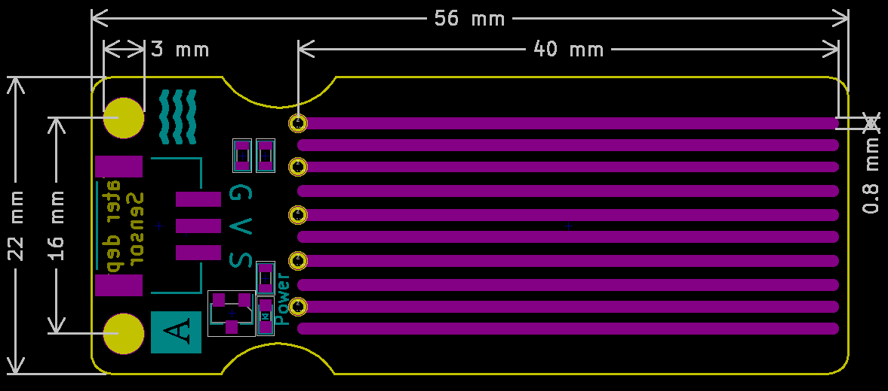

# 水深传感器


## 概述

水深传感器专为水质检测而设计，可广泛用于感应降雨，水位，甚至液体泄漏。该传感器的工作原理是将一系列暴露的走线连接到地，并在接地走线之间交错，即感应走线。传感器走线具有1MΩ的弱上拉电阻。电阻器将传感器迹线值拉高，直到一滴水使传感器走线短路到接地走线。可以将它与模拟引脚配合使用，以检测接地和传感器走线之间的水接触量。

## 原理图

[查看原理图](zh-cn\ph2.0_sensors\sensors\water_depth_sensor\water_depth_sensor_schematic.pdf ':ignore') 


## 模块参数

| 引脚名称| 描述 |
|:--: |:--:|
| G | GND |
| V | VCC |
| S | 当模拟值越大，水的深度越深。 |

- 供电电压：3v3/5V

- 连接方式：3PIN防反接杜邦线

- 模块尺寸：56 x 22mm

- 安装方式： M3螺钉固定 


## 机械尺寸图



## Arduino示例程序

[下载示例程序](zh-cn\ph2.0_sensors\sensors\water_depth_sensor\water_depth_sensor.zip ':ignore')

```c++
void setup() {
    Serial.begin(9600);  // 初始化串口通信
    pinMode(A3, INPUT);  // 设置水深传感器引脚为输入
}

void loop() {
 	Serial.print(analogRead(A3));//打印水深传感器模拟值
    delay(200);  // 延时200毫秒
}
```

## MicroPython示例程序

### Esp32 MicroPython示例程序

```python
from machine import ADC,Pin
import time

AnalogPin = 15  # 定义水深传感器模拟接口引脚

p1 = ADC(AnalogPin)
      
while True:
    AnalogValue = p1.read_u16()  # 读取水深传感器模拟值
    print("Analog Data:", AnalogValue)  # 打印水深传感器模拟值
    time.sleep_ms(200)
```

### micro:bit MicroPython示例程序

```python
from microbit import *

AnalogPin = pin1  # 定义水深传感器模拟接口引脚

while True:
    AnalogValue = AnalogPin.read_analog()  # 读取水深传感器模拟值
    print( AnalogValue)  # 打印水深传感器模拟值
    sleep(0.2)
```

## MakeCode示例程序

<a href="https://makecode.microbit.org/_e1XeY08vy2kx">动手试一试</a>