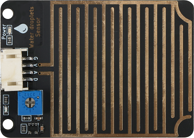
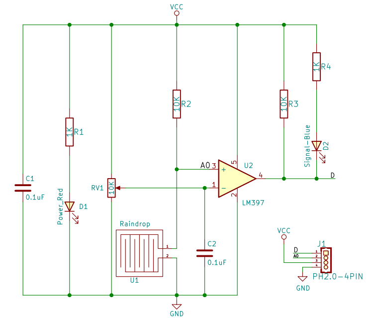
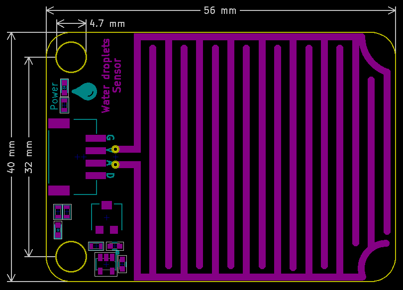

# 雨滴传感器

## 实物图



## 概述

​  雨滴传感器是一种传感装置，主要用于检测是否下雨及雨量的大小，并广泛应用于汽车自动刮水系统、智能灯光系统和智能天窗系统等。传感器采用优质FR-04双料，大面积5.0 * 4.0厘米，镀镍处理面。 它具有抗氧化，导电性和更出色的耐久性能; 用电位器调节灵敏度; 工作电压为3.3 V至5 V. 输出形式：数字值输出（0和1）和模拟值AO电压输出, 使用LM393双电压比较器, 当传感器连接到5v电源时，感应板上没有水滴，DO输出处于高电平。 当滴下液滴时，DO输出处于低电平。 如果我们刷掉水滴，输出将返回高水平状态。 AO模拟输出可以连接到微控制器上的AD接口，以检测上面雨滴的大小。 DO数字输出也可以连接微控制器，以检测是否有雨。

## 原理图



<a href="zh-cn/ph2.0_sensors/sensors/water_droplets_sensor/water_droplets_sensor_schematic.pdf" target="_blank">点击此处查看原理图</a>

## 模块参数

| 引脚名称 | 描述         |
| -------- | ------------ |
| G        | GND          |
| V        | VCC          |
| A        | 模拟信号引脚 |
| D        | 数字信号引脚 |

- 供电电压:3v3/5V

- 连接方式:4PIN防反接杜邦线

- 模块尺寸:56 x 40 mm

- 安装方式:M4螺钉兼容乐高插孔固定

## 机械尺寸图



## Arduino示例程序

```c++
#define ANALOG_PIN 15   // 定义传感器模拟接口引脚
#define DIGITAL_PIN 14  // 定义传感器数字接口引脚

int analog_value = 0;
byte digital_value = 0;

void setup() {
  Serial.begin(9600);          // 设置串口波特率
  pinMode(ANALOG_PIN, INPUT);   // 将传感器模拟接口引脚设置为输入
  pinMode(DIGITAL_PIN, INPUT);  // 将声传感器音数字接口引脚设置为输入
}

void loop() {
  analog_value = analogRead(ANALOG_PIN);     // 读取传感器模拟值
  digital_value = digitalRead(DIGITAL_PIN);  // 读取传感器数字值
  Serial.print("Analog Data:");
  Serial.println(analog_value);  // 打印传感器模拟值
  Serial.print("Digital Data:");
  Serial.println(digital_value);  // 打印传感器数字值
  delay(200);
}
```

## MicroPython示例程序

### Esp32 MicroPython示例程序

```python
from machine import ADC,Pin
import time

analog_pin = 15  # 定义传感器模拟接口引脚
digital_pin = 14  # 定义传感器数字接口引脚

p1 = ADC(analog_pin)
p2 = Pin(digital_pin, Pin.IN)     # create input pin on GPIO2

while True:
    analog_value = p1.read_u16()  # 读取传感器模拟值
    print("Analog Data:", analog_value)  # 打印传感器模拟值
    print("Digital Data:", p2.value())  # 打印传感器数字值
    time.sleep_ms(200)

```

### micro:bit MicroPython示例程序

```python
from microbit import *

while True:
    p1 = pin1.read_analog() # 读取传感器模拟值
    p2 = pin2.read_digital() # 读取传感器数字值
    print("Analog Data:", p1)  # 打印传感器模拟值
    print("Digital Data:", p2)  # 打印传感器数字值
    sleep(1000)
```

## MakeCode示例程序

<a href="https://makecode.microbit.org/_FaF5Xx1C2Tvb" target="_blank">动手试一试</a>
