# AI语音助手

## 实物图


## 概述

AI语音助手是一款基于虾哥开源项目小智AI进行二次开发，集成先进语音识别和AI对话能力的智能语音助手，在具备自然语音交互功能的基础上，新增加了外设控制指令串口输出功能，构建了一套完整的"语音-指令-硬件"控制链路。

当用户通过自然语言发出设备控制指令（如"请打开灯"、"调节电机速度"）时，AI语音助手将通过配置的知识库引擎智能匹配预设的"语音指令-串口指令"映射关系，并通过指定串口输出对应的标准化控制指令（如turn on led），供外部设备（如Arduino）接收并执行。

用户可通过简单配置自定义外设控制语音指令与串口指令的映射关系，即可快速实现语音控制LED、电机、舵机等多种外设功能，大幅降低智能语音交互的开发门槛。

---

## 串口参数配置

| 串口参数  | 配置     | 说明                     |
| -------- | -------- | ----------------------- |
| RX引脚    | IO引脚5  | 接引外部串口工具的TX引脚  |
| TX引脚    | IO引脚6  | 接引外部串口工具的RX引脚  |
| 波特率    | 115200   | 波特率固定为115200       |

**注意：串口接线需遵循 “交叉连接” 原则（本设备的TX接对端的RX，本设备的RX接对端的TX），接反会导致指令无法接收。**

---

## AI语音助手主板详情

AI语音助手主板详情请参阅：<a href="https://dcnmu33qx4fc.feishu.cn/docx/VXHzdBYH0ohpNAxw2ifc3P2InBe" target="blank">AI语音助手主板</a>

---

## 固件烧录

**AI语音助手默认已烧录固件，请根据需要自行选择是否进行烧录固件。**

1. 点击下载AI语音助手固件：<a href="zh-cn/ph2.0_sensors/smart_module/ai_voice_assistant/ai_voice_assistant.zip" download>AI语音助手固件</a>
2. 点击下载ESP32 Flash下载工具：<a href="zh-cn/ph2.0_sensors/smart_module/ai_voice_assistant/flash_download_tool.zip" download>flash_download_tool.zip</a>
3. 将下载后的文件进行解压后，打开"flash_download_tool_3.9.9_R2.exe"文件。

    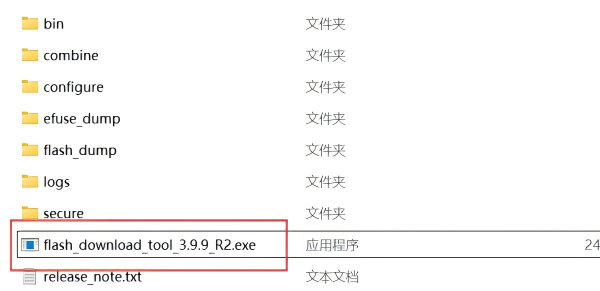

4. 选择配置：
    - ChipType：选择【**ESP32-S3**】
    - WorkMode：选择【**Develop**】
    - LoadMode：选择【**UART**】

5. 选择完毕后点击【**OK**】进入烧录页面。

    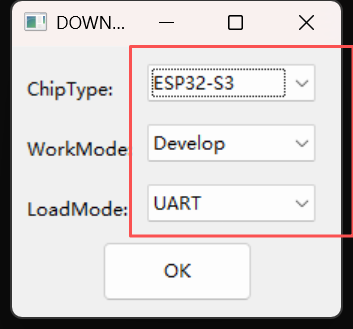

6. 点击如下图所示位置按钮进行选择固件，固件选择为刚刚下载的AI语音助手固件。

    

7. 勾选 bin 文件前面的复选框，以及在bin 文件后面的输入框内输入【**0**】。

    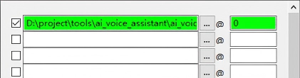

8. 配置烧录模式：
    - SPI SPEED: 选择【**80MHz**】
    - SPI MODE: 选择【**DIO**】
    - BAUD: 选择【**921600**】

    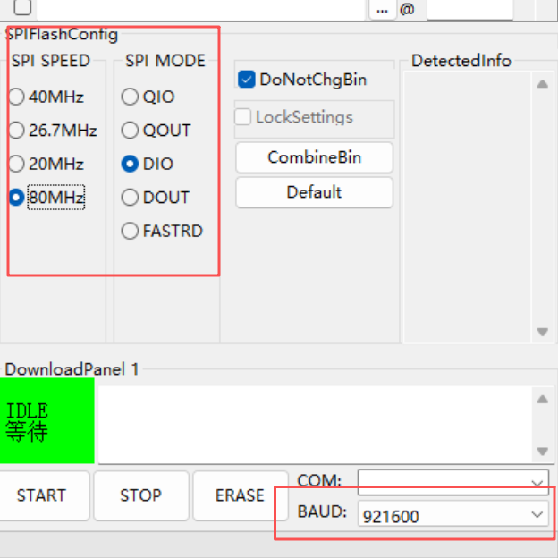

9. 将AI语音助手通过type-C数据线连接电脑，选择相应【**COM口**】。

10. 确认配置完成且无误后，点击【**START**】开始烧录。

    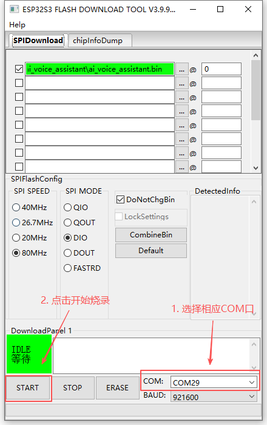

11. 等待烧录完成。

    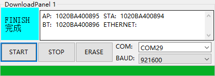

---

## 网络配置

1. 固件烧录完成后，按下AI语音助手的Power按键，进入配网模式。

    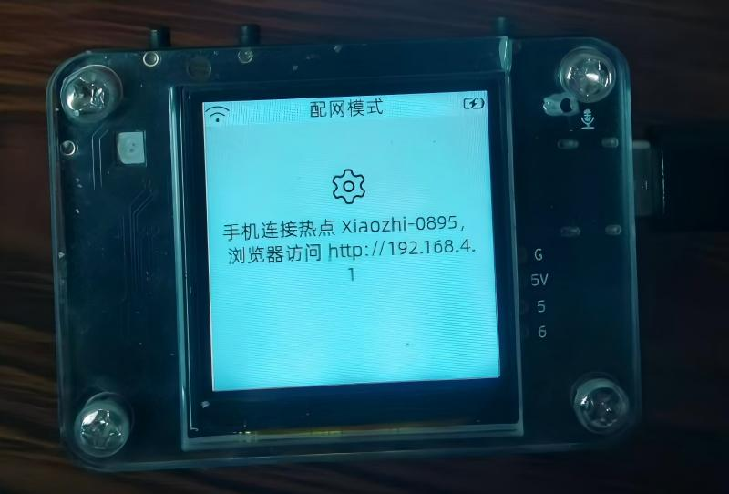

2. 打开手机wifi,连接对应WiFi后，配置要连接的WIFI名称和密码。

    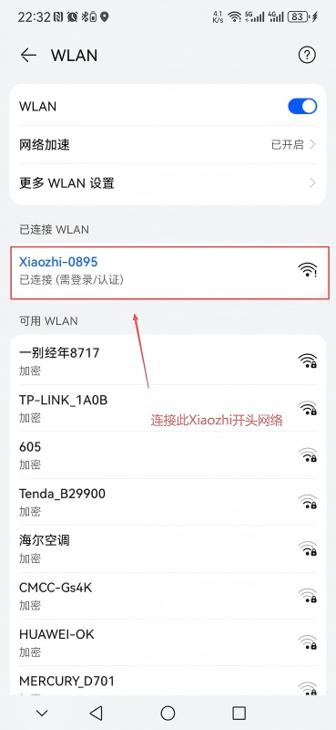
    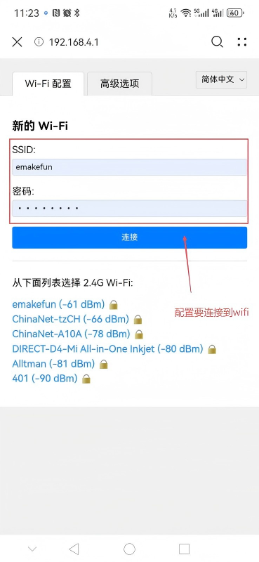
    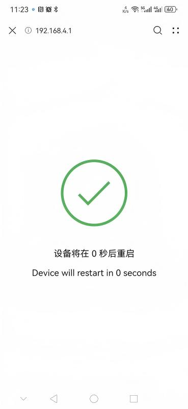

### 重新配网说明

将AI语音助手重新上电/重启，在连接WIFI闪烁蓝灯时(即还未连上WiFi时)，直接按下Boot按钮然后松开，听到提示音重新进入WIFI配网模式。

---

## 设备激活

1. 网络配置好后，登录小智平台<a href="https://xiaozhi.me/" target="_blank">xiaozhi.me</a>进行设备激活。
2. 点击进入【**控制台**】页面。
3. 进入智能体控制页面，点击页面上的【**添加设备**】按钮。

    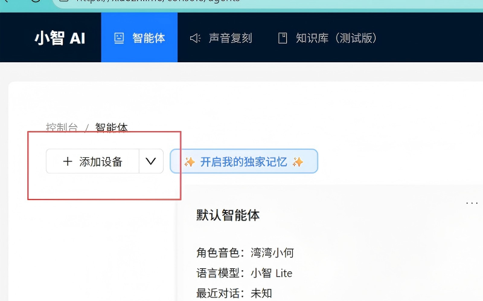

4. 在弹窗中输入播报的6位数验证码，然后点击确定即可激活。

    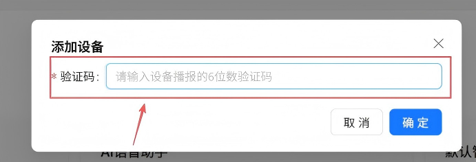

5. 添加设备后，按下AI语音助手的Power按键，进入语音交互模式。

---

## 知识库配置

**使用时，需要在小智后台进行相应智能体的知识库配置，才能正常使用外设控制指令串口输出功能。**

### 关于知识库

知识库用于存储“用户语音指令”与"串口输出指令"之间的映射关系。当小智AI识别到用户语音指令后，会查询知识库中是否匹配对应条目，若匹配则通过串口发送相应指令。

### 知识库配置步骤

#### 第一步：创建外设控制指令表（Excel）

新建Excel文件，在该文件中按照以下格式输入外设控制的相应指令，然后保存。指令格式参考如下。

| 外设控制  | 串口发送指令     | 备注                     |
| -------- | --------------- | ------------------------ |
| 打开灯    | turn on led     |                         |
| 关闭灯    | turn off led    |                         |
| 电机      | dc run speed x  | x代表转动速度，其绝对值为速度大小，正负代表旋转方向，速度大小为0~255，x默认为100  |

---

#### 第二步：新建知识库

1. 登录小智平台<a href="https://xiaozhi.me/" target="_blank">xiaozhi.me</a>。
2. 点击进入【**控制台**】页面。
3. 点击进入【**知识库**】模块。
4. 点击【**新建知识库**】按钮。
5. 在弹窗里填写相关信息，创建知识库：
    - 知识库名称：会在智能体配置时，显示在知识库列表里。
    - 知识库描述： 介绍该知识库的作用，AI会根据介绍内容来决定是否调用该知识库，以及使用效果；知识库描述词会直接影响AI调用逻辑，描述词应尽可能准确描述。
6. 完成知识库的创建。

**知识库描述参考（重要‼️）**

```text
本文档包含“外设控制的串口发送指令”内容，当用户提及外设控制时（如打开灯），我不能直接作答，必须在每次对话中调用该工具查询资料后，再调用相应MCP功能进行发送相应文本，注意，外设控制必须是在此资料中已有，如若在此资料中匹配不到相应外设控制，则应当回复暂时无法设置此功能。
```


---

#### 第三步：上传指令文档

1. 在知识库列表中，找到刚刚创建的知识库，点击【**查看**】按钮，进入文档上传页面。
2. 点击右上角的【**新建文档**】按钮。
3. 选择第一步中新建的外设控制指令文档，并点击【**确定**】上传。
4. 文档上传成功后，系统会自动解析文档，解析完成后，状态会变成【**解析完成**】。


---

#### 第四步：关联知识库

1. 在"控制台→智能体"模块页面。
2. 选择AI语音助手所在的智能体，点击【**配置角色**】。
3. 在配置角色页面，下拉找到并点击展开【**MCP设置**】。
4. 在"官方服务"中勾选【**知识库**】功能。
5. 在下方【**知识库配置**】列表中，选择刚刚创建的外设控制指令知识库。
6. 点击【**保存**】，并按提示重启设备，使配置生效。


---

## Arduino 使用示例

### 硬件准备

- Arduino uno 开发板

- AI语音助手（已配置好相应知识库）

- LED灯

- SG90舵机

- R300C电机风扇

### 接线

| 模块            | Arduino 开发板引脚  |
| --------------- | ------------------ |
| AI语音助手引脚5  | 12                 |
| AI语音助手引脚6  | 13                 |
| LED灯           | 3                  |
| SG90舵机        | 4                  |
| R300C电机INA    | 5                  |
| R300C电机INB    | 6                  |

### 接线图


### 程序下载

点击下方链接下载示例程序，下载后解压用Arduino IDE打开示例文件，主板选择Arduino uno。

<a href="https://gh-proxy.com/https://github.com/emakefun-arduino-library/example_ai_voice_assistant/archive/refs/tags/v1.0.0.zip" download>点击此处下载示例程序</a>

### 使用说明

配置好AI语音助手的知识库，以及将示例程序烧录到主板之后，给主板通电，用户可通过语音发出控制指令。语音助手识别到指令后，会通过串口向Arduino Uno发送对应的控制指令（如"turn on led"）。Arduino接收到指令后进行解析和匹配，最终控制相应的外设执行动作。

例如，对语音助手说"舵机转到150度"，语音助手通过串口发送"servo set angle 150"指令，Arduino识别后即控制舵机旋转至150度位置。
