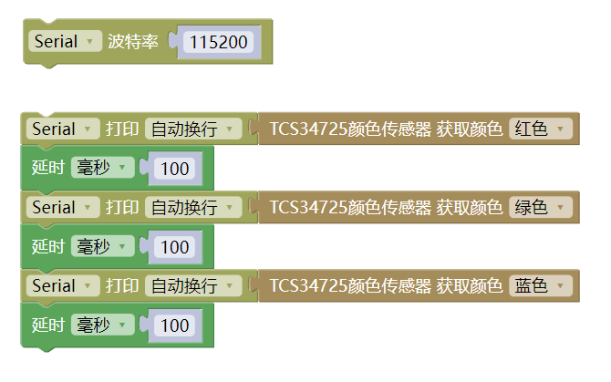

# TCS34725颜色识别传感器模块

## 模块图


## 概述

TCS34725是一款低成本，高性价比的RGB全彩颜色识别传感器，传感器通过光学感应来识别物体的表面颜色。支持红、绿、蓝(RGB)三基色，支持明光感应，可以输出对应的具体数值，帮助您还原颜色本真。

为了提高精度，让颜色管理更加准确。板载自带一个高亮LED，可以让传感器在低环境光的情况下依然能够正常使用，实现“补光”的功能，可以通过LED Switch开关对它进行打开或关闭。颜色识别传感器模块采用I2C通信，拥有PH2.0防反插接口，使用便利

## 原理图


## 模块参数

* 工作电压：3.3-5V
* 工作电流：65uA
* 检测距离：3-10mm
* 时钟频率：0-400KHZ
* 接 口：IIC接口和2.54间距接口
* 温度范围：-30℃ ~ +70℃
* 通信方式:  IIC通信，地址0x29
* 尺 寸：40 * 22 mm，兼容乐高积木和M4螺丝固定孔

## 引脚定义

| 引脚名称 | 描述      |
| ---- | ------- |
| G    | GND地线   |
| V    | 5V电源引脚  |
| SDA  | I2C数据引脚 |
| SCL  | I2C时钟引脚 |

### Arduino函数介绍

```c++
#include "EM_TCS34725.h"

EM_TCS34725 tcs34725;  // 初始化颜色识别 I2C地址为 0x29

void setup() {
  tcs34725.begin();
  Serial.begin(115200);
}

void loop() {
  int r = tcs34725.getRedToGamma();        // 颜色识别传感器读取颜色 并获取Red色值
  int g = tcs34725.getGreenToGamma();      // 颜色识别传感器读取颜色 并获取Green色值
  int b = tcs34725.getBlueToGamma();       // 颜色识别传感器读取颜色 并获取Blue色值
  Serial.print(String("R:") + String(r));  // 串口打印三原色
  Serial.print(",");
  Serial.print(String("G:") + String(g));
  Serial.print(",");
  Serial.println(String("B:") + String(b));
  delay(500);
}
```

<a href="zh-cn/ph2.0_sensors/smart_module/color_recognition//Experiment_of_color_recognition_sensor.zip" download>点击下载Arduino示例</a>

## Mixly图形化示例



程序解析：颜色识别模块为I2C通信，将模块与Arduino Uno主板的I2C接口相连，将程序上传到主板中，就可以读取颜色的三色值。

<a href="zh-cn/ph2.0_sensors/smart_module/color_recognition/color_recognition_mixly.zip" download>点击下载Mixly示例</a>

## Mind+图形化示例

<a href="zh-cn/ph2.0_sensors/smart_module/color_recognition/emakefun-em_color_sensor_tcs34725-thirdex-V0.0.1.mpext" download>点击下载Mind+库</a>

<a href="zh-cn/ph2.0_sensors/smart_module/color_recognition/color_sensor_TCS34725_get_color.mp" download>点击下载Mind+示例</a>

## Micro:Bit示例程序

<a href="https://makecode.microbit.org/_9Rk2LufUED6j" target="_blank">点击打开MicroBit示例</a>
