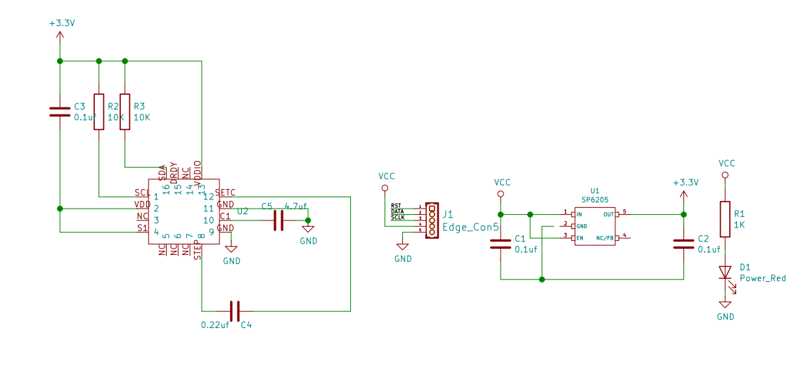
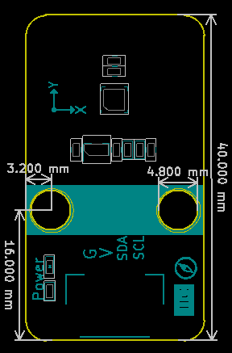
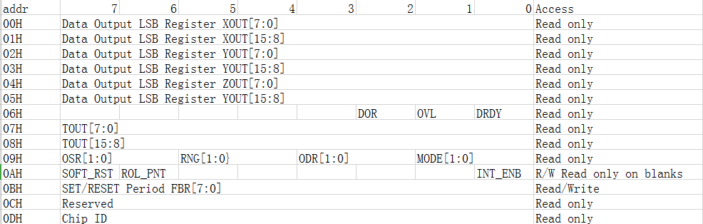
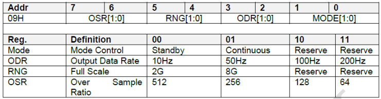
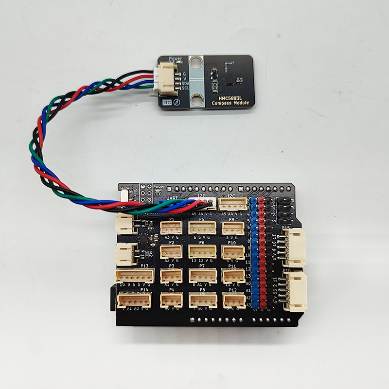

# QMC5883L电子指南针罗盘模块介绍

## 模块实物图

## 概述

QMC5883L是一款三轴磁传感器电子指南针模块，基于霍尔效应，可测量地磁场强度并输出数字信号。它集成了信号放大、模数转换和I2C接口，具备高灵敏度、低功耗和小尺寸的特点，适用于无人机、机器人、导航设备等需要方向检测的场合。模块通过I2C与主控通信，提供航向角、俯仰角和横滚角数据，支持校准和多种工作模式，便于集成和开发。

功能特点：

* 采用先进的AMR技术
* 拥有16位ADC
* 分辨率达到0.2uT
* 可实现1°航向精度
* 数据更新频率可达200Hz
* 宽幅工作电压（2.16V to 3.6V）
* 低功耗特征(75uA)
* 尺寸小3*3*0.9mm³ 采用LGA封装

## 模块参数

* 工作电压：VDD供电电压为2.5V±5%、3.0V±5%、3.3V±5%；

* GND:地

* SCL:IIC通信模式时钟信号

* SDA:IIC通信模式数据信号

* SETC:S/R电容器（c2）电容连接-驱动端

* SETP：置位/复位带正-S/R电容（C2）连接

* NC:无连接

* DRDY:数据准备，中断引脚。内部被拉高。当数据为于输出寄存器上时会在低电位上停250u sec

* ADC：16位的模数转换器

* Clock Gen.：内部振荡器，用于内部操作

* QMC5883L有两种工作模式：连续测量模式和待命模式。

## 原理图

[点击查看原理图](zh-cn/ph2.0_sensors/smart_module/compass/指南针.pdf ':ignore')

## 机械图

## 寄存器说明

00H~05H是数据寄存器，分别存放的是三轴传感器的X、Y和Z轴的值，每两个寄存器构成一个轴的高低字节，

表示范围：-32768~32768。

06H是状态寄存器，当传感器数据已测量完毕并准备好DRDY位被置“1”，数据寄存器一旦被读取，DRDY位将被置“0”。OVL是溢出位，当有任意一个轴的测量值超过范围，OVL将被置“1”，当下一次测量不超测量范围时，OVL将会被置“0”。当处于连续模式下测量数据被跳过时DOR被置“1”，而当数据寄存器被读写后置“0”。

07H~08H存放的是QMC5883L内置的温度传感器的输出数据。这里需要注意的是温度传感器的增益出厂前校正过，但偏移没有得到补偿，所以，温度传感器测得的相对值是准确的。温度系数100 LSB/℃。

09H~0AH是QMC5883L的控制寄存器。09H设置工作模式(MODE)、数据输出更新频率(ODR)、传感器测量范围(RNG)以及过采样率(OSR)。0AH设置中断使能

(INT_ENB)、点翻转使能(POL_PNT)以及软复位(SOFT_RST)。09H寄存器的设置如下图所示：

INT_ENB被置“0”时，中断引脚(即DRDY)将被使能，置“1”时中断被禁止。

ROL_PNT被置“0”时，I2C总线接口将不会自动在00H~06H间翻转，置“1”时自动翻转。

SOFT_RST被置“1”时对QMC5883L进行软复位，软复位可以发生于任何模式下的任何时段，软复位发生后所有寄存器将会被置默认值。

0BH控制QMC5883L的设置/复位时间，推荐值是设定为0x01。

0DH是器件标识寄存器，其值为0xFF。

## 在Arduino IDE中使用QMC5883L

软件使用方法可参照[Arduino IDE使用说明](zh-cn/software/arduino_ide/arduino_ide.zh-CN.md)

### 连接图

1. 安装相应库文件

按照下图所示安装相应库文件：

2. 打开示例程序

3. 上传程序至Arduino，打开串口监视器，可以看到如下信息：

## Mixly示例程序

<a href="zh-cn/ph2.0_sensors/smart_module/compass/compass_Mixly.zip" download>点击mixly示例程序下载</a>

## Esp32 MicroPython示例程序

<a href="zh-cn/ph2.0_sensors/smart_module/compass/ESP32--CompassModule-GY-271-QMC5883L-main.zip" download>点击esp32示例程序下载</a>

由于micro:bit 自带指南针模块，所以此处不再提供示例程序。
