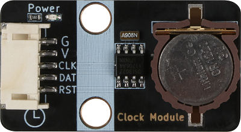
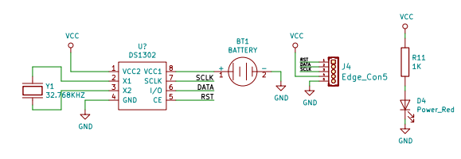
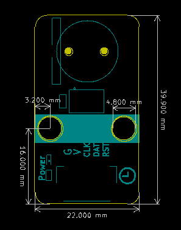
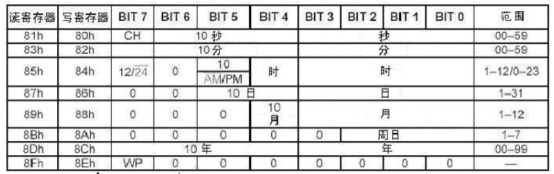
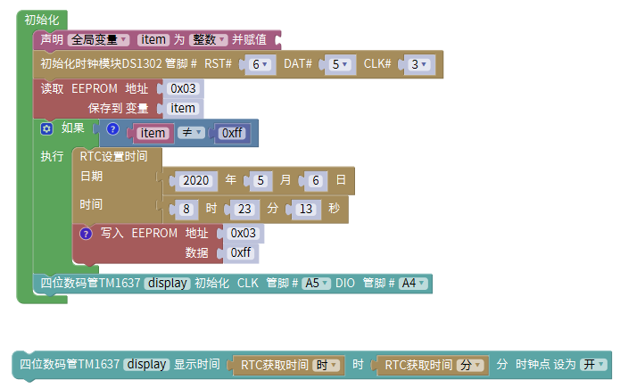

# DS1302时钟模块

## 模块实物图

## 概述

DS1302是一款低功耗的实时时钟（RTC）模块，具备计时、日历和闹钟功能。它通过简单的三线接口（数据、时钟、使能）与微控制器通信，内置31字节的静态RAM用于数据存储。DS1302以其低功耗、高精度和易集成性，广泛应用于嵌入式系统和电子设备中，适合需要精确时间管理的场景。

★  实时时钟具有能计算2100 年之前的秒、分、时、日、星期、月、年的能力，还有闰年调整的能力

★  318位暂存数据存储RAM

★  串行 I/O 口方式使得管脚数量最少

★  宽范围工作电压2.0 - 5.5V

★  工作电流 2.0V 时,小于300nA

★  读/写时钟或 RAM 数据时有两种传送方式单字节传送和多字节传送字符组方式

★  8 脚DIP 封装或可选的 8 脚 SOIC 封装根据表面装配

★  简单 3 线接口

★  与 TTL 兼容Vcc = 5V

★  可选工业级温度范围-40 ~ +85℃

★  双电源管用于主电源和备份电源供应

## 模块参数

- 工作电压：3.3V

- VCC2: 主电源引脚

- X1,X2: DS1302外部晶振引脚

- GND：接地引脚

- RST: 复位引脚

- DAT: 串行数据引脚，数据输出或输入都从这个引脚

- CLK: 串行时钟引脚

- VCC1: 备用电源

## 原理图

[点击此处查看原理图](zh-cn/ph2.0_sensors/smart_module/ds1302/DS1302.pdf ':ignore')

## 机械安装图

DS1302有关日历、时间的寄存器共有12个，其中有7个寄存器（读时81h~8Dh,写时80h~8Ch）是存放秒、分、时、日、月、年、周数据的，存放的数据格式为BCD码形式。

## 内部时间寄存器说明

1. 秒寄存器（81h、80h）的位7定义为时钟暂停标志（CH）。当初始上电时该位置为1，时钟振荡器停止，DS1302处于低功耗状态；只有将秒寄存器的该位置改写为0时，时钟才能开始运行。

2. 控制寄存器（8Fh、8Eh）的位7是写保护位（WP），其它7位均置为0。在任何的对时钟和RAM的写操作之前，WP位必须为0。当WP位为1时，写保护位防止对任一寄存器的写操作。也就是说在电路上电的初始态WP是1，这时是不能改写上面任何一个时间寄存器的，只有首先将WP改写为0，才能进行其它寄存器的写操作。

3. 控制寄存器（8Fh、8Eh）的位7是写保护位（WP），其它7位均置为0。在任何的对时钟和RAM的写操作之前，WP位必须为0。当WP位为1时，写保护位防止对任一寄存器的写操作。也就是说在电路上电的初始态WP是1，这时是不能改写上面任何一个时间寄存器的，只有首先将WP改写为0，才能进行其它寄存器的写操作。

### Arduino IDE示例程序

<a href="zh-cn/ph2.0_sensors/smart_module/ds1302/DS1302_Clock.zip" download>点击下载Arduino示例程序</a>

### Mixly示例程序

程序解析：从EEPROM里面获取是否为DS1302时钟模块设置过时间的标记，如果没有设置过则重新设置，否则不再设置时间，再通过获取时钟模块的时分到数码管上显示出来。

<a href="zh-cn/ph2.0_sensors/smart_module/ds1302/DS1302_Mixly.zip" download>Mixly示例下载</a>

### MicroPython示例程序

<a href="zh-cn/ph2.0_sensors/smart_module/ds1302/ds1302_esp32_micropython.zip" download>点击下载ESP32 MicroPython示例程序</a>

<a href="zh-cn/ph2.0_sensors/smart_module/ds1302/ds1302_microbit_micropython.zip" download>点击下载micro:bit MicroPython示例程序</a>

### micro:bit MakeCode示例程序

[点击查看示例程序](https://makecode.microbit.org/S63587-43847-56920-65953)

[点击查看用户库](https://github.com/zhuning239/DS1302)
