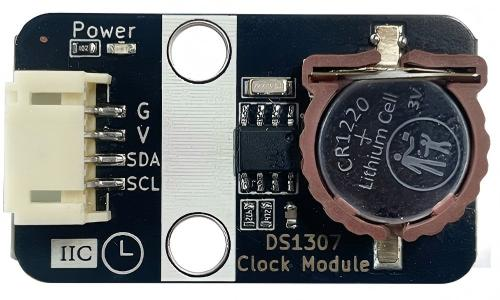
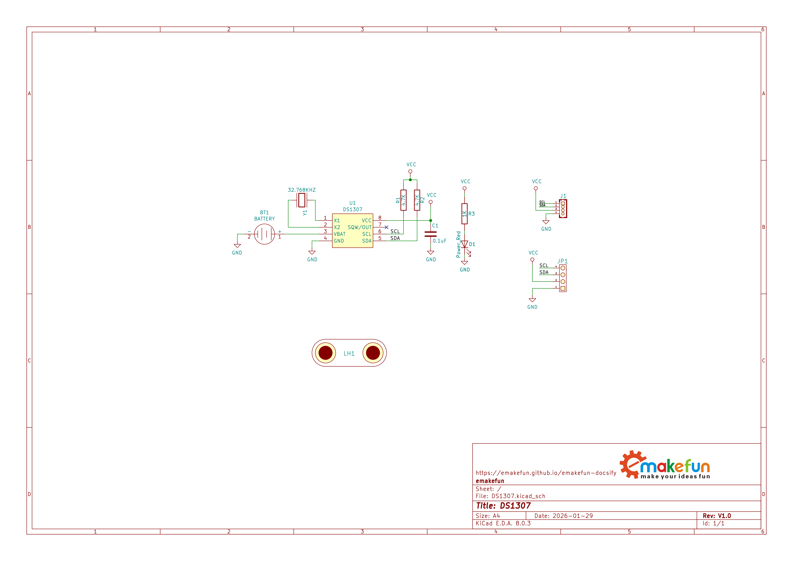
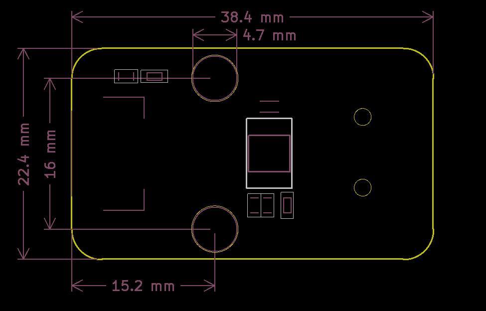
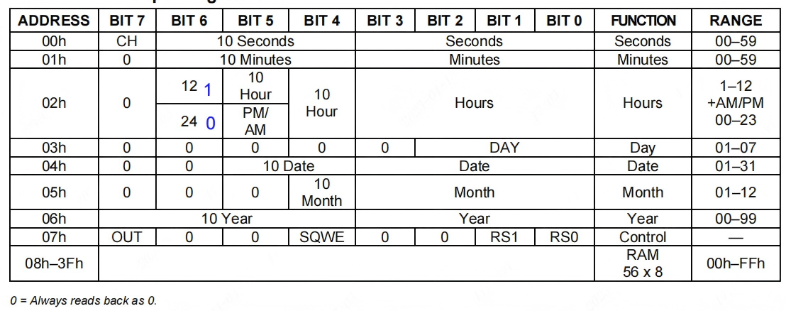
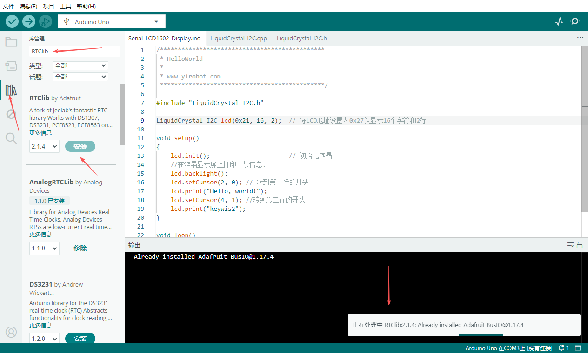
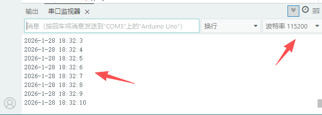

# DS1307时钟模块

## 模块实物图



## 概述

DS1307 是一款低功耗的实时时钟（RTC）模块，通过 I2C 接口与微控制器通信，接线简单，便于集成。该模块可提供秒、分、时、星期、月、年等信息，每一个月的天数能自动调整，并且具备闰年补偿功能。可通过 AM/PM 标志选择 12 小时或 24 小时制。模块内部集成了 56 字节的非易失性 RAM，可用于存储关键数据。此外，DS1307还具备电源感应电路，检测主电源失效时自动切换到备用电源，以保持时间、日期信息和计时。凭借其低功耗、高精度和易于集成的特点，DS1307 广泛应用于嵌入式系统、数据记录仪、智能仪表及其他需要可靠时间管理的电子设备中。

## 模块特性

- 实时时钟可对秒、分、时、日期、月份、星期和年份进行计数，具备闰年补偿功能，有效期至 2100 年

- 支持 24 小时制或 12 小时制的时间显示

- 采用I2C串行接口

- 内置56字节非易失性RAM

- 与 TTL 兼容Vcc = 5V

- 8引脚DIP和SOIC封装可选

- 可选工业级温度范围：-40℃至+85℃

- 双电源管用于主电源和备份电源供应

- 在电池备份模式下，功耗小于500nA

## 原理图



<a href="zh-cn/ph2.0_sensors/smart_module/ds1307/resource/ds1307.pdf" target="_blank">点击此处查看原理图</a>

## 模块参数

- 工作电压：5V

- 接 口：I2C接口和PH2.0间距接口

- 连接方式：PH2.0 4PIN防反接杜邦线

- 通信方式：I2C通信，地址0x68

- 尺 寸：38.4*22.4mm，兼容乐高积木和M4螺丝固定孔

| 引脚名称  | 描述        |
| -------- | ----------- |
| G        | GND地线      |
| V        | 5v电源引脚   |
| SDA      | I2C数据引脚  |
| SCL      | I2C时钟引脚  |

## 机械尺寸图



## 内部时间寄存器说明



DS1307片内有多个时间保存寄存器，单片机就是通过读取这些寄存器得到时间和日期相关的数据的，其中有8个寄存器专门用来存储时间信息，另外56个字节的RAM可以供用户自由使用。

RTC寄存器位于00h至07h地址区间，RAM寄存器则分布在08h至3Fh地址区域。在进行多字节访问时，当地址指针到达RAM空间末端的3Fh地址，系统会自动回绕至时钟空间的起始位置00h。

时间与日历信息通过读取对应寄存器字节获取。上方图表列出了RTC寄存器的配置说明。时间与日历参数通过写入对应寄存器字节进行设置或初始化，其内容采用BCD格式。星期寄存器在午夜时分自动递增，对应星期的数值由用户自定义但必须保持顺序（例如1代表星期日，2代表星期一，依此类推）。输入非逻辑时间或日期将导致系统无法正常运行。寄存器0的第7位是时钟停止（CH）位，当该位置为1时振荡器关闭，置为0时振荡器启动。设备首次通电时，时间与日期寄存器通常会重置为01/01/00 01 00:00:00（格式为MM/DD/YY DOW HH: MM: SS）。秒寄存器中的CH位会被置为1。当不需要计时功能时，可随时停止时钟运行，从而有效降低电流消耗（IBATDR）。

DS1307支持12小时和24小时两种工作模式。小时寄存器的第6位作为模式选择位，当该位为高电平时，系统将切换至12小时模式。在12小时模式下，第5位作为AM/PM模式位，逻辑高电平对应PM模式；而在24小时模式下，第5位则对应第二个10小时位（即20至23小时）。每当切换模式时，都需重新输入小时数值。

在读取或写入时间日期寄存器时，系统会使用辅助（用户）缓冲区来防止内部寄存器更新时产生错误。当读取时间日期寄存器时，用户缓冲区会在每次 I2C 启动时与内部寄存器同步。此时时钟持续运行，时间信息直接从这些辅助寄存器读取，这样就无需在读取过程中等待内部寄存器更新时重新读取。每当秒寄存器写入数据时，分频链都会被重置。写入操作通过DS1307的 I2C 确认信号完成。重置分频链后，为避免时间溢出问题，剩余时间日期寄存器必须在1秒内完成写入。

## Arduino 使用示例

### 接线

| DS1307  | ESP32  |
| ------- | ------ |
| G       | GND    |
| V       | 5V     |
| SDA     | 16     |
| SCl     | 17     |

### 示例程序

```c++
#include <Wire.h>
#include "RTClib.h"

RTC_DS1307 g_rtc;

void setup() {
  Serial.begin(115200);

  if (!g_rtc.begin()) {
    Serial.println("Error: Couldn't find g_rtc.");
    while (1);
  }

  if (!g_rtc.isrunning()) {
    g_rtc.adjust(DateTime(__DATE__, __TIME__));
  }
}

void loop() {
  DateTime now_datetime = g_rtc.now();

  Serial.print(now_datetime.year(), DEC);
  Serial.print('-');
  Serial.print(now_datetime.month(), DEC);
  Serial.print('-');
  Serial.print(now_datetime.day(), DEC);
  Serial.print(' ');
  Serial.print(now_datetime.hour(), DEC);
  Serial.print(':');
  Serial.print(now_datetime.minute(), DEC);
  Serial.print(':');
  Serial.print(now_datetime.second(), DEC);
  Serial.println();
  delay(1000);
}
```

### 安装库

打开Arduino IDE，前往 工具 -> 管理库，搜索RTClib，然后安装。



### 使用效果

烧录完成后，打开串口监视器，设置波特率为115200，等待程序运行，可以看到在串口中会打印时间值。


