# ESP32 AI小智聊天机器人模块使用说明

## 概述

ESP32 AI小智聊天机器人模块是一款基于ESP32芯片的AI聊天机器人，具备语音识别、语音合成、语音对话、语音唤醒等功能。

## 已实现功能

- Wi-Fi / ML307 Cat.1 4G
- BOOT 键唤醒和打断，支持点击和长按两种触发方式
- 离线语音唤醒 ESP-SR
- 流式语音对话（WebSocket 或 UDP 协议）
- 支持国语、粤语、英语、日语、韩语 5 种语言识别 SenseVoice
- 声纹识别，识别是谁在喊 AI 的名字 3D Speaker
- 大模型 TTS（火山引擎 或 CosyVoice）
- 大模型 LLM（Qwen, DeepSeek, Doubao）
- 可配置的提示词和音色（自定义角色）
- 短期记忆，每轮对话后自我总结
- OLED / LCD 显示屏，显示信号强弱或对话内容
- 支持 LCD 显示图片表情
- 支持多语言（中文、英文）

## 使用方法

### 硬件准备

- [I2S麦克风模块](zh-cn/ph2.0_sensors/smart_module/i2s_mems_mic/i2s_mems_mic.md) x1
- [I2S音频放大器模块](zh-cn/ph2.0_sensors/smart_module/i2s_audio_amplifier_module/i2s_audio_amplifier_module.md) x1
- [OLED屏模块](zh-cn/ph2.0_sensors/displayers/GT20L16S1Y_OLED/GT20L16S1Y_OLED.md) x1
- [按键模块](zh-cn/ph2.0_sensors/base_input_module/button_module/button_module.md) x3
- 电源模块 x1
- ESP32系列主板

[视频教程链接](https://www.bilibili.com/video/BV1XnmFYLEJN/?vd_source=ebdd12013edf6ee0e6759b8884b4e1eb)

| ESP32 引脚编号 | 连接外设                            |
| -------------- | ----------------------------------- |
| 25             | 麦克风（MIC）的 SCK 引脚            |
| 26             | 麦克风（MIC）的 WS 引脚             |
| 27             | 麦克风（MIC）的 DIN (DO) 引脚       |
| 23             | 扬声器（SPAKER）的 DOUT 引脚        |
| 33             | 扬声器（SPAKER）的 BCLK 引脚        |
| 32             | 扬声器（SPAKER）的 LRCK 引脚        |
| 21             | OLED 显示屏的 SDA 引脚              |
| 22             | OLED 显示屏的 SCL 引脚              |
| 34             | 启动按钮（BOOT BUTTON）             |
| 35             | 触摸按钮（TOUCH BUTTON）            |
| 36             | 语音识别按钮（ASR BUTTON）          |
| 4              | 内置 LED 按钮（BUILTIN LED BUTTON） |

按下图所示接线，将 ESP32 AI小智聊天机器人模块连接到您的主板上。

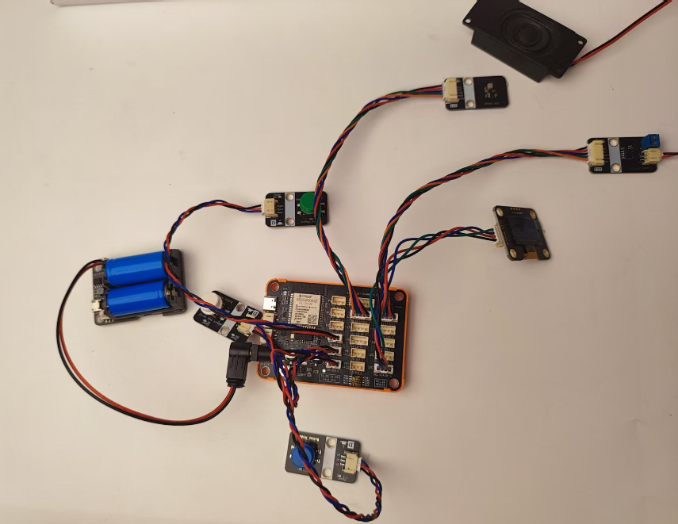

### 烧录固件

<a href="zh-cn/ph2.0_sensors/smart_module/esp32_ai_xiaozhi/flash_download_tool.zip" target="_blank">点击下载ESP32 Flash下载工具</a>

将下载后的文件进行解压后打开'flash_download_tool_3.9.8_6.exe'文件.

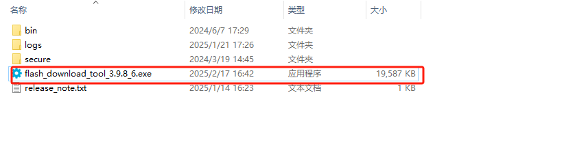

chip type选择ESP32，点击OK。

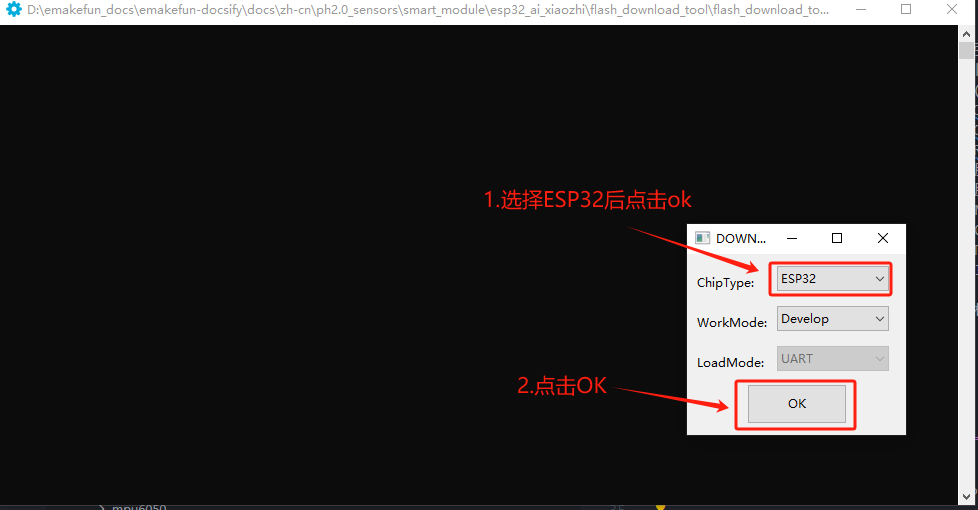

<a href="zh-cn/ph2.0_sensors/smart_module/esp32_ai_xiaozhi/nulllab_esp32_xiaozhi.bin" target="_blank">ESP32 AI小智聊天机器人模块固件</a>

选择刚刚下载的固件文件。

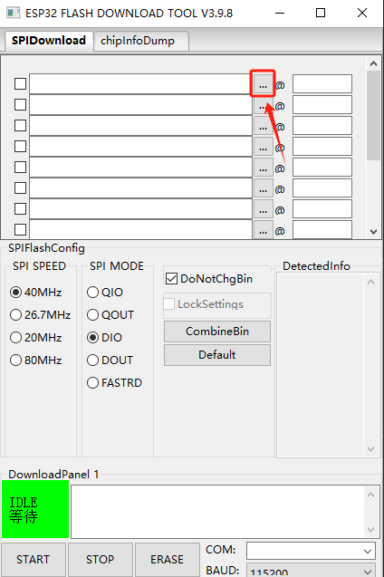

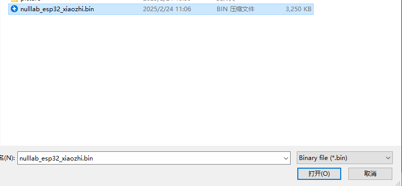

配置相关信息后勾选。

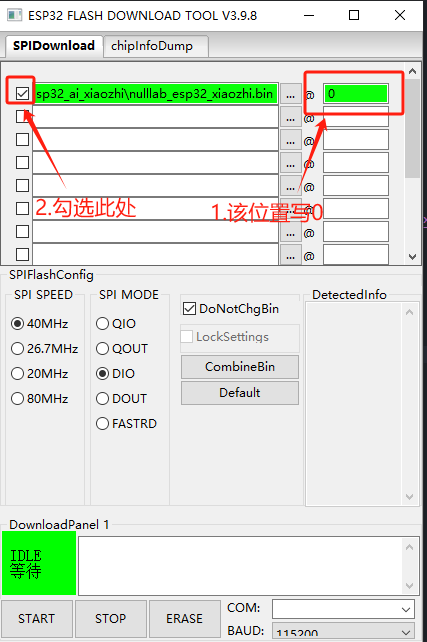

选择快速烧录模式。

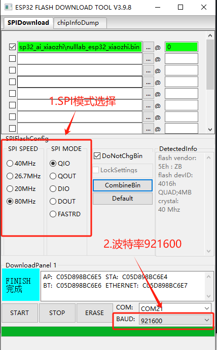

将主板通过type-C数据线连接电脑，选择相应COM口。

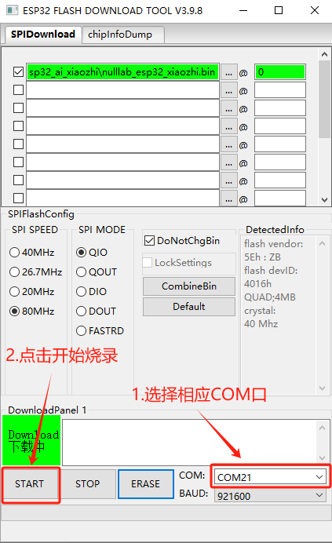

等待烧录完成。

### 网络配置

固件烧录完成后，按下esp32主板的Reset按键，进入配置模式。

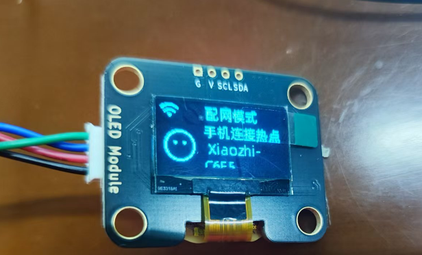

打开手机wifi,连接对应WiFi后，配置要连接的WIFI名称和密码。

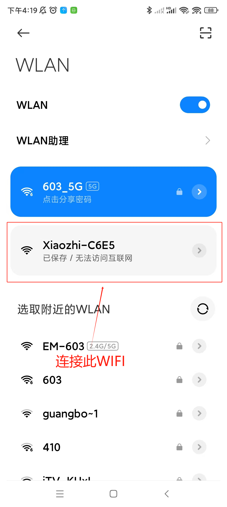

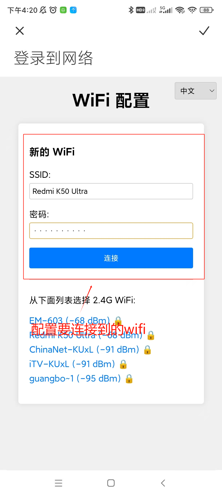

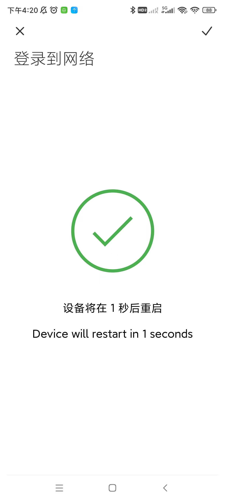

网络配置好后，去[小智AI平台](https://xiaozhi.me)进行激活

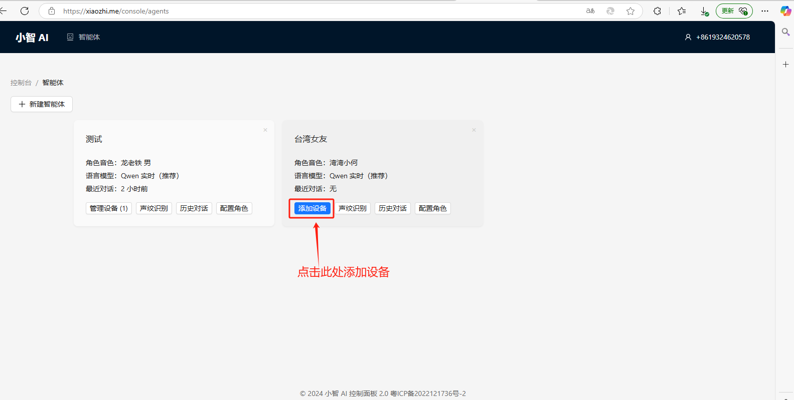

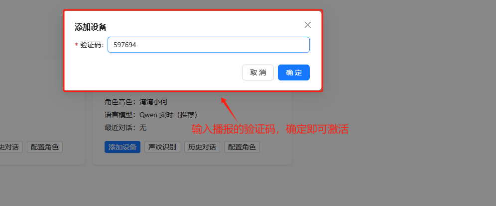

添加设备后，按下ESP32主板的Reset按键，进入语音交互模式。

### 语音交互

打开语音交互模式，按下语音按钮即GPIO口34处的按键，即可进行语音交互。

<a href="https://ccnphfhqs21z.feishu.cn/wiki/F5krwD16viZoF0kKkvDcrZNYnhb" target="_blank">更多信息可以参考小智 AI 聊天机器人百科全书</a>

## 源码

本项目为开源项目，你可以<a href="https://github.com/nulllab-org/xiaozhi-esp32/tree/nulllab_esp32" target="_blank">点击此处查看源码</a>
