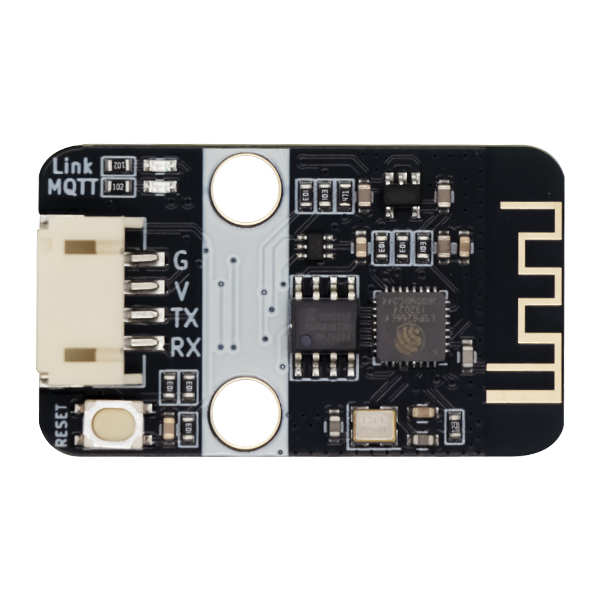
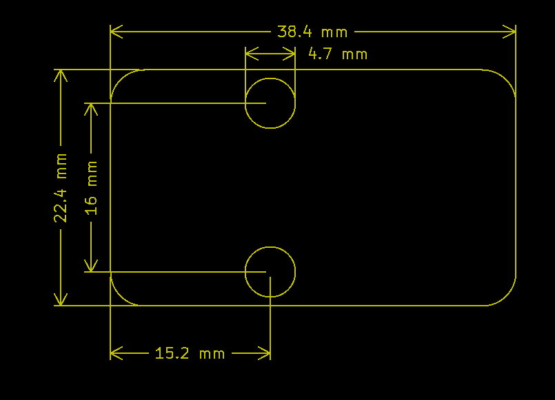
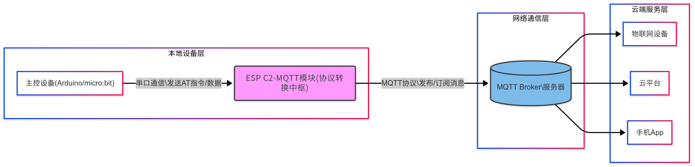

# ESP32 C2 MQTT 物联网无线模块

## 实物图

## 概述

esp32-c2-mqtt无线模块是emakefun公司基于乐鑫科技的wifi芯片ESP8684基础上重新研发的串口转wifi的物联网模块，该模块采用AT配置方式来支持wifi无线通信，AT指令全面兼容[乐鑫官方AT指令库](https://docs.espressif.com/projects/esp-at/zh_CN/latest/esp32c2/AT_Command_Set/)，全部封装成scratch，mixly，Makecode图形化编程块支持arduino，micro:bit。 总而言之，这个模块就像一个无线网卡，但它不仅仅能连接Wi-Fi，还能理解和使用物联网中常用的通信方式，让您的设备轻松接入互联网，实现**远程控制和数据交换**。

## 模块特点及参数

**特点**

- 内置低功率 32 位 CPU：可以兼作应用处理器

- 内置协议：TCP/IP 协议栈

- 加密类型：WPA WPA2/WPA2–PSK

- 支持乐鑫官方AT标准指令集

- 支持连接标准MQTT协议和TTL串口到无线的应用

**参数**

- 工作电压：5V

- 接口速率：115200 bps

- 无线频率：2.4GHz

- 接口类型：PH2.0-4Pin (G V TX RX)

- 无线模式：IEEE802.11b/g/n

- SRAM：160KB

- 外置Flash：4MB

- 支持低功耗：<240mA

- 模块尺寸：4 * 2.1cm

- 安装方式：M4螺钉螺母固定

- LED指示灯：**Link网络连接指示灯（该灯常亮表示Wifi连接成功）和MQTT服务器连接指示灯（该灯常亮表示MQTT连接成功）**

## 硬件接口

### 引脚说明

| 引脚名称  | 描述       |
| -------- | ---------- |
| G        | GND        |
| V        | 5V         |
| TX       | 串口发送端  |
| RX       | 串口接收端  |

### 机械尺寸图

## 功能说明

- **主控设备**通过串口：

发送AT指令配置模块（Wi-Fi/MQTT参数）

发送/接收传感器数据或控制指令

- **ESP32 C2-MQTT模块**：

执行AT指令配置网络连接

将串口数据转换为MQTT协议

作为双向通信枢纽，通过Wi-Fi连接MQTT Broker

- **MQTT Broker**：

接收模块发布的消息并转发给订阅者

将订阅的云端/设备消息转发给模块

- **物联网应用层**：

订阅设备数据主题

发布控制指令主题

进行数据存储/展示/分析

## AT 指令详解

### 指令类型

| 类型      | 指令格式      | 描述                                   |
| -------- | ------------- | -------------------------------------- |
| 测试指令  | AT+< x >=?    | 该命令用于查询设置指令的参数以及取值范围  |
| 查询指令  | AT+< x >?     | 该命令用于返回参数的当前值               |
| 设置指令  | AT+< x >=<…>  | 该命令用于设置用户自定义的参数值         |
| 执行指令  | AT+< x >      | 该命令用于执行受模块内部程序控制的功能    |

**注意：**

• 不是每条 AT 指令都具备上述 4 种类型的命令。

• [ ] 括号内为缺省值，不必填写或者可能不显示。

• 使⽤双引号表示字符串数据 "string"，例如：AT+CWSAP="ESP756290","21030826",1,4

• 默认波特率为 115200。

• AT 指令必须⼤写，并且以回⻋换⾏符结尾（CR LF）。

### 指令汇总

| 序号  | 指令                | 描述                                                  |
| --- | -------------------- | ----------------------------------------------------- |
| --- | AT+CWMODE=1          | 重置                                                  |
| 1   | AT+CWMODE=1          | 重置                                                  |
| 2   | AT+RST               | 复位                                                  |
| 3   | AT+CWJAP             | 连接wifi                                              |
| 4   | AT+CIPSTART          | 建立TCP连接丶创建UDP连接或SSL连接                       |
| 5   | AT+MQTTUSERCFG       | 配置 MQTT 用户属性                                     |
| 6   | AT+MQTTCONNCFG       | 配置 MQTT 连接属性                                     |
| 6   | AT+MQTTCONN          | 连接指定 MQTT broker                                   |
| 7   | AT+MQTTCONN          | 连接指定 MQTT broker                                   |
| 8   | AT+ALIYUN_MQTTCONN?  | 连接指定的阿里云MQTT broker                             |
| 9   | AT+MQTTPUB           | 在 LinkID上通过 topic 发布数据 data，data 为字符串消息   |
| 10  | AT+MQTTPUBRAW        | 在 LinkID 上通过 topic 发布数据 data，data 为二进制数据  |
| 11  | AT+MQTTSUB           | 订阅指定连接的 MQTT 主题, 可重复多次订阅不同 topic        |
| 12  | AT+MQTTUNSUB         | 取消订阅指定连接的 MQTT 主题, 可多次取消不同订阅 topic    |
| 13  | AT+MQTTCLEAN         | 关闭 MQTT Client 为 LinkID 的连接, 并释放内部占用的资源  |

### AT指令详解

#### AT+CWMODE=1  重置模块

| 指令：AT+CWMODE=1                         |
| ---------------------------------------- |
| **功能：**重置MQTT模块，对内部进行参数重置  |
| **响应：**OK或ERROR                       |

**举例：**AT+CWMODE=1

**结果：**将示例复制在串口发送后，串口返回  OK

#### AT+RST  复位

| 指令：AT+RST                  |
| ---------------------------- |
| **功能：**复位MQTT模块        |
| **响应：**固件版本信息或ERROR  |

**举例：**AT+RST

**结果：**将示例复制在串口发送后，串口返回 固件版本信息

#### AT+CWJAP="ssid","pwd"  连接Wifi

| 指令：AT+CWJAP="ssid","pwd"                                                    |
| ----------------------------------------------------------------------------- |
| **功能：**连接wifi                                                             |
| **响应：**OK（模块Link灯常亮表示连接WIFI）或ERROR（模块Link灯闪烁表示连接服务器）  |

| 代码  | 含义             | 举例      |
| ----- | --------------- | --------- |
| ssid  | 目标 AP 的 SSID  | Emakefun  |
| pwd   | 目标 AP 的密码   | 12345678  |

**举例：**AT+CWJAP_DEF="EmakeFun","12345678"

**结果：**将示例复制在串口发送后，串口返回  OK，同时Link灯常亮

#### AT+CIPSTART  建立TCP连接,创建UDP连接或SSL连接

默认为单连接

| 连接方式  | 指令                                                                        |
| -------- | --------------------------------------------------------------------------- |
| 单连接    | AT+CIPSTART="type","remote host",remote port,keep_alive,"local IP"          |
| 多连接    | AT+CIPSTART=link ID,"type","remote host",remote port,keep alive,"local IP"  |

| 代码           | 含义                                                        | 举例              |
| -------------- | ---------------------------------------------------------- | ----------------- |
| LinkID         | 网络连接 ID (0 ~ 4)，用于多连接的情况                         | 0                |
| "type"         | 字符串参数，表示网络连接类型，"TCP" 或 "TCPv6"。默认值："TCP"  | TCP               |
| "remote host"  | 字符串参数，表示远端 IPv4 地址、IPv6 地址，或域名              | 192.168.101.110  |
| remote port    | 远端端口值                                                  | 8000              |
| keep alive     | TCPkeep-alive间隔，默认值为0                                 | 0                |
| "local IP"     | 连接绑定的本机 IPv4 地址或 IPv6 地址，该参数在本地多网络接口时和本地多 IP 地址时非常有用。默认为禁用，如果您想使用，需自行设置，空值也为有效值  | 192.168.101.100  |

**举例：**AT+CIPSTART="TCP","iot.espressif.cn",8000

**结果：**将示例复制在串口发送后，串口返回  OK

#### AT+MQTTUSERCFG - 配置 MQTT 用户属性

| 指令：AT+MQTTUSERCFG=LinkID,scheme,"client_id","username","password",cert_key_ID,CA_ID,"path"  |
| --------------------------------------------------------------------------------------------- |
| **功能：**设置 MQTT 用户配置                                                                    |
| **响应：**OK（模块MQTT灯常亮）或ERROR（模块MQTT灯不亮）                                          |

| 代码         | 含义                                                     | 举例       |
| ------------ | ------------------------------------------------------- | ---------- |
| LinkID       | 当前只支持 0                                             | 0          |
| scheme       |                                                         | 1          |
| "client_id"  | 对应 MQTT client ID, 用于标志 client 身份, 最长 256 字节  | ESP8266    |
| "username"   | 用于登录 MQTT broker 的 用户名, 最长 64 字节              | kxmqttp1   |
| "password"   | 用于登录 MQTT broker 的 密码, 最长 64 字节                | public985  |
| cert_key_ID  | 证书 ID, 目前支持一套 cert 证书, 参数为 0                 | 0          |
| CA_ID        | CA ID, 目前支持一套 CA 证书, 参数为 0                     | 0          |
| "path"       | 资源路径, 最长 32 字节                                   |            |

**举例：**AT+MQTTUSERCFG=0,1,"ESP8266","kxmqttp1","public985",0,0,""

**结果：**将示例复制在串口发送后，串口返回  OK，模块MQTT灯常亮

#### **AT+MQTTCONNCFG - 配置 MQTT 连接属性**

| 指令：AT+MQTTCONNCFG=LinkID,keepalive,disable_clean_session,"lwt_topic","lwt_msg",lwt_qos,lwt_retain  |
| ----------------------------------------------------------------------------------------------------- |
| **功能：**设置 MQTT 连接配置                                                                           |
| **响应：**OK或ERROR                                                                                   |

| 代码                   | 含义                                                    | 举例      |
| ---------------------- | ------------------------------------------------------ | --------- |
| LinkID                 | 当前只支持 0                                            | 0         |
| keepalive              | MQTT PING 超时时间,范围为 [60, 7200], 单位为秒. 默认 120  | 120       |
| disable_clean_session  | MQTT 清理会话标志, 参数为 0 或 1, 默认为 0                | 0         |
| "lwt_topic"            | 主题 topic, 最长 64 字节                                 | Emakefun  |
| "lwt_msg"              | 主题 message, 最长 64 字节                               | 12345678  |
| lwt_qos                | 主题 QoS, 参数可选 0, 1, 2, 默认为 0                     | 0         |
| lwt_retain             | 主题 retain, 参数可选 0, 1, 默认为 0                     | 0         |

**举例：**AT+MQTTCONNCFG=0,120,0,topic,msg,0,0

**结果：**将示例复制在串口发送后，串口返回  OK

#### **AT+MQTTCONN - 连接服务器的IP地址**

| 指令：AT+MQTTCONN=LinkID,"host",port,reconnect  |
| ----------------------------------------------- |
| **功能：**连接指定 MQTT broker                   |
| **响应：**OK或ERROR                             |

| 代码       | 含义                           | 举例            |
| ---------- | ----------------------------- | --------------- |
| LinkID     | 当前只支持 0                   | 0               |
| "host"     | MQTT域名，IP地址               | 47.111.117.220  |
| port       | MQTT端口，一般情况下默认1833    | 1833            |
| reconnect  | 0 代表不重连MQTT，1 会一直重连  | 0               |

**举例：**AT+MQTTCONN=0,"47.111.117.220",1883,0

**结果：**将示例复制在串口发送后，串口返回  OK

#### **AT+ALIYUN_MQTTCONN?**

| 指令：AT+ALIYUN_MQTTCONN="host",port,"ProductKey","DeviceName","DeviceSecret"  |
| ------------------------------------------------------------------------------ |
| **功能：**连接指定的阿里云MQTT broker                                           |
| **响应：**OK或ERROR                                                            |

| 代码             | 含义                                                            | 举例          |
| --------------- | --------------------------------------------------------------- | ------------- |
| "host"          | 连接阿里云的MQTT broker 域名, 详情请参考阿里云域名格式              | 192.168.1.17  |
| port            | 连接 MQTT broker 端口, 最大 65535 默认 1883                       | 1883          |
| "ProductKey"    | 设备所属产品的ProductKey，即物联网平台为产品颁发的全局唯一标识符     | 0             |
| "DeviceName"    | 设备在产品内的唯一标识符。DeviceName与设备所属产品的ProductKey组合，作为设备标识，用来与物联网平台进行连接认证和通信。  | 0  |
| "DeviceSecret"  | 物联网平台为设备颁发的设备密钥，用于认证加密。需与DeviceName成对使用  |               |

**举例：**AT+MQTTCONN="192.168.1.17",1883,0,0,

**结果：**将示例复制在串口发送后，串口返回  OK

#### **AT+MQTTPUB**

| 指令：AT+MQTTPUB=LinkID,"topic","data",qos,retain                                                       |
| ------------------------------------------------------------------------------------------------------ |
| **功能：**在 LinkID上通过 topic 发布数据 data, 其中 data 为字符串消息, 若要发布二进制,请使用 AT+MQTTPUBRAW  |
| **响应：**OK或ERROR                                                                                     |

| 代码      | 含义                                                                       | 举例     |
| -------- | --------------------------------------------------------------------------- | ------- |
| LinkID   | 当前只支持 0                                                                 | 0       |
| "topic"  | 发布主题, 最长 64 字节                                                       | topic   |
| "data"   | 发布消息, data 不能包含 \0, 请确保整条 AT+MQTTPUB 不超过 AT 指令的最大长度限制  | test    |
| qos      | 发布服务质量, 参数可选 0,1,2, 默认为 0                                        | 0       |
| retain   | 发布 retain                                                                 | retain  |

**举例：**AT+MQTTPUB=0,"topic","test",0,retain

**结果：**将示例复制在串口发送后，串口返回  OK

#### **AT+MQTTPUBRAW**

| 指令：AT+MQTTPUBRAW=LinkID,"topic",length,qos,retain                                    |
| --------------------------------------------------------------------------------------- |
| **功能：**在 LinkID 上通过 topic 发布数据 data, 其中 data 为二进制数据                     |
| **响应：**OK或ERROR,等待用户输入 length 大小数据, 之后响应如下:+MQTTPUB:FAIL或+MQTTPUB:OK  |

| 代码      | 含义                                  | 举例    |
| -------- | ---------------------------------- -- | ------- |
| LinkID   | 当前只支持 0                           | 0       |
| "topic"  | 发布主题, 最长 64 字节                 | topic   |
| length   | 要发布消息长度, 长度受限于当前可用内存   | 2       |
| qos      | 发布服务质量, 参数可选 0,1,2, 默认为 0  | 0       |
| retain   | 发布 retain                           | retain  |

**举例：**AT+MQTTPUBRAW=0,"topic",2,0,retain

**结果：**将示例复制在串口发送后，串口返回  OK

#### **AT+MQTTSUB**

| 指令：AT+MQTTSUB=LinkID,"topic",qos                                                                                                                                                                      |
| ------------------------------------------------------------------------------------------------------------------------------------------------------------------------------------------------------- |
| **功能：**订阅指定连接的 MQTT 主题, 可重复多次订阅不同 topic                                                                                                                                                |
| **响应：**OK或ERROR，当收到对应主题订阅的 MQTT 消息时, 将按照如下格式打印消息内容+MQTTSUBRECV:LinkID,"topic",data_length,data  如果订阅已订阅过的主题, 仍无条件向 MQTT broker 订阅, Log 口打印 ALREADY SUBSCRIBE  |

| 代码     | 含义                                  | 举例   |
| -------- | ------------------------------------ | ------ |
| LinkID   | 当前只支持 0                          | 0      |
| "topic"  | 订阅主题, 最长 64 字节                 | topic  |
| qos      | 订阅服务质量, 参数可选 0,1,2, 默认为 0  | 0      |

**举例：**AT+MQTTSUB=0,"topic",0

**结果：**将示例复制在串口发送后，串口返回  OK

#### **AT+MQTTUNSUB**

| 指令：AT+MQTTUNSUB=LinkID,"topic"                              |
| ------------------------------------------------------------- |
| **功能：**取消订阅指定连接的 MQTT 主题, 可多次取消不同订阅 topic  |
| **响应：**OK或ERROR                                           |

| 代码      | 含义                  | 举例    |
| -------- | --------------------- | ------- |
| LinkID   | 当前只支持 0           | 0       |
| "topic"  | 订阅主题, 最长 64 字节  | topic  |

**举例：**AT+MQTTUNSUB=0,"topic"

**结果：**将示例复制在串口发送后，串口返回  OK

#### **AT+MQTTCLEAN**

| 指令：AT+MQTTCLEAN=LinkID                                        |
| --------------------------------------------------------------- |
| **功能：**关闭 MQTT Client 为 LinkID 的连接, 并释放内部占用的资源  |
| **响应：**OK或ERROR                                             |

| 代码    | 含义          | 举例  |
| ------- | ------------ | ----- |
| LinkID  | 当前只支持 0  | 0     |

**举例：**AT+MQTTCLEAN=0

**结果：**将示例复制在串口发送后，串口返回  OK

## Arduino示例程序

<a href="https://gh-proxy.com/https://github.com/emakefun-arduino-library/em_esp_at/archive/refs/tags/v1.0.1.zip" download>点击下载Arduino示例程序</a>

## MicroPython示例程序

<a href="https://gh-proxy.com/https://github.com/emakefun-microbit-micropython-lib/em_microbit_mpy_esp_at/archive/refs/tags/v1.0.1.zip" download>点击下载micro:bit MicroPython示例程序</a>

## micro:bit MakeCode示例程序

Makecode扩展链接：<https://github.com/emakefun-makecode-extensions/emakefun_esp_at>

<a href="https://github.com/emakefun-makecode-extensions/emakefun_esp_at" target="_blank">点击查看用户库</a>

<a href="https://makecode.microbit.org/S28290-28560-10741-59870" target="_blank">点击查看示例程序</a>
