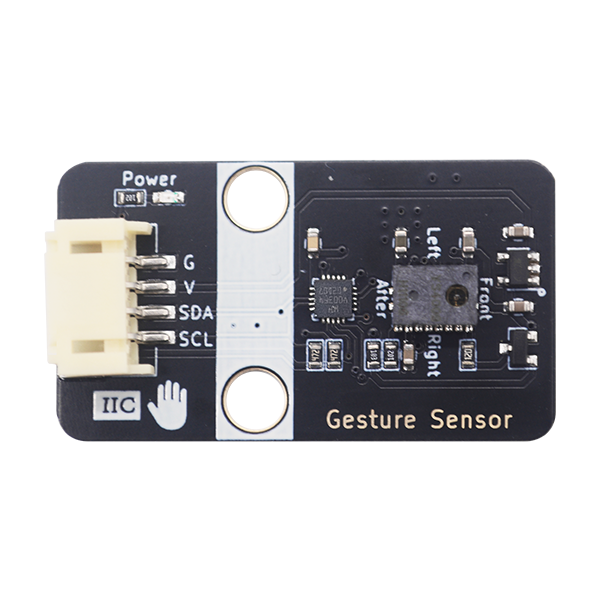

# GS20手势识别传感器

## 模块实物图

## 概述

该模块集成了YS4009专用手势识别传感器，它内部集成图像传感器，DSP处理，MCU控制单元。采用红外成像的原理实现隔空手势识别，使用高性能 RISC CPU，通过内部实时高速的手势采集与运算处理，实现了手势的快速检测识别、信号输出指示，产品可应用于人工智能、工业控制、医疗设备、消费电子、智能穿戴、智能家居、仪器仪表、汽车电子、虚拟现实等领域。

### 尺寸图

待补充

## 模块参数

- 工作电压 5V

- I2C通讯协议，I2C默认地址为0x39

- 隔空手势操作感应距离可达 25cm，特殊应用可达 35cm

- 手势识别率可达到 98%以上

- 待机功耗低、检测灵敏度高、响应速度快

- 支持前移、后移、左移、右移、上移、下移、悬停、单击、挥动等多种隔空手势操作

## 功能说明

当手在平行于手势装置正上方的平面运动时，可以识别出手势移动的方向

- 前移
- 后移
- 左移
- 右移

当手在垂直于手势装置的方向运动时，可以识别出手势接近的动作状态

- 上拉
- 下压
- 离开感应区
- 悬停

### **注意**

- 模组有效操作距离为 25cm 左右，在做下压动作时，刚开始停留动作应该距离模组高一些；在做上拉动作时，刚开始停留动作应该距离模组低一些。
- 上拉动作：手从较低位置进入模组感应区悬停 200ms 以上，使模组捕捉到手的初始位置，再将手向上移动到较高位置（不能离开模组感应区），此时触发上移动作。
- 下压动作：手从较高位置进入模组感应区悬停 200ms 以上，使模组捕捉到手的初始位置，再将手向下移动到较低位置，此时触发下压动作。
- 上电 300ms 内模组感应区不要有东西阻挡，如果需要在模组上面加亚克力板使用，请将亚克力板盖上再上电使用。

## 模块测试

### 接线

| Arduino Uno | GS20 |
| ----------- | ---- |
| VCC         | VCC  |
| GND         | GND  |
| A5          | SCL  |
| A4          | SDA  |

即将手势识别模块插入I2C接口即可。

### 测试

Arduino 程序示例说明以及下载链接如下：

- Arduino库和示例程序：[点击此处链接下载](zh-cn/ph2.0_sensors/smart_module/gesture_recognizer/emakefun_gesture_recognizer-latest.zip ':ignore')

- 主类和接口说明：[点击此处链接查看](https://emakefun-arduino-library.github.io/emakefun_gesture_recognizer/classemakefun_1_1_gesture_recognizer.html)

- 识别手势并打印：[点击此处链接查看](https://emakefun-arduino-library.github.io/emakefun_gesture_recognizer/get_gesture_8ino-example.html)

下载好上述的Arduino库，打开Arduino IDE，点击项目->导入库->添加.ZIP库，选择下载好的库文件，点击打开，然后点击确定。

等待库文件安装完即可。

选择主板型号，比如我的是Arduino Uno，然后点击确定。

#### 打开示例程序

打开Arduino IDE，点击文件->示例->Emakefun Gesture Recognizer->get_gesture然后点击打开。

选择COM口，然后点击上传。

打开串口监视器，选择波特率为115200.

可以从串口监视器观察到，对传感器做不同手势会输出不同的数据。

## Mixly示例程序

[点击此处下载Mixly库以及示例程序](zh-cn/ph2.0_sensors/smart_module/gesture_recognizer/gesture_recognizer_8_8_matrix_mixly.zip ':ignore')

## MicroPython示例程序

[点击此处下载ESP32 MicroPython库以及示例程序](zh-cn/ph2.0_sensors/smart_module/gesture_recognizer/gesture_recognizer_esp32_micropython.zip ':ignore')

[点击此处下载micro:bit MicroPython库以及示例程序](zh-cn/ph2.0_sensors/smart_module/gesture_recognizer/gesture_recognizer_microbit_micropython.zip ':ignore')

## micro:bit MakeCode示例程序

MakeCode用户库链接: <https://github.com/emakefun-makecode-extensions/emakefun_gesture_recognizer>

- 示例程序: 识别手势并显示图标和串口打印 [点击此处链接查看](https://makecode.microbit.org/_8wKYfX8z6KJA)
