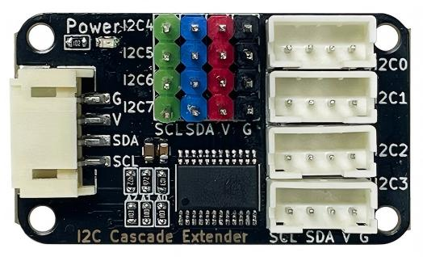
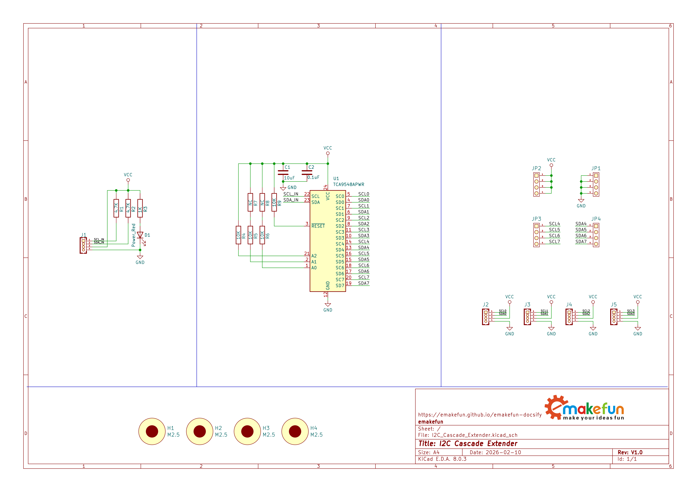
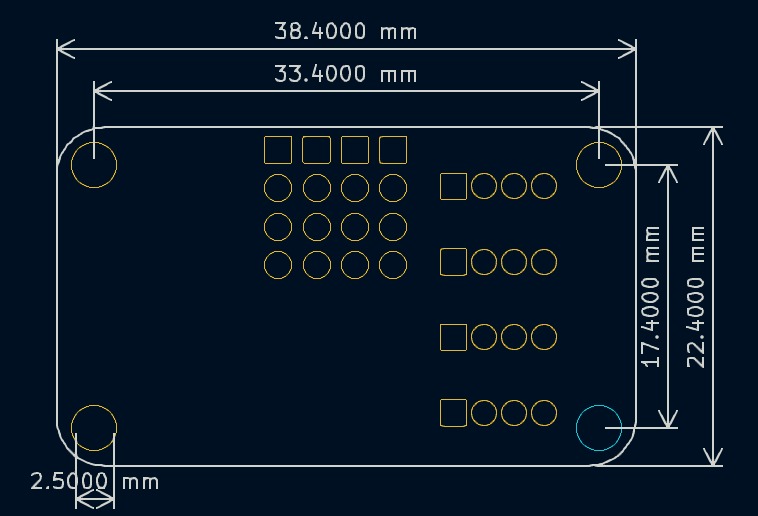
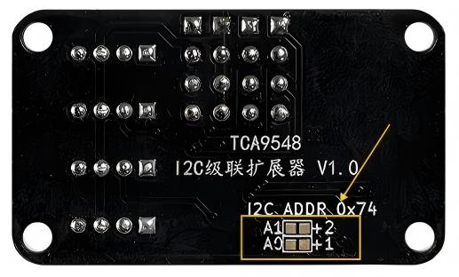
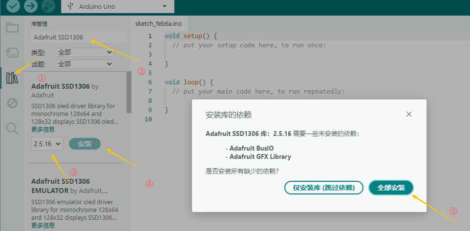
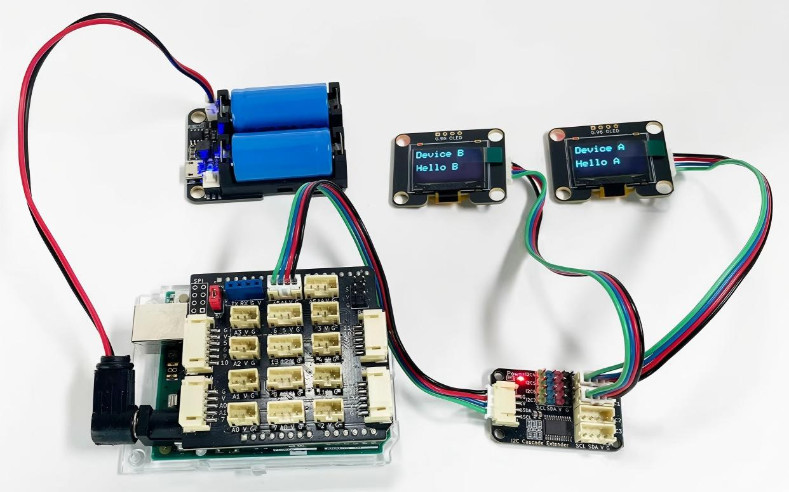

# I2C级联扩展器

## 实物图



## 概述

I2C级联扩展器是一款专门用于解决I2C总线设备地址冲突的扩展模块。它内置多路复用开关，能够将一个I2C主机端口扩展为8个独立的I2C子通道（4个PH2.0接口和4个排针接口）。通过该模块，用户可以将多个地址相同的I2C传感器或设备（如OLED显示屏等）连接到同一个主板的I2C总线上，并实现分别寻址与通信，完美解决了固定地址I2C器件无法并联使用的难题。

模块采用PH2.0防反接接口，即插即用，无需焊接。其默认I2C地址为0x74，并可通过模块背部的地址配置接触点在0x74至0x77范围内调整I2C地址，极大地扩展了系统的传感器接入能力，非常适合机器人、环境监测、多传感器数据采集等需要大量同类型I2C设备的项目。

>注意：若仅需扩展物理接口数量（如主控板I2C接口不足），而非解决地址冲突，则可选用[I2C-IO扩展模块](zh-cn/ph2.0_sensors/smart_module/gpio_expansion_board/gpio_expansion_board.md)。

## 原理图



<a href="zh-cn/ph2.0_sensors/smart_module/i2c_cascade_extender/resource/i2c_cascade_extender.pdf" target="_blank">点击此处查看原理图</a>

## 模块参数

- 工作电压：3.3V ~ 5.0V

- 接 口：PH2.0间距接口、排针接口

- 扩展端口数量：4个PH2.0接口(0-3通道)和4个排针接口(4-7通道)（共8通道）

- 通信协议：I2C

- 默认I2C地址：0x74

- 可配置I2C地址范围：0x74 ~ 0x77 (通过背部地址配置接触点A1/A0设置)

- I2C速率：支持标准模式（100kHz）和快速模式（400kHz）

- 连接方式：PH2.0 4PIN防反接杜邦线

- 尺 寸：38.4*30.4mm，兼容乐高积木和M4螺丝固定孔

| 引脚名称  | 描述        |
| -------- | ----------- |
| G        | GND地线      |
| V        | 5v电源引脚   |
| SDA      | I2C数据引脚  |
| SCL      | I2C时钟引脚  |

## 机械尺寸图



## I2C地址调整

模块通过背部的地址配置接触点来调整I2C地址，有两组接触点，分别标记为A0和A1。用于临时设置模块自身的I2C地址。这是一种通过短接相应的接触点才能生效的配置方式。

### 配置方法与地址对应关系

| 短接触点组合        | I2C 地址         | 说明                    |
| ------------------ | --------------- | ----------------------- |
| 不短接任何触点      | **0x74 (默认)**  | 松开所有触点时的默认地址  |
| 只短接 A0          | 0x75             | 短接A0触点期间有效       |
| 只短接 A1          | 0x76             | 短接A1触点期间有效       |
| 同时短接 A0 和 A1  | 0x77             | 同时短接两个触点期间有效  |

### 重要特性说明

1. 瞬态配置：地址改变仅在短接触点期间生效。一旦松开，地址立即恢复为默认的0x74。
2. 地址范围：地址仅能在0x74-0x77范围内调整，无法设置为更低地址或更高地址。
3. 短接操作：必须确保短接触点的两个口，I2C地址才会有变化。

### 使用示例

如果您需要让模块使用地址0x75，您需要按照如下说明进行操作：

1. 找到模块背部的**A0触点**
2. 用工具短接**A0触点**
3. 在短接期间，模块地址会变为**0x75**
4. 主机此时可以与地址**0x75**进行通信
5. 松开**A0触点**后，地址会恢复为**0x74**



## 工作原理

I2C级联扩展器的核心是一颗I2C多路复用器芯片。主机通过I2C总线向扩展器发送一个控制字节，其低3位（0-7）用于选择接通对应的物理通道，同时断开其他所有通道。

### 多路复用机制

- 模块内部包含一个包含一个I2C多路复用器芯片。
- 主机通过I2C总线发送通道选择指令到扩展器的地址。
- 扩展器收到指令后，接通对应的物理通道。
- 主机随后可与该通道上的设备通信，其他通道处于断开状态。

### 地址冲突解决原理

传统I2C总线系统中，当多个设备具有相同地址时，主控无法区分它们，导致通信冲突。I2C级联扩展器通过在物理层面创建独立通道，从本质上解决了这一问题。

**工作原理如下**：

主机首先与扩展器本身通信，发送选择特定通道的指令。扩展器接收到指令后，内部的多路复用开关将对应通道与主机总线接通，同时断开其他所有通道。此时，主机总线只与被选通道上的设备物理连接，可以正常通信而不会受到其他通道上地址相同设备的干扰。

例如，假设有四个地址都是0x3C的OLED显示屏，分别连接到扩展器的四个通道。当主机需要与第一个显示屏通信时，先向扩展器（地址0x74）发送"选择通道0"的指令，接通通道0，断开其他通道，然后向地址0x3C发送数据，此时只有通道0上的显示屏会响应。完成通信后，主机可以选择通道1，再与第二个显示屏通信，依此类推。

这种分时复用机制使多个地址相同的设备可以共享同一I2C总线，而不会相互干扰。

>注意：同一时刻只能有一个通道处于激活状态。

```text
主机 (Master)
   │
   └── I2C级联扩展器 (地址: 0x74)
         ├── 通道0 ── 设备A (地址: 0x3C)
         ├── 通道1 ── 设备B (地址: 0x3C)  ← 相同地址
         ├── 通道2 ── 设备C (地址: 0x3C)  ← 相同地址
         └── 通道3 ── 设备D (地址: 0x3C)  ← 相同地址
```

## Arduino 使用示例

本示例以两块OLED显示屏为例来演示如何使用这个模块。

本例中采用的OLED显示屏，I2C地址是固定的，因此这两块OLED屏幕不能直接同时直接连接到同一个主板上使用。但通过I2C级联扩展器的转接，主控板的一个I2C口就能正常的同时使用这2块OLED显示屏了。

### 硬件准备

- Arduino uno开发版

- I2C级联扩展器

- OLED显示屏 x2

- PH2.0 4PIN防反接杜邦线若干

#### 接线

| I2C级联扩展器  | Arduino开发板  |
| ------------- | ------------- |
| G             | GND           |
| V             | V             |
| SDA           | A4            |
| SCL           | A5            |

| OLED显示屏   | I2C级联扩展器  |
| ------------ | ------------- |
| OLED显示屏1  | I2C0          |
| OLED显示屏2  | I2C1          |

### 示例程序

```c++
#include <Adafruit_GFX.h>
#include <Adafruit_SSD1306.h>
#include <Wire.h>

#include "DFRobot_I2C_Multiplexer.h"

namespace {

constexpr uint8_t kScreenWidth = 128;
constexpr uint8_t kScreenHeight = 64;

Adafruit_SSD1306 g_oled_display(kScreenWidth, kScreenHeight, &Wire);
DFRobot_I2C_Multiplexer g_i2c_multi(&Wire, 0x74);
}  // namespace

void setup(void) {
  Serial.begin(115200);

  g_i2c_multi.begin();

  g_i2c_multi.selectPort(0);

  if (!g_oled_display.begin(SSD1306_SWITCHCAPVCC, 0x3C)) {
    Serial.println("Error: Port 0, SSD1306 初始化失败！");
    while (true);
  }
  g_oled_display.clearDisplay();
  g_oled_display.setTextSize(2);
  g_oled_display.setTextColor(SSD1306_WHITE);
  g_oled_display.setCursor(0, 0);
  g_oled_display.println("Device A");
  g_oled_display.setCursor(0, 30);
  g_oled_display.println("Hello A");
  g_oled_display.display();
  delay(10);

  g_i2c_multi.selectPort(1);
  if (!g_oled_display.begin(SSD1306_SWITCHCAPVCC, 0x3C)) {
    Serial.println("Error: Port 1, SSD1306 初始化失败！");
    while (true);
  }
  g_oled_display.clearDisplay();
  g_oled_display.setTextSize(2);
  g_oled_display.setTextColor(SSD1306_WHITE);
  g_oled_display.setCursor(0, 0);
  g_oled_display.println("Device B");
  g_oled_display.setCursor(0, 30);
  g_oled_display.println("Hello B");
  g_oled_display.display();
}

void loop(void) {
}
```

### 依赖库安装

- 安装**Adafruit SSD1306** by Adafruitby，版本**2.5.16**。
- 安装**DFRobot_I2C_Multiplexer** by DFRobot，版本**1.0.2**。

安装步骤，以安装**Adafruit SSD1306**  by Adafruitby为例：

1. 启动Arduino IDE
2. 点击打开库管理
3. 输入并搜索"Adafruit SSD1306"
4. 在结果中找到 "**Adafruit SSD1306** by Adafruit"
5. 选择**2.5.16**版本
6. 点击"安装"按钮
7. 在弹出的弹窗中，点击"全部安装"按钮
8. 等待安装完成



### 示例显示效果

将示例程序烧录到主板之后，给主板通电，等待几秒后，可以看到两个OLED显示屏上会显示不同的内容，OLED显示屏1上显示"Device A  Hello A"的字样，而OLED显示屏2上显示"Device B  Hello B"的字样，如下图


