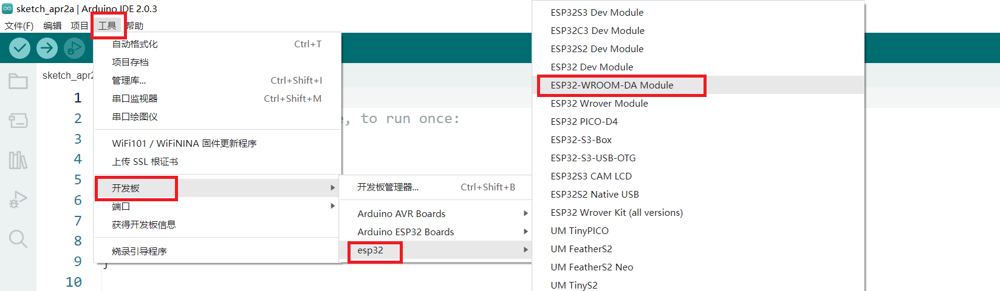
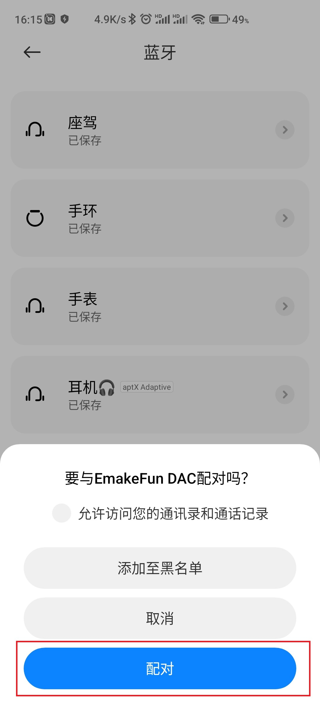

# I2S音频放大器模块

## 实物图

## 概述

​	NS4168是一款支持I2S数字音频信号输入，输出具有防失真功能，2.5W单声道D 类音频功放模块，特别适合对功耗和抗干扰要求高的便携式音频设备。比如蓝牙音响，wifi音响，平板电脑，而本模块主要是介绍如何在ESP32系类主控上如何使用。

## 主要特性

- I2S串行数字音频输入接口
- 支持宽范围采样速率：8kHz~96kHz
- 自动采样率检测，自适应功能
- 内置数字高通滤波器，一线脉冲设置其转折点
- 左右声道可选，通过CTRL管脚电平设置
- 防失真NCN功能，  
- 无需滤波器的Class D放大器
- 输出功率：2.5W(VDD=5V, RL=4Ω)
- 工作电压范围：3.0V～5.5V
- 0.2%THD（VDD=5V, RL=4Ω, Po=1W）
- 80%的效率(VDD=5V, RL=4Ω, Po=2.5W)
- 优异的“上电，掉电”噪声抑制
- 过流保护、过热保护、欠压保护
- eSOP8封装

## 原理图

<a href="zh-cn/ph2.0_sensors/smart_module/i2s_audio_amplifier_module/NS4168_SCH.pdf" target="_blank">点击此处查看原理图</a>

## 芯片规格书

<a href="zh-cn/ph2.0_sensors/smart_module/i2s_audio_amplifier_module/NS4168_datasheet.pdf" target="_blank">点击查看NS4168规格书</a>

## 使用示例

[点击查看本模块搭配I2S麦克风模块的示例](zh-cn/ph2.0_sensors/smart_module/i2s_mems_mic/i2s_mems_mic.md#Arduino使用示例)

## 蓝牙音响实验

示例接线图：

| ESP32 | NS468 |
| ----- | -------- |
| 3.3V  | VCC      |
| GND   | GND      |
| IO33 | BCLK      |
| IO32 | LRCLK     |
| IO23 | DIN      |

<a href="zh-cn/ph2.0_sensors/smart_module/i2s_audio_amplifier_module/ESP32-A2DP.zip" download>点击出下载示例代码以及zip库文件</a>

在本次实验中，我们在Arduino IDE中运行。

在编写程序之前，先选择相应主板型号。

在上传此程序之前，需要先导入相关库文件，步骤如下：

更新库文件后，打开示例程序'bt_music_receiver_arduino_i2s',如下图所示：

再按如下选择内存选项以免编译时报内存溢出错误。

编译成功后，烧写到开发板上。

### 实验结果

上传示例程序后，打开手机蓝牙设置（电脑蓝牙设置），搜索周围蓝牙设备，例如本实验中设备名称为“MyMusic”，点击连接配对，配对成功后，即可外放音频，达到蓝牙音响的效果。

|  |  |  |
| ---------------------- | ---------------------- | ---------------------- |
|                        |                        |                        |
