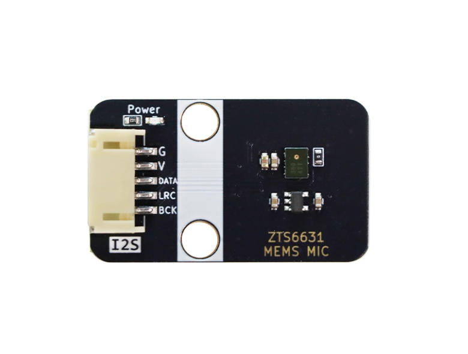
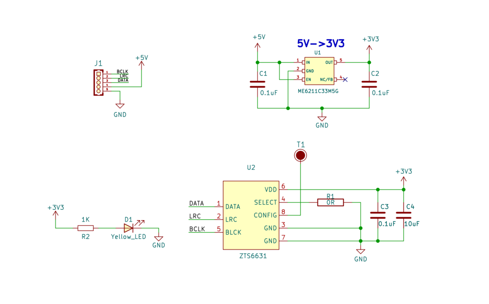
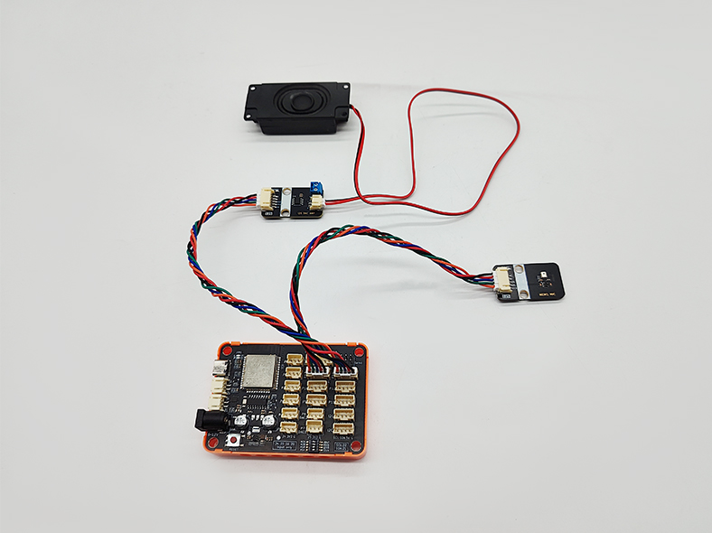
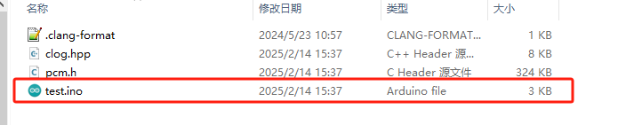

# I2S MEMS麦克风模块

## 实物图

## 概述

该款MEMS数字I2S麦克风模块是以MSM261S4030H0声音传感器为核心，内置一个对声音敏感的电容式驻极体话筒。声波使话筒内的驻极体薄膜振动导致电容的变化，而产生与之对应变化的微小电压。这一电压随后被转化成0-5V的电压，经过A/D转换被数据采集器接收通过I2S协议和主控通讯。

该模块不仅具有小巧的体积，还具有高灵敏度和低噪音特性，非常适合用于各种需要高质量音频输入的应用场景。结合ESP32等主控设备的强大处理能力，用户可以轻松实现语音识别、录音、AI学习等功能。

## 原理图

[原理图点击此处查看](zh-cn/ph2.0_sensors/smart_module/i2s_mems_mic/MSM261S4030H0_MEMS_MIC.pdf ':ignore')

## 芯片规格书

[点击查看I2S麦克风规格书](zh-cn/ph2.0_sensors/smart_module/i2s_mems_mic/MSM261S4030H0.pdf ':ignore')

## 模块参数

- 工作电压：3.3~5V
- 麦克风封装工艺：MEMS
- 方向性：全向 顶进音
- 数据接口：I2S
- 灵敏度：-26dB
- 声压等级：124dB
- 信噪比：61dB

## ESP32 Arduino 使用示例

### 接线图

[I2S音频放大模块使用说明点击此处查看](zh-cn/ph2.0_sensors/smart_module/i2s_audio_amplifier_module/i2s_audio_amplifier_module.md)

|       名称        | 数量 |
| :---------------: | :--: |
|  ESP32-IOT_BOARD  |  1   |
| I2S音频放大器模块 |  1   |
|   I2S麦克风模块   |  1   |
|     喇叭模块      |  1   |
|  5PinPH2.0杜邦线  |  2   |
|    TypeC数据线    |  1   |

| 麦克风模块 | ESP32 |
| ---------- | ----- |
| SD         | 27    |
| WS         | 26    |
| SCK        | 25    |

| 音频放大器模块 | ESP32 |
| -------------- | ----- |
| BCLK           | 33    |
| LRLCK          | 32    |
| DIN            | 23    |

### ESP32 Arduino使用示例

[点击下载ESP32的Arduino示例代码](zh-cn/ph2.0_sensors/smart_module/i2s_mems_mic/esp32_i2s_rw.zip ':ignore')

下载后解压打开test.ino文件，通过ArduinoIDE上传到ESP32主板中。

上传后，对准麦克风说话，即可在喇叭模块上实时听到麦克风录制的声音。
