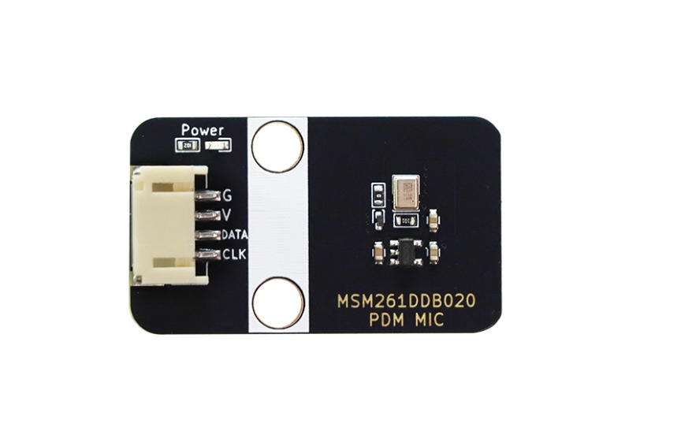
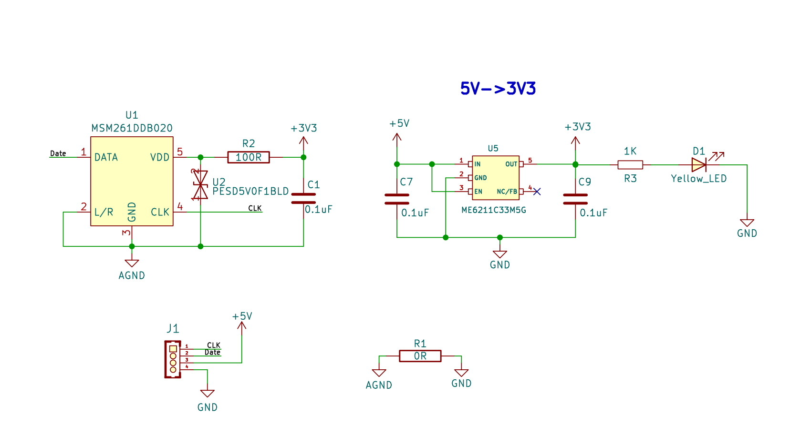

# PDM数字麦克风模块

## 实物图

## 概述

​	该PDM数字麦克风模块是以MSM261DDB020声音传感器为核心，内置一个对声音敏感的电容式驻极体话筒。声波使话筒内的驻极体薄膜振动导致电容的变化，而产生与之对应变化的微小电压。这一电压随后被转化成0-3.3V的电压，经过A/D转换被数据采集器接收通过2线I2S接口和主控通讯，数据格式为PDM。
该模块不仅具有小巧的体积，还具有高灵敏度和低噪音特性，非常适合用于各种需要高质量音频输入的应用场景。结合ESP32等主控设备的强大处理能力，用户可以轻松实现语音识别、录音、AI学习等功能。

## 原理图

<a href="zh-cn/ph2.0_sensors/smart_module/pdm_mic/MSM261DDB020_PDM_MIC_SCH.pdf" target="_blank">原理图点击此处查看</a>

## 芯片规格书

<a href="zh-cn/ph2.0_sensors/smart_module/pdm_mic/MSM261DDB020_datasheet Rev1.1.pdf" target="_blank">点击查看PDM麦克风规格书</a>

## 模块参数

- 工作电压：模块为3.3~5V，芯片工作电压（1.6V-3.6V)
- 麦克风封装工艺：MEMS
- 方向性：全向 背进音
- 数据接口：PDM
- 灵敏度：-26dBFS
- 声压等级：140dB SPL
- 信噪比：64dB
- 尺寸：38.4mmx22.4mm 重量3.6g

## ESP32 Arduino 使用示例

测试PDM麦克风的时候需要搭配一个I2S音频放大器才可以完成测试

[I2S音频放大模块使用说明点击此处查看](zh-cn/ph2.0_sensors/smart_module/i2s_audio_amplifier_module/i2s_audio_amplifier_module.md)

|        名称         | 数量 |
| :-----------------: | :--: |
|   ESP32 IOT BOARD   |  1   |
|  I2S音频放大器模块  |  1   |
|    PDM麦克风模块    |  1   |
|  PH2.0接口喇叭模块  |  1   |
| 5Pin双头PH2.0杜邦线 |  1   |
| 4Pin双头PH2.0杜邦线 |  1   |
|     TypeC数据线     |  1   |

### 接线如下

| PDM麦克风模块 | ESP32 |
| ------------- | ----- |
| DATA          | 13    |
| CLK           | 12    |

| 音频放大器模块 | ESP32 |
| -------------- | ----- |
| BCLK           | 33    |
| LRCLK          | 32    |
| DIN            | 23    |

### ESP32 Arduino使用示例

<a href="zh-cn/ph2.0_sensors/smart_module/pdm_mic/esp32_i2s_rw_pdm.zip" download>点击下载ESP32的Arduino示例代码</a>

下载后解压用ArduinoIDE打开esp32_i2s_rw_pdm.ino文件，主板选择ESP32，通过ArduinoIDE上传。

测试现象：

1、上传成功后，首先会听到喇叭播放“易创空间”；

2、对准麦克风说话，即可在喇叭模块上实时听到麦克风录制的声音。