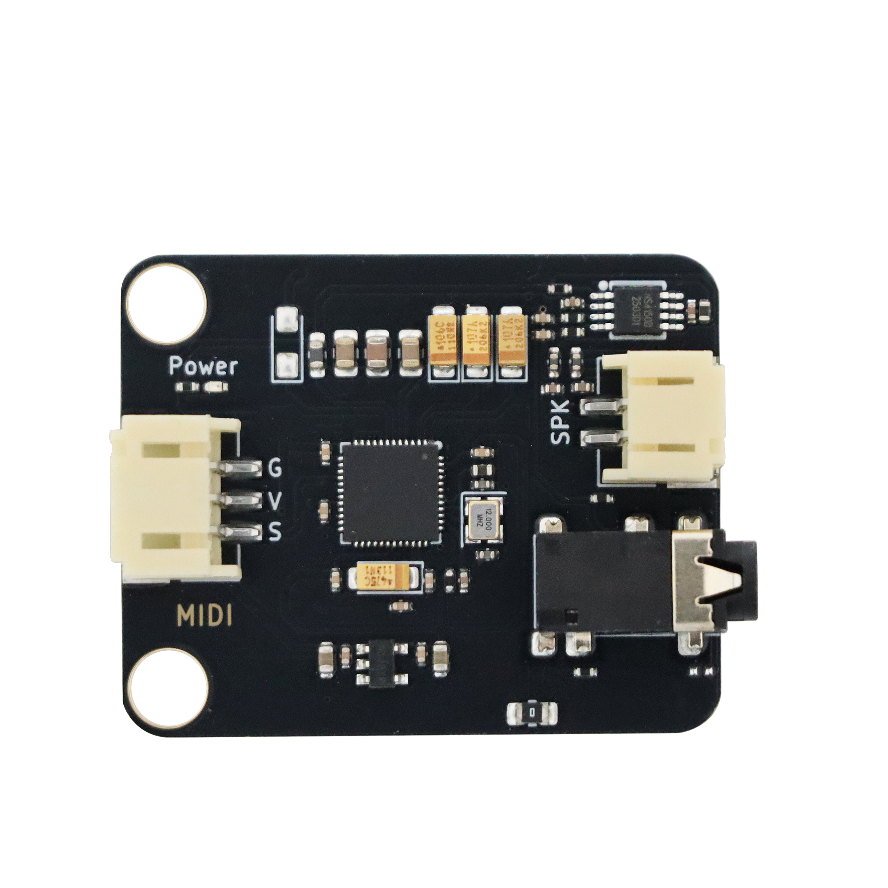

# SAM2695 MIDI音源模块

## 实物图

## 概述

SAM2695 MIDI音源模块是一款基于General MIDI 2.0标准的专业音频合成模块，具备完整的MIDI音频处理与输出能力。该模块内置丰富的波表音色库，包含128种通用MIDI音色和128种扩展音色，以及数十种专业打击乐音色。

该模块支持**16个独立MIDI通道**，其中**通道9**专用于专业打击乐音色，可实现复杂的多通道音乐编排。在音频处理方面，模块最大支持64声部同时播放（无效果器模式）或38声部带效果器播放，具备32复音处理能力，保证流畅的多音部演奏效果。

模块集成专业级音效处理系统，内置四段参数均衡器、多种混响与合唱效果，并配备立体声音频功放，可直接通过耳机或喇叭播放。通过串行接口输入标准MIDI信号，即可输出高保真立体声音频。

该模块兼容Arduino、micro:bit、ESP32等主流控制器，适用于电子乐器设计、教育编程套件及各类嵌入式音频系统等应用场景，为嵌入式音乐应用提供完整的音频解决方案。

**注意：使用耳机播放时，有些类型的耳机不适用于该模块，可能会导致播放出现问题，建议使用 4段式插头耳机。**

## 模块参数

- 波 特 率：31.25×( 1±0.01) Kbaud

- 工作电压：5V

- 接 口：PH2.0间距接口

- 连接方式：PH2.0 3PIN防反接连接线

- 尺 寸：40*32mm，兼容乐高积木和M4螺丝固定孔

| 引脚名称  | 描述         |
| -------- | ------------ |
| G        | GND地线       |
| V        | 电源引脚    |
| S        | 信号引脚   |

## 机械尺寸图

## 功能概述

### 通道特性

模块采用多通道合成器架构，具有16个独立的MIDI通道（0-15，其中通道9是打击乐节奏通道）。每个通道可独立配置乐器音色、音量、声相和各种音效参数，实现复杂的多声部音乐编排。

通道分配特性：

- 通道0-8, 10-15：旋律乐器通道

- 通道9：专用打击乐通道，支持多种鼓组音色集

- 所有通道支持实时音色切换和参数控制

### 音频合成特性

#### 音色库系统

模块内置两个完整的音色库以及通道9专用的打击乐音色库：

- 标准GM音色库(Bank 0)：128种通用MIDI乐器音色

- 扩展音色库(Bank 127)：128种增强和特殊音色

- 专用打击乐库：多个专业鼓组，通过通道9访问

#### 音效处理系统

内置DSP音效处理引擎，提供广播级音质：

**均衡器系统**

- 四段参数均衡：低频/中低频/中高频/高频独立调节

- 每个频段支持±12db增益调节

- 支持通道独立EQ设置

**空间效果器**

- 混响效果：房间混响、大厅混响、板式混响、教堂混响等多种混响类型

- 合唱效果：立体声合唱、和声合唱、镶边合唱等多种合唱类型

- 声相控制：精确的立体声定位调节。

### 音色和音符表

#### 标准GM音色库 (Bank 0)

| 编号  | 音色         | 编号  | 音色         | 编号  | 音色         | 编号  | 音色         |
| ----- | ----------- | ----- | ------------ | ----- | ----------- | ----- | ----------- |
| 0     | 大钢琴       | 32   | 原声贝斯      | 64    | 高音萨克斯   | 96    | 雨声效果     |
| 1     | 明亮钢琴     | 33   | 指弹贝斯      | 65    | 中音萨克斯    | 97   | 音轨效果     |
| 2     | 电钢琴音色3  | 34   | 拨片贝斯      | 66    | 次中音萨克斯  | 98    | 水晶效果     |
| 3     | 酒吧钢琴     | 35   | 无品贝斯      | 67    | 上低音萨克斯  | 99    | 大气效果     |
| 4     | 电钢琴音色1  | 36   | 击弦贝斯音色1  | 68    | 双簧管       | 100   | 明亮效果     |
| 5     | 电钢琴音色2  | 37   | 击弦贝斯音色2  | 69    | 英国管       | 101   | 哥布林效果   |
| 6     | 大键琴       | 38   | 合成贝斯音色1  | 70    | 巴松管       | 102   | 回声效果    |
| 7     | 击弦古钢琴   | 39   | 合成贝斯音色2  | 71    | 单簧管       | 103   | 科幻效果    |
| 8     | 钢片琴       | 40   | 小提琴        | 72    | 短笛         | 104   | 西塔琴      |
| 9     | 钟琴         | 41   | 中提琴        | 73    | 长笛         | 105   | 班卓琴      |
| 10    | 八音盒       | 42   | 大提琴        | 74    | 直笛         | 106   | 三味线      |
| 11    | 颤音琴       | 43   | 低音提琴      | 75    | 排笛         | 107   | 古筝        |
| 12    | 马林巴琴     | 44   | 颤音弦乐      | 76    | 瓶笛         | 108   | 卡林巴琴     |
| 13    | 木琴         | 45   | 拨奏弦乐      | 77    | 尺八         | 109   | 风笛        |
| 14    | 管钟         | 46   | 管弦乐竖琴    | 78    | 口哨         | 110   | 古提琴       |
| 15    | 扬琴         | 47   | 定音鼓        | 79    | 陶笛         | 111   | 唢呐        |
| 16    | 拉杆风琴     | 48   | 弦乐合奏音色1  | 80    | 方波主奏     | 112   | 叮当铃       |
| 17    | 击音管风琴   | 49   | 弦乐合奏音色2  | 81    | 锯齿波主奏    | 113   | 阿戈戈玲    |
| 18    | 摇滚风琴     | 50   | 合成弦乐音色1  | 82    | 汽笛风琴主奏  | 114   | 钢鼓        |
| 19    | 教堂管风琴   | 51   | 合成弦乐音色2  | 83    | 风鸣主奏      | 115   | 木鱼        |
| 20    | 簧风琴       | 52   | 人声合唱"啊"  | 84    | 查兰琴主音    | 116   | 太鼓         |
| 21    | 法国手风琴   | 53   | 人声"哦"      | 85    | 人声主音      | 117   | 旋律鼓       |
| 22    | 口琴        | 54   | 合成人声       | 86    | 五度音主音    | 118   | 合成鼓       |
| 23    | 探戈手风琴   | 55  | 交响打击乐     | 87    | 贝斯吉他主音   | 119   | 反向钹       |
| 24    | 尼龙弦吉他   | 56  | 小号           | 88    | 幻想音垫      | 120   | 吉他品丝噪音  |
| 25    | 钢弦吉他     | 57  | 长号          | 89    | 温暖音垫       | 121   | 呼吸声       |
| 26    | 爵士电吉他   | 58  | 大号          | 90    | 复音合成音垫   | 122   | 海浪声        |
| 27    | 清音电吉他   | 59  | 弱音小号       | 91    | 合唱音垫      | 123   | 鸟鸣声        |
| 28    | 闷音电吉他   | 60  | 法国号         | 92    | 弓弦音垫      | 124   | 电话铃声      |
| 29    | 过载电吉他   | 61  | 铜管合奏       | 93    | 金属音垫      | 125   | 直升机声      |
| 30    | 失真吉他     | 62  | 合成铜管音色1  | 94    | 光环音垫      | 126   | 掌声          |
| 31    | 吉他泛音     | 63  | 合成铜管音色2  | 95    | 扫掠音垫      | 127   | 枪声          |

#### 扩展音色库 (Bank 127)

| 编号  | 音色               | 编号  | 音色          | 编号  | 音色           | 编号  | 音色         |
| ----- | ----------------- | ----- | ------------- | ----- | ------------- | ----- | ----------- |
| 0     | 钢琴音色1          | 32   | 幻想音色       | 64    | 手风琴贝斯     | 96    | 铜管音色2    |
| 1     | 钢琴音色2          | 33   | 合成汽笛       | 65    | 指弹贝斯       | 97    | 颤音琴音色1  |
| 2     | 钢琴音色3          | 34   | 人声合唱"啊"   | 66    | 拨片贝斯       | 98    | 颤音琴音色2  |
| 3     | 失谐电钢琴音色1    | 35    | 弓弦玻璃音色1  | 67    | 无品贝斯音色1  | 99    | 卡林巴琴     |
| 4     | 电钢琴音色1        | 36   | 原声带         | 68    | 击弦贝斯音色1  | 100   | 叮当铃音色2  |
| 5     | 电钢琴音色2        | 37   | 氛围音色       | 69    | 击弦贝斯音色2  | 101   | 钟琴        |
| 6     | 失谐电钢琴音色2    | 38   | 水晶音色       | 70    | 无品贝斯音色2  | 102   | 管钟音色2    |
| 7     | 酒吧钢琴          | 39   | 风笛           | 71    | 无品贝斯音色3  | 103   | 木琴         |
| 8     | 风琴音色1         | 40   | 叮当铃音色1     | 72    | 长笛音色1      | 104   | 马林巴琴     |
| 9     | 风琴音色2         | 41   | 冰雨音色1       | 73    | 长笛音色2     | 105   | 古筝         |
| 10    | 风琴音色3         | 42   | 双簧管音色1     | 74    | 短笛音色1     | 106   | 太正琴        |
| 11    | 失谐风琴音色1      | 43   | 排笛音色1      | 75    | 短笛音色2      | 107   | 尺八         |
| 12    | 教堂风琴音色2      | 44   | 锯齿波         | 76    | 竖笛          | 108   | 口哨音色1     |
| 13    | 教堂风琴音色1      | 45   | 查朗          | 77    | 排笛音色2      | 109   | 口哨音色2     |
| 14    | 教堂风琴音色3      | 46   | 管钟          | 78    | 高音萨克斯     | 110   | 瓶笛          |
| 15    | 法国手风琴         | 47   | 方波          | 79    | 中音萨克斯     | 111   | 排笛音色3     |
| 16    | 大键琴            | 48   | 弦乐           | 80    | 次中音萨克斯   | 112   | 定音鼓        |
| 17    | 耦合羽管键琴音色1  | 49   | 颤音弦乐       | 81    | 上低音萨克斯   | 113   | 旋律鼓音色1    |
| 18    | 耦合羽管键琴音色2  | 50   | 慢弦乐         | 82    | 单簧管音色1    | 114   | 旋律鼓音色2    |
| 19    | 击弦古钢琴音色1    | 51   | 拨奏弦乐       | 83    | 单簧管音色2    | 115   | 合成鼓音色1    |
| 20    | 击弦古钢琴音色2    | 52   | 小提琴         | 84    | 双簧管音色2    | 116   | 合成鼓音色2    |
| 21    | 击弦古钢琴音色3    | 53   | 中提琴         | 85    | 英国管         | 117   | 太鼓音色1     |
| 22    | 钢片琴音色1        | 54   | 大提琴音色1    | 86    | 巴松管         | 118   | 太鼓音色1     |
| 23    | 钢片琴音色2        | 55   | 大提琴音色2    | 87    | 口琴           | 119   | 反向钹        |
| 24    | 合成铜管音色1      | 56   | 低音提琴       | 88    | 小号           | 120   | 响板          |
| 25    | 合成铜管音色2      | 57   | 竖琴音色1      | 89    | 弱音小号       | 121   | 叮当铃音色3    |
| 26    | 合成铜管音色3      | 58   | 竖琴音色2      | 90    | 长号音色1      | 122   | 管弦乐强音     |
| 27    | 合成铜管音色4      | 59   | 尼龙弦吉他     | 91    | 长号音色2      | 123   | 电话铃声       |
| 28    | 合成贝斯音色1      | 60   | 钢弦吉他       | 92    | 法国号音色1    | 124   | 鸟鸣声         |
| 29    | 合成贝斯音色2      | 61   | 合唱吉他       | 93    | 法国号音色2    | 125   | 直升机声       |
| 30    | 合成贝斯音色3      | 62   | 放克吉他       | 94    | 大号           | 126   | 弓弦玻璃音色2  |
| 31    | 合成贝斯音色4      | 63   | 西塔琴         | 95    | 铜管音色1      | 127   | 冰雨音色2      |

#### 通道9的打击乐音色和音符常量

空白单元表示使用默认的“标准音色”。**\*** 表示无声音。

| 编号  | 音符  | 音色类型1(0)   | 音色类型2(16)  | 音色类型3(40)  | 音色类型4(48)   | 音色类型5(127)    |
| ----- | ---- | ------------- | -------------- | ------------- | -------------- | ----------------- |
| 27    | D#1  |               |                |               | 闭合踩镲        | \*                |
| 28    | E1   |               |                |               | 踏板踩镲        | \*                |
| 29    | F1   |               |                |               | 开镲            | \*               |
| 30    | F#1  |               |                |               |                | \*                |
| 31    | G1   |               |                |               |                | \*                |
| 32    | G#1  |               |                |               |                | \*                |
| 33    | A1   |               |                |               |                | \*                |
| 34    | A#1  |               |                |               |                | \*                |
| 35    | B1   | 底鼓音色2      |                | 爵士底鼓音色2  |                | 底鼓音色1         |
| 36    | C2   | 底鼓音色1      |                | 爵士底鼓音色1  | 枪声           | 底鼓音色2          |
| 37    | C#2  | 边击           |               |                |               | 边击               |
| 38    | D2   | 军鼓音色1      | 门控军鼓       | 鼓刷轻击       | 军鼓音色2       | 军鼓              |
| 39    | D#2  | 拍手           |               | 鼓刷拍打       | 响板            | 拍手              |
| 40    | E2   | 军鼓音色2      |               | 鼓刷旋转        | 军鼓音色1      | 电子军鼓           |
| 41    | F2   | 低地通鼓       |               |                | 定音鼓音色1     | 原声低音嗵鼓音色1  |
| 42    | F#2  | 闭合踩镲       |               |                | 定音鼓音色2     | 闭合踩镲          |
| 43    | G2   | 高地通鼓       |               |                | 定音鼓音色3     | 原声低音嗵鼓音色2  |
| 44    | G#2  | 踏板踩镲       |               |                | 定音鼓音色4     | 开镲音色2         |
| 45    | A2   | 低通鼓         |               |                | 定音鼓音色5    | 原声中音嗵鼓音色1   |
| 46    | A#2  | 开镲           |               |                | 定音鼓音色6    | 开镲音色1          |
| 47    | B2   | 低中通鼓       | 枪声           |                | 定音鼓音色7   | 原声中音嗵鼓音色2   |
| 48    | C3   | 高中通鼓       |                |                | 定音鼓音色8   | 原声高音嗵鼓音色1   |
| 49    | C#3  | 碎音镲音色1    |                |                | 定音鼓音色9   | 碎音镲             |
| 50    | D3   | 高通鼓         |                |                | 定音鼓音色10  | 原声高音嗵鼓音色2   |
| 51    | D#3  | 叮音镲音色1    |                |                | 定音鼓音色11  | 节奏镲             |
| 52    | E3   | 中国镲         |                |                | 定音鼓音色12  | \*                |
| 53    | F3   | 浮音镲碗       |                |                | 定音鼓音色13  | \*                |
| 54    | F#3  | 铃鼓           |               |                 |              | 铃鼓              |
| 55    | G3   | 溅音镲         |               |                 |              | \*                |
| 56    | G#3  | 牛铃           |               |                 |              | 牛铃              |
| 57    | A3   | 碎音镲音色2     |              |                  |             | \*                |
| 58    | A#3  | 颤音叉         |               |                 |              | \*                |
| 59    | B3   | 叮音镲音色2     |              |                  |             | \*                |
| 60    | C4   | 高音邦戈鼓      |              |                  |             |                   |
| 61    | C#4  | 低音邦戈鼓      |              |                  |             |                   |
| 62    | D4   | 闷音高音康加鼓  |              |                  |             |                   |
| 63    | D#4  | 开放高音康加鼓  |              |                  |             |                   |
| 64    | E4   | 低音康加鼓      |              |                  |             |                   |
| 65    | F4   | 高定音鼓       |               |                  |             |                   |
| 66    | F#4  | 低定音鼓       |               |                  |             |                   |
| 67    | G4   | 高音阿戈戈铃   |               |                  |             |                   |
| 68    | G#4  | 低音阿戈戈铃   |               |                  |             |                   |
| 69    | A4   | 卡巴萨         |              |                   |             |                   |
| 70    | A#4  | 沙槌          |               |                  |             |                   |
| 71    | B4   | 短哨          |               |                  |             |                   |
| 72    | C5   | 长哨          |               |                  |             |                   |
| 73    | C#5  | 短刮瓜        |               |                  |             | 颤音叉             |
| 74    | D5   | 长刮瓜        |               |                  |             | \*                |
| 75    | D#5  | 响棒          |               |                  |             | 响棒              |
| 76    | E5   | 高音木鱼      |               |                  |             | \*                |
| 77    | F5   | 低音木鱼      |               |                  |             | \*                |
| 78    | F#5  | 弱音锯琴      |               |                  |             | \*                |
| 79    | G5   | 开放锯琴      |               |                  |             | \*                |
| 80    | G#5  | 弱音三角铁    |               |                  |             | \*                |
| 81    | A5   | 开放三角铁    |               |                  |             | \*                |
| 82    | A#5  |              |               |                  |             | 掌声              |
| 83    | B5   |              |               |                  |             | \*                |
| 84    | C6   |              |               |                  |             | \*                |
| 85    | C#6  |              |               |                  |             | \*                |
| 86    | D6   |              |               |                  |             | \*                |
| 87    | D#6  |              |               |                  |             | \*                |
| 88    | E6   |              |               |                  | 掌声        | \*                |
| 89    | F6   |              |               |                  |             | \*                |
| 90    | f#6  |              |               |                  |             | \*                |
| 91    | G6   |              |               |                  |             | \*                |
| 92    | G#6  |              |               |                  |             | \*                |
| 93    | A6   |              |               |                  |             | \*                |
| 94    | A#6  |              |               |                  |             | 直升机声           |
| 95    | B6   |              |               |                  |             | \*                |
| 96    | C7   |              |               |                  |             |                   |
| 97    | C#7  |              |               |                  |             | \*                |
| 98    | D7   |              |               |                  |             | \*                |
| 99    | D#7  |              |               |                  |             | \*                |
| 100   | E7   |              |               |                  |             | \*                |
| 101   | F7   |              |               |                  |             | \*                |
| 102   | F#7  |              |               |                  |             | 鸟鸣声             |
| 103   | G7   |              |               |                  |             | \*                |
| 104   | G#7  |              |               |                  |             | \*                |
| 105   | A7   |              |               |                  |             | \*                |
| 106   | A#7  |              |               |                  |             | 海浪声             |

#### MIDI 音符编号

| Oct  | C    | C#   | D    | D#   | E    | F    | F#   | G    | G#   | A    | A#   | B    |
| ---- | ---- | ---- | ---- | ---- | ---- | ---- | ---- | ---- | ---- | ---- | ---- | ---- |
| -1   | 0    | 1    | 2    | 3    | 4    | 5    | 6    | 7    | 8    | 9    | 10   | 11   |
| 0    | 12   | 13   | 14   | 15   | 16   | 17   | 18   | 19   | 20   | 21   | 22   | 23   |
| 1    | 24   | 25   | 26   | 27   | 28   | 29   | 30   | 31   | 32   | 33   | 34   | 35   |
| 2    | 36   | 37   | 38   | 39   | 40   | 41   | 42   | 43   | 44   | 45   | 46   | 47   |
| 3    | 48   | 49   | 50   | 51   | 52   | 53   | 54   | 55   | 56   | 57   | 58   | 59   |
| 4    | 60   | 61   | 62   | 63   | 64   | 65   | 66   | 67   | 68   | 69   | 70   | 71   |
| 5    | 72   | 73   | 74   | 75   | 76   | 77   | 78   | 79   | 80   | 81   | 82   | 83   |
| 6    | 84   | 85   | 86   | 87   | 88   | 89   | 90   | 91   | 92   | 93   | 94   | 95   |
| 7    | 96   | 97   | 98   | 99   | 100  | 101  | 102  | 103  | 104  | 105  | 106  | 107  |
| 8    | 108  | 109  | 110  | 111  | 112  | 113  | 114  | 115  | 116  | 117  | 118  | 119  |
| 9    | 120  | 121  | 122  | 123  | 124  | 125  | 126  | 127  |      |      |      |      |

## Arduino 应用

<a href="https://gh-proxy.org/https://github.com/emakefun-arduino-library/em_sam2695_midi/archive/refs/tags/v1.0.0.zip" download>点击此处下载Arduino示例程序</a>

### Arduino 库使用文档

<a href="https://emakefun-arduino-library.github.io/em_sam2695_midi/html/zh-CN/classem_1_1_sam2695_midi.html" target="_blank">点击此处查看API说明文档</a>

### Arduino 库示例程序

<a href="https://emakefun-arduino-library.github.io/em_sam2695_midi/html/zh-CN/drum_pattern_player_8ino-example.html" target="_blank">通道9的打击乐播放</a>

<a href="https://emakefun-arduino-library.github.io/em_sam2695_midi/html/zh-CN/play_music_8ino-example.html" target="_blank">使用标准GM音色库的钢弦吉他音色播放音乐</a>

## MicroPython 示例程序

### ESP32 MicroPython示例程序

<a href="https://gh-proxy.org/https://github.com/emakefun-micropython-lib/em_mpy_sam2695_midi/archive/refs/tags/v1.0.0.zip" download>点击下载ESP32 MicroPython示例程序</a>

### micro:bit MicroPython示例程序

待补充

## micro:bit MakeCode示例程序

待补充
