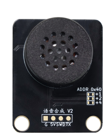
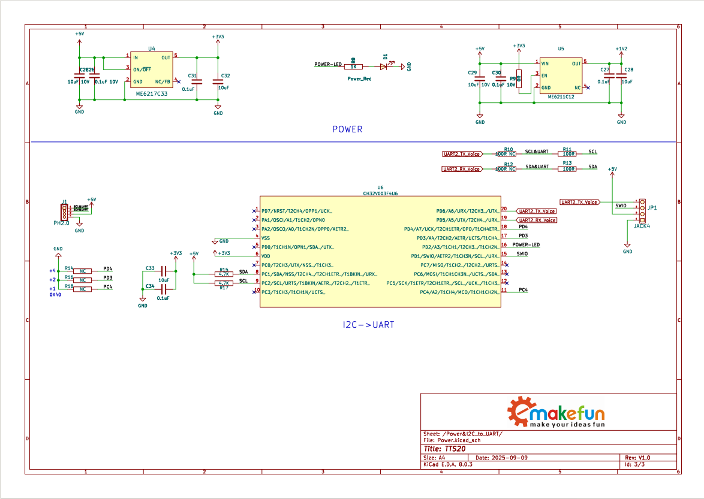

# TTS20 语音合成模块

## 实物图



## 概述

TTS20语音合成模块基于SNR9816高性能语音合成处理器芯片开发的一款高流畅度、高自然度的优美人声语音合成模块。SNR9816芯片是一款专业的32位语音合成处理器，主频高达250MHz，内置8M FLASH和1M SRAM，具有优异的语音处理能力。模块通过创新的设计方案，将SNR9816芯片封装为标准I2C接口，用户可直接通过I2C协议发送指令与文本，提供了更便捷的访问与系统集成方案。

本模块采用新一代神经网络算法和优质女声发音人，以中文为主，同时支持数字、字母、单词、简单的中英文混读，在合成效果（可懂度、清晰度、自然度、表现力、节奏/ 停顿、语速、语调、音质、音色、理解费力程度）方面有显著的提升。

本模块采用 **UTF-8** 文本编码，通过I2C协议接收待合成文本并直接转换为语音输出，支持音量、语速、语调的灵活调节，同时提供合成、停止、暂停与恢复多种控制功能；面向中高端应用场景，提供高性价比的完整语音解决方案。模块可流畅合成纯中文（不含繁体与生僻字）、常规英文及中英文混合文本，准确处理多音字、数字、日期、时间等信息，输出语音清晰自然、无杂音。

## 原理图



<a href="zh-cn/ph2.0_sensors/smart_module/tts20_module/TTS20-MCU&SKP.pdf" target="_blank">点击此处查看原理图</a>

## 模块参数

- 供电电压：5V，**注意：供电电压必须是5V**

- 接 口：I2C接口和PH2.0间距接口

- 连接方式：PH2.0 4PIN防反接杜邦线

- 通信方式：I2C通信，地址0x40

- 尺 寸：40*32mm，兼容乐高积木和M4螺丝固定孔

| 引脚名称  | 描述         |
| -------- | ------------ |
| G        | GND地线       |
| V        | 5v电源引脚    |
| SDA      | I2C数据引脚   |
| SCL      | I2C时钟引脚   |

## 机械尺寸图


## 合成文本播放详细参数设置

如需对合成播放效果进行设置，如**音量**，**语速**，**语调**等，以下提供一套标注方式，用户可以通过标注的方式，达到想要的合成效果，修复机器合成在自然度、流畅度方面的不足。

### 文本标注方法

正常文本:

```c++
"一二三四五"
```

增加音量标准的文本，正常文本任意位置添加`[详细参数]`，例如文本前增加`[v9]`，代表以音量为9来合成播放这段文本，如下所示:

```c++
"[v9]一二三四五"
```

可以在任意位置进行标注，比如`"一二三"`以音量为`9`进行合成播放，`"四五六"`以音量为`5`进行合成播放，如下所示：

```c++
"[v9]一二三[v5]四五六"
```

文本控制标记的格式一般是半角中括号（即“[]”）内一个小写字母、一个阿拉伯数字。需要注意的是：**文本标记符全部是半角，字母必须是小写的英文字母，不符合要求的不作为文本标记**。

### 文本控制标记列表

| 序号  | 类型                     | 格式  | 参数                                                       | 说明                        |
| ---- | ------------------------ | ----- | --------------------------------------------------------- | --------------------------- |
| 1    | 设置音量                  | [v*]  | *=0~9                                                     | 默认音量值为 5，最高音量为 9  |
| 2    | 设置语速                  | [s*]  | *=0~9                                                     | 默认语速值为 5，最大语速为 9  |
| 3    | 设置语调                  | [t*]  | *=0~9                                                     | 默认语调值为 5，最大语调为 9  |
| 4    | 指定该位置做短暂停顿       | [w0]  |                                                           | 指定该位置做短暂停顿          |
| 5    | 指定该标记后的数字发音方式  | [n*]  | *=1/2/3   <br />1–按数字发音  <br />2–按数值发音   <br />3–按电话号码格式发音  | 默认为按数值发音  |
| 6    | 标记前一汉字的拼音         | [=*]  | *=拼音 为前一个汉字设定的拼音                               | 拼音格式为拼音+声调，声调数值范围 1-5，分别代表（1:阴平 2:阳平 3:上声 4:去声 5:轻声）。拼音中ü用字母 v 代替，字母均为小写。 示例： “着 [=zhuo2]手”，“着” 字将读作“zhuó”  |

## 内置提示音效

模块内置有15种提示音效，其中:铃声 5 首；信息提示音 5 首；警示音 5 首。可通过发送特定文本进行播放提示音效。

| 音效类型   | 格式       | 参数    |
| ---------- | ---------- | ------ |
| 铃声       | ring_*     | *=1~5  |
| 信息提示音  | message_*  | *=1~5  |
| 警示音     | alert_*    | *=1~5   |

音效播放:

```c++
"ring_1"
```

**注意：如果播放音效的同时还需要播放文本数据，则音效和文本数据请勿放在放在同一播放中，即分开执行。**

## Arduino 应用

<a href="https://gh-proxy.com/https://github.com/emakefun-arduino-library/em_tts20/archive/refs/tags/v1.0.0.zip" download>点击此处下载Arduino示例程序</a>

### Arduino 库使用文档

<a href="https://emakefun-arduino-library.github.io/em_tts20/html/zh-CN/classem_1_1_tts20.html" target="_blank">点击此处查看API说明文档</a>

### Arduino 库示例程序

<a href="https://emakefun-arduino-library.github.io/em_tts20/html/zh-CN/play_8ino-example.html" target="_blank">文本播放</a>

<a href="https://emakefun-arduino-library.github.io/em_tts20/html/zh-CN/play_builtin_sounds_8ino-example.html" target="_blank">模块内置提示音效</a>

<a href="https://emakefun-arduino-library.github.io/em_tts20/html/zh-CN/play_flow_control_8ino-example.html" target="_blank">播放流程控制</a>

<a href="https://emakefun-arduino-library.github.io/em_tts20/html/zh-CN/play_with_parameters_8ino-example.html" target="_blank">设置播放参数</a>

## MicroPython 示例程序

### ESP32 MicroPython示例程序

待补充

### micro:bit MicroPython示例程序

待补充

## micro:bit MakeCode示例程序

待补充
