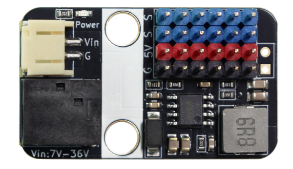
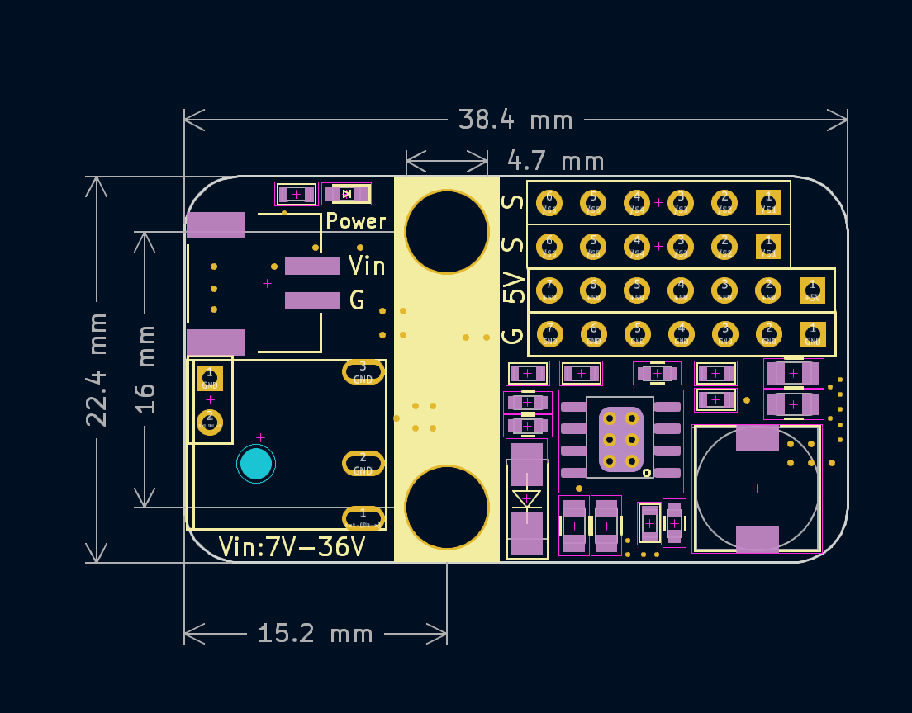

# PM01 5V5A电源模块

## 实物图

## 概述

​	该电源模块是一款基于SY8205降压芯片设计的5V 5A输出的电源模块。模块支持PH2.0接口和DC头输入，输入电压范围6-30V输入。本模块专为大电流舵机驱动扩展使用，也可以同时给其他需要使用5V电压场景供电。

## 模块参数

- 电源输入 ：PH2.0接口和5.5-2.1mm DC头输入；
- 输出：最大电流5V 5A，最多可以接6路舵机；
- 模块尺寸： 38.4*22.4 mm ；
- 安装方式：M4螺丝（孔径4.7mm）固定。

## 使用说明

- G V S可以直接接3pin直插舵机；
- 独立S引脚为外部单片机控制信号引脚；
- 注意和外部单片机控制使用的时候需要电源模块和主控电源共电连接。

## 机械尺寸图

