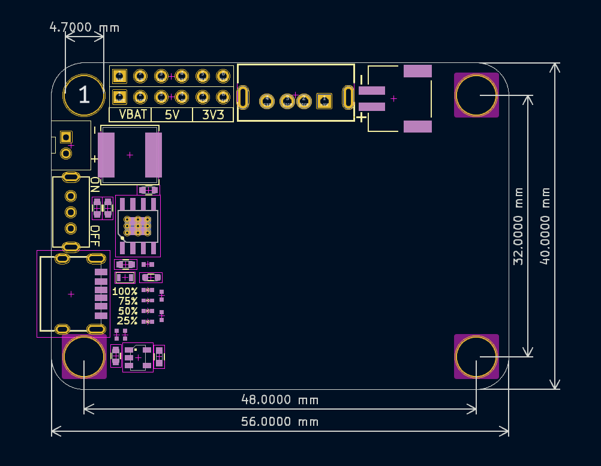

# PM11充电升压模块

## 实物图

## 概述

​	该充电模块为3.7V锂电池充电升压5V一体模块，板载1200mA锂电池包。通过TypeC接口即可为板载锂电池提供最高1.2A的安全高效充电。板子上提供了PH2.0-2Pin ，2pin排针锂电池直接输出，USBA口、2pin排针5V/2.4A输出，2Pin排针3.3V 800mA输出。多种电压输出，非常方便应用在多种电压低功耗应用场景需求。且充电芯片自带过充，反接，过载保护。

## 模块参数

- USB充电 ：TypeC接口 5V最高充电电流1.2A；
- 充电升压转换效率90%
- 电压输出：PH2.0-2Pin 、2pin排针锂电池输出，USBA口 、2pin排针5V/2.4A输出，2Pin排针3.3V 800mA输出；
- 电池类型：1200mA锂电池包(充满电压4.2V)；
- 模块尺寸： 54 * 48mm ；
- 安装方式：M4螺钉螺母固定；
- 电池过充/反接/过载保护

## LED状态说明

| 状态        | 描述                                                         |
| ----------- | ------------------------------------------------------------ |
| Power指示灯 | 拨动开关ON时，四个LED灯会闪一下，无负载输出的时候，所有灯熄灭 |
| 电量        | 4个LED灯分布代表25%，50%，75%，100%电量                      |
| 充电        | 4灯逐个电流代表在充电中                                      |

## 机械尺寸图

