# RaspberryPi-Sensor-Board
[中文版](README_zh.md)

 [Emakefun](http://www.emakefun.com)

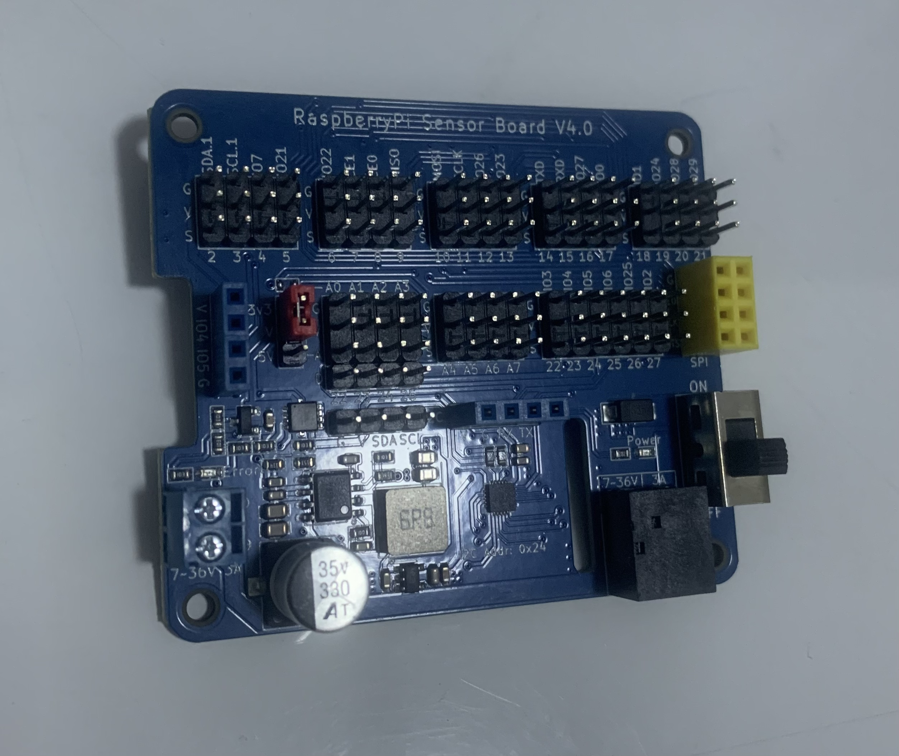

## Features

- Support 8-channel ADC detection
- MCU with built-in 10-bit ADC, ADC range 0 to 1023
- Support Raspberry Pi 2B/3B/3B+/4/zero
- 5.5x2.1 DC head and terminal power supply
- Freely switch between external sensor voltage 3V3 and 5V
- On-board DC-DC step-down chip Wide voltage input: 5 ~ 36V Voltage output: 5V Maximum current output: 3A

## MCU specifications
- Operating voltage: 3.3V and 5V, selected via jumper cap, ADC checks voltage
- MCU: STM32
- IO: 8-channel ADC detection
- The sensor communication with Raspberry Pi: I2C
- I2C address: 0x24

## Hardware Preview

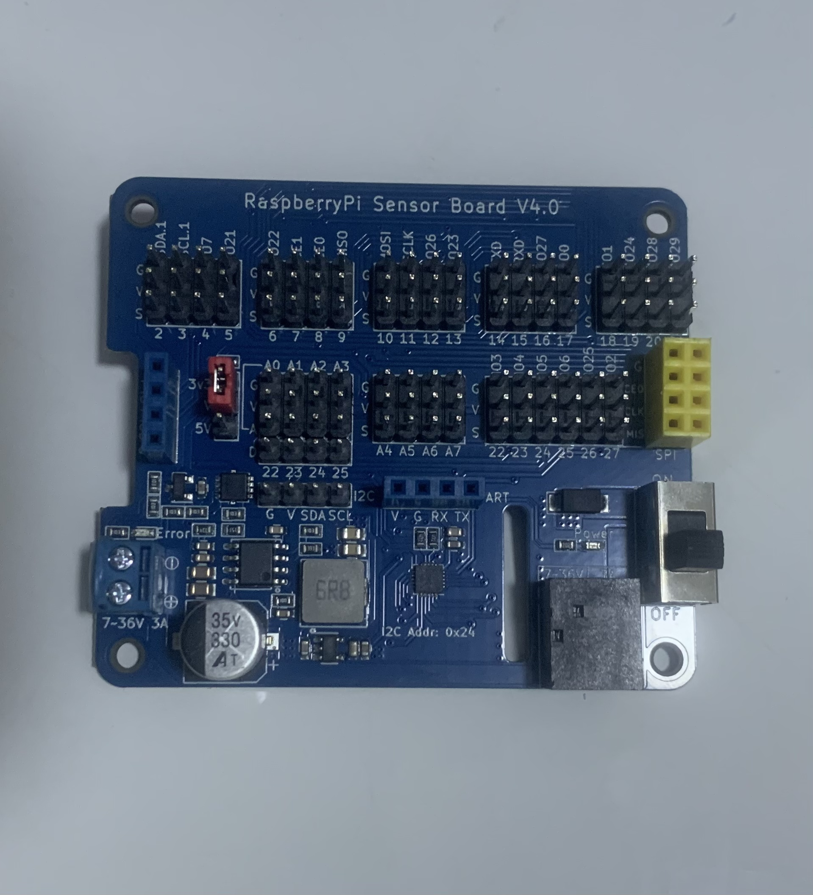

## Register

&ensp;&ensp;&ensp;&ensp;The MCU I2C address of the expansion board is 0x24, and the registered address is explained as follows:


  - 0x10 ~ 0x17: read ADC raw data

  - 0x20 ~ 0x27: read input voltage(mv)

  - 0x30 ~ 0x37: Read the ratio of input voltage to output voltage, Input voltage / output voltage(0~100)

##    Raspberry Pi I2C library installation

&ensp;&ensp;&ensp;&ensp;Open the Raspberry Pi terminal and enter the "sudo raspi-config" command, then follow the sequence shown below.

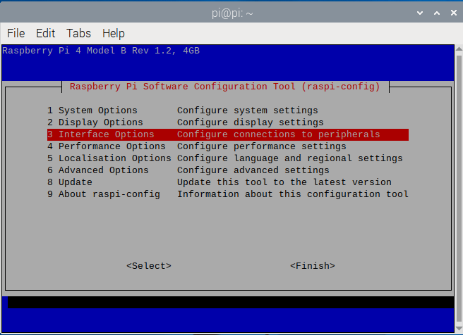

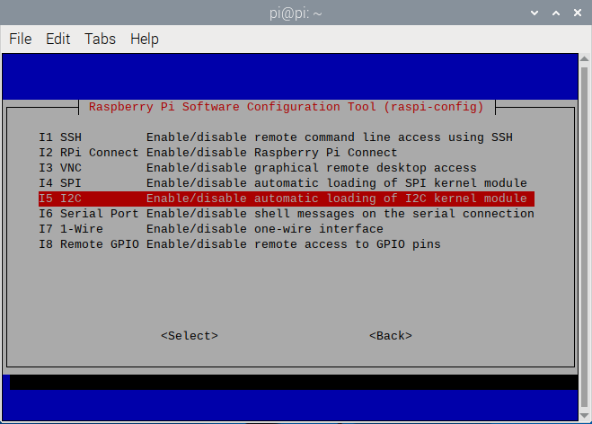

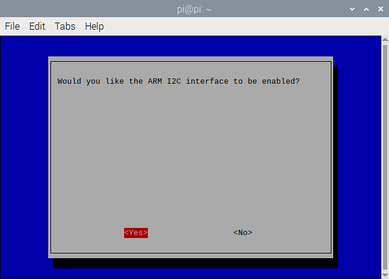

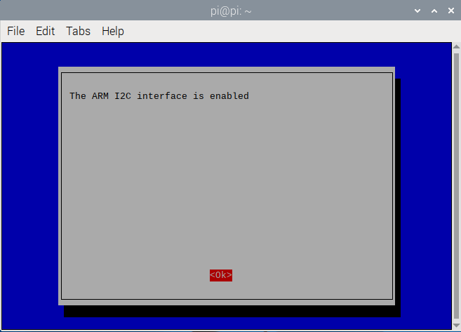

&ensp;&ensp;&ensp;&ensp;The above is to enable the Raspberry Pi I2C. Next we install the Raspberry I2C library by typing "sudo apt-get install i2c-tools" in the terminal. After the installation is complete, you can see that the I2C library is being downloaded. After the installation is complete, you can type " sudo i2cdetect -l "to check whether the installation is correct or not. If there is a message similar to the following, it means that the installation is normal.

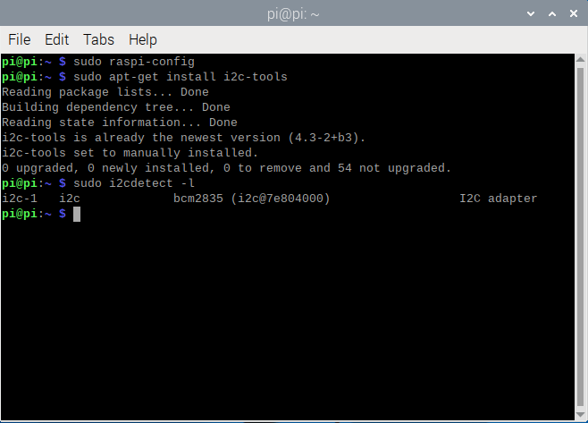

&ensp;&ensp;&ensp;&ensp;Entering "sudo i2cdetect -y 1" command in the terminal to scan all I2C devices connected to the I2C bus and print out the I2C bus address of the device, and the I2C address of our expansion board is 0x24.

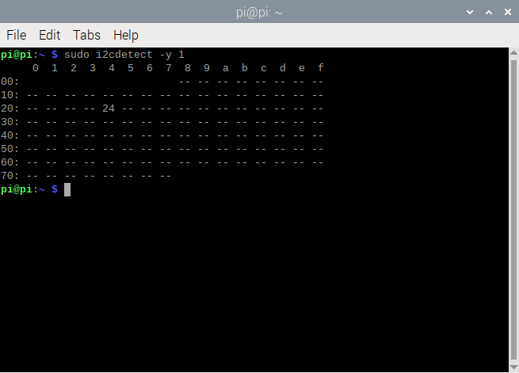

!!! Edit the config.txt file to set the Raspberry Pi I2C bus speed

    sudo nano /boot/config.txt

Locate the line containing "dtParam =i2c_arm=on" and append ", i2c_arm_baudrate=100000", where 100000 is the newly set speed (100kbit /s). Note the comma before i2c. The complete code is as follows:

    dtparam=i2c_arm=on,i2c_arm_baudrate=100000

This enables the I2C bus while also completing the configuration of the new baud rate. After editing, use Ctrl-X, then select Y, and press Enter to save the file and exit.

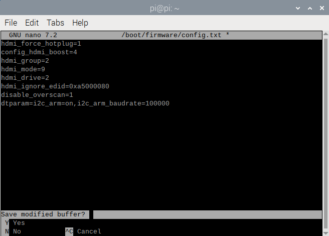

Reboot the Raspberry Pi to make the new Settings take effect:

    sudo reboot

## Read ADC analog value

&ensp;&ensp;&ensp;&ensp;As we all know, there is no ADC in Raspberry Pi, so the analog value of the sensor cannot be read directly. Thanks to the built-in MCU STM32 on the expansion board, it is possible to read a 10-bit ADC, which means analog sensors can be used on the Raspberry Pi, with a total of 8 available interfaces.

&ensp;&ensp;&ensp;&ensp;The analog sensor inputs the analog voltage into the 10-bit analog-to-digital converter. After the analog-to-digital converter converts the analog data into digital data, it transmits the digital data to the Raspberry Pi via I2C.

### Python Demo
[Demo](https://gitee.com/jiexinjx/sensor_expansion_board/repository/archive/master.zip)
### Python code

```
     from sensor_expansion_board_i2c import IoExpansionBoardI2c
     from smbus2 import SMBus
     import time
     
     # 初始化I2C总线
     i2c_bus = 1  # 树莓派上的I2C总线号，通常是1
     i2c_address = 0x24  # I2C设备地址
     
     # 创建IoExpansionBoardI2c对象
     io_expansion_board_i2c = IoExpansionBoardI2c(i2c_bus, i2c_address)
     
     # 设置引脚7为ADC模式
     io_expansion_board_i2c[7].mode = IoExpansionBoardI2c.ADC_MODE
     
     # 循环读取ADC值
     try:
         while True:
             adc_value = io_expansion_board_i2c[7].adc_value
             print(adc_value)
             time.sleep(1)  # 延时1秒
     except KeyboardInterrupt:
         # print("程序已停止")
         pass
```

### C++ Demo
[Demo](https://gitee.com/jiexinjx/sensor_board/repository/archive/master.zip)
### C++ code

```
    #include <iostream>
    #include <chrono>
    #include <thread>
    #include "gpio_expansion_board.h"
    
    // 创建 GpioExpansionBoard 实例
    GpioExpansionBoard gpio_expansion_board;
    
    int main() {
      std::cout << "Setup" << std::endl;
    
      // 配置E0为ADC模式
      if (!gpio_expansion_board.SetGpioMode(GpioExpansionBoard::kGpioPinE0, GpioExpansionBoard::kAdc)) {
        std::cerr << "Failed to set GPIO mode for E0" << std::endl;
        return -1;
      }
    
      while (true) {
        // 读取E0的ADC值并打印
        uint16_t adc_value = gpio_expansion_board.GetGpioAdcValue(GpioExpansionBoard::kGpioPinE0);
        std::cout << "ADC value: " << adc_value << std::endl;
    
        // 延时100毫秒
        std::this_thread::sleep_for(std::chrono::milliseconds(100));
      }
    
      return 0;
    }
```

&ensp;&ensp;&ensp;&ensp;If the following error occurs while generating the current file：

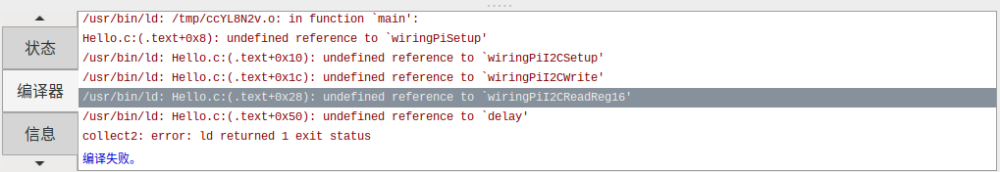

&ensp;&ensp;&ensp;&ensp;If this problem occurs, please modify the generated command and enter the settings below：

&ensp;&ensp;&ensp;&ensp;&ensp;&ensp;&ensp;&ensp;Compile&ensp;&ensp;&ensp;&ensp;&ensp;&ensp;&ensp;&ensp;gcc -Wall -c "%f"

&ensp;&ensp;&ensp;&ensp;&ensp;&ensp;&ensp;&ensp;Build&ensp;&ensp;&ensp;&ensp;&ensp;&ensp;&ensp;&ensp;gcc -Wall -o "%e" -lwiringPi "%f"

&ensp;&ensp;&ensp;&ensp;&ensp;&ensp;&ensp;&ensp;Lint&ensp;&ensp;&ensp;&ensp;&ensp;&ensp;&ensp;&ensp;cppcheck --language=c --enable=warning,style --template=gcc "%f"

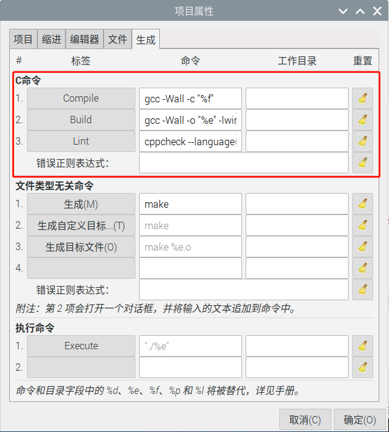
