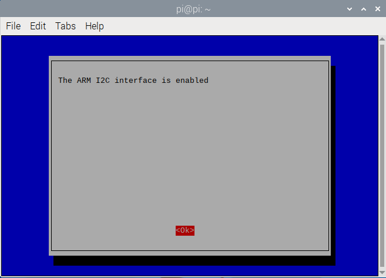

# RaspberryPi-Sensor-Board V4.0

[English]( [RaspberryPi-Sensor-Board/README.md at V4.0 · emakefun/RaspberryPi-Sensor-Board](https://github.com/emakefun/RaspberryPi-Sensor-Board/blob/V4.0/README.md) ) 中文版
	树莓派传感器扩展板是由[深圳市易创空间科技有限公司](http://www.emakefun.com)专门为方便树莓派外接传感器而设计。本扩展板适用于 Raspberry Pi Zero/Zero W/Zero WH/A+/B+/2B/3B/3B+/4B。 可以通过5.5-2.1mm的DC头或接线柱可以给树莓派供电。预留了RF24L01模块，HC-SR04超声波模块，I2C接口，UART接口，支持8路ADC。同时空出摄像头和显示屏排线接口。


树莓派扩展板上面标注了丝印为信号引脚的BCM编码和功能名，如下图：


更详细的引脚对应关系，请参考原理图设计

<a href="zh-cn/raspberrypi/raspberrypi_sensor_board/RaspBerrySensor_Board.pdf" download>**下载树莓派扩展板原理图**</a>

## 特点

- 内置10bit ADC MCU，支持8路ADC检测，ADC值范围为0 ~ 1023；
- 支持树莓派 2B/3B/3B+/4B/zero；
- 5.5x2.1DC头与接线端子外部供电，输入范围7~30V；
- 外接传感器供电电压3V3与5V切换；
- 板载DC-DC降压芯片最大输出5V3A给树莓派直接供电

## MCU规格

- 工作电压：3.3V和5V 根据跳线帽选择ADC检测电压；
- 与树莓派通信方式: I2C 速率 1~400K；
- I2C地址： 0x24，背面可以配置地址；
- IO: 8路ADC检测 对应引脚A0~A7；
- 8路扩展模式支持ADC输入，GPIO，PWM（只A1-A2支持）

## 寄存器

&ensp;&ensp;&ensp;&ensp;扩展板MCU I2C地址为0x24，寄存地址说明如下：


- 0x01寄存器为模式设置

    如下模式可以设置

    | 命令 | 模式         | 功能描述                                                     |
    | ---- | ------------ | ------------------------------------------------------------ |
    | 0x01 | 输入上拉     | MCU内置上拉电阻使能                                          |
    | 0x02 | 输入下拉     | MCU内置下拉电阻使能                                          |
    | 0x04 | 浮空输入模式 | 浮空输入                                                     |
    | 0x08 | 输出模式     | 可把引脚配置为高低电平输出模式，然后使引脚输出高电平或者低电平 |
    | 0x10 | ADC模式      | 可把引脚配置为ADC模式，然后读取引脚的ADC值，精度10位，ADC值范围为0 ~ 1023 |
    | 0x20 | PWM输出模式  | 可配置扩展板的PWM输出频率（1 ~ 10000Hz），然后把引脚为PWM输出模式，再配置引脚PWM输出的占空比(12位精度：0 ~ 4095)，然后使引脚输出PWM，可用于驱动**舵机** |

- 0x10 ~ 0x17: 读取ADC原始数据

- 0x20 ~ 0x27: 读取输入电压，单位是mv

- 0x30 ~ 0x37: 读取输入电压与输出电压的比,输入电压/输出电压(0~100)

- 0x40 ~ 0x47: 读取或者是设置A0-A7的数字值

- 0x51 ~ 0x52: 设置A1-A2的PWM占空比

- 0x61 ~ 0x62: 设置A1-A2的PWM的频率

## 树莓派I2C库安装

&ensp;&ensp;&ensp;&ensp;打开树莓派终端输入"sudo raspi-config"命令，然后按照下图顺序依次操作即可。




&ensp;&ensp;&ensp;&ensp;以上就是开启树莓派I2C，接下来我们安装树莓I2C库在终端输入“sudo apt-get install i2c-tools”，输入完成后就可以看到正在下载I2C库，安装完成之后可以在终端输入“sudo i2cdetect -l”检测是否安装正确，若出现类似于下面的信息就说明安装正常。


&ensp;&ensp;&ensp;&ensp;在终端输入“sudo i2cdetect -y 1”命令即可扫描接在I2C总线上的所有I2C设备，并打印出该设备的I2C总线地址，且我们的扩展板的I2C地址为0x24。


!!! 编辑config.txt文件设置树莓派IIC总线速度

    sudo nano /boot/config.txt

查找包含“dtparam=i2c_arm=on”的行，添加“，i2c_arm_baudrate=100000”，其中100000是新设置的速度(100kbit /s)，注意i2c前面的逗号。完整代码如下：

    dtparam=i2c_arm=on,i2c_arm_baudrate=100000

这样可以启用I2C总线的同时，也完成了新波特率的设置。编辑完成后，使用CTRL-X，然后选择Y，再按下回车键，保存文件并退出。


重新启动树莓派，使新的设置生效:

    sudo reboot

<a href="zh-cn/raspberrypi/raspberrypi_sensor_board/sensor_expansion_board_python_demo.zip" download>**下载树莓派python示例程序**</a>

## 读取ADC模拟值

​	众所周知，Raspberry Pi中没有ADC，因此不能直接通过树莓派的引脚读取模拟值。本扩展板内置一颗I2C协议 10bit精度的ADC MCU，树莓派可以通过这个ADC MCU获取模拟值，扩展板上一共有8个可用的模拟输入接口，对应板子丝印A0~A7，ADC读取值范围为0~1023。

运行python demo前，一定要用如下命名安装smbus2

```bash
pi@raspberrypi: pip3 install smbus2 
```

```python
#coding=utf-8
from sensor_expansion_board_i2c import IoExpansionBoardI2c
from smbus2 import SMBus
import time

# 初始化I2C总线
i2c_bus = 1  # 树莓派上的I2C总线号，通常是1
i2c_address = 0x24  # I2C设备地址

# 创建IoExpansionBoardI2c对象
io_expansion_board_i2c = IoExpansionBoardI2c(i2c_bus, i2c_address)

# 设置所有引脚为ADC模式
for i in range(8):
    io_expansion_board_i2c[i].mode = IoExpansionBoardI2c.ADC_MODE

# 循环读取ADC值
try:
    while True:
        print('A0:',io_expansion_board_i2c[0].adc_value) 
        print('A1:',io_expansion_board_i2c[1].adc_value) 
        print('A2:',io_expansion_board_i2c[2].adc_value) 
        print('A3:',io_expansion_board_i2c[3].adc_value)
        print('A4:',io_expansion_board_i2c[4].adc_value)
        print('A5:',io_expansion_board_i2c[5].adc_value) 
        print('A6:',io_expansion_board_i2c[6].adc_value) 
        print('A7:',io_expansion_board_i2c[7].adc_value)
        time.sleep(1)  # 延时1秒
except KeyboardInterrupt:
    # print("程序已停止")
    pass
```

用python3运行demo

```
pi@raspberrypi:~/$ python3 adc.py 
```

## 数字GPIO测试

树莓派扩展板上丝印A0~A7引脚的每个单独引脚都可以独立设置成输入或者输出功能，输入可以设置 上拉、下拉或者浮空输入 。

```python
#coding=utf-8
from sensor_expansion_board_i2c import IoExpansionBoardI2c
from smbus2 import SMBus
import time

# 初始化I2C总线
i2c_bus = 1  # 树莓派上的I2C总线号，通常是1
i2c_address = 0x24  # I2C设备地址

# 创建IoExpansionBoardI2c对象
io_expansion_board_i2c = IoExpansionBoardI2c(i2c_bus, i2c_address)

# Set pin mode
io_expansion_board_i2c[0].mode = IoExpansionBoardI2c.OUTPUT_DIGITAL_MODE  # Pin 0 set as digital output mode
io_expansion_board_i2c[1].mode = IoExpansionBoardI2c.INPUT_PULL_UP_MODE   # Pin 1 set as input pull up mode

try:
    while True:
        digital_value = io_expansion_board_i2c[1].value  # reads pin 1 value
        print('digital value:', digital_value)
        io_expansion_board_i2c[0].value = digital_value  # write pin 1 value into pin 0
except KeyboardInterrupt:
    print("The programme has been stopped")
```

## PWM输出

树莓派原本的硬件pwm只有GPIO1、GPIO26、GIPIO23、GPIO24对应的WiringPi就是1，26，23，24但是不同库支持的输出不一样，使用和树莓派本身的硬件资源冲突，比如声卡，定时器等。所以本扩展板外扩2路pwm可以很好解决这个问题。但是只有A1和A2两个引脚支持

```python
#coding=utf-8
from sensor_expansion_board_i2c import IoExpansionBoardI2c
import time

# 初始化I2C总线
i2c_bus = 1  # 树莓派上的I2C总线号，通常是1
i2c_address = 0x24  # I2C设备地址

# 创建IoExpansionBoardI2c对象
io_expansion_board_i2c = IoExpansionBoardI2c(i2c_bus, i2c_address)
io_expansion_board_i2c.pwm_frequency = 1000 # Setting PWM frequency

# Setting pin mode as PWM output mode
io_expansion_board_i2c[1].mode = IoExpansionBoardI2c.OUTPUT_PWM_MODE
io_expansion_board_i2c[2].mode = IoExpansionBoardI2c.OUTPUT_PWM_MODE

print('only A1 A2 support pwm output')

try:
    while True:
        io_expansion_board_i2c[1].pwm_duty = 100  # Setting the PWM duty ratio of pin 1 as 100
        io_expansion_board_i2c[2].pwm_duty = 1023  # Setting the PWM duty ratio of pin 2 as 1023
        print('A1 pwm_duty:', io_expansion_board_i2c[1].pwm_duty, 'A2 pwm_duty:', io_expansion_board_i2c[2].pwm_duty)
        time.sleep(1)
        io_expansion_board_i2c[1].pwm_duty = 2048  # Setting the PWM duty ratio of pin 1 as 2048
        io_expansion_board_i2c[2].pwm_duty = 4096  # Setting the PWM duty ratio of pin 2 as 1023
        print('A1 pwm_duty:', io_expansion_board_i2c[1].pwm_duty, 'A2 pwm_duty:', io_expansion_board_i2c[2].pwm_duty)
        time.sleep(1)
except KeyboardInterrupt:
    print("The programme has been stopped")
```

## 舵机控制

有了PWM的支持，那么意味着也可以将此pwm扩展成驱动舵机的接口，如下代码就是驱动SG90舵机测试代码：

其他非标准协议的脉冲宽度舵机，可以自行修改驱动实现。

```python
#coding=utf-8
from sensor_expansion_board_i2c import IoExpansionBoardI2c
import time

# 初始化I2C总线
i2c_bus = 1  # 树莓派上的I2C总线号，通常是1
i2c_address = 0x24  # I2C设备地址

# 创建IoExpansionBoardI2c对象
io_expansion_board_i2c = IoExpansionBoardI2c(i2c_bus, i2c_address)

io_expansion_board_i2c.pwm_frequency = 50 # Setting PWM frequency as 50Hz

# Setting pin mode as PWM output mode
io_expansion_board_i2c[1].mode = IoExpansionBoardI2c.OUTPUT_PWM_MODE
io_expansion_board_i2c[2].mode = IoExpansionBoardI2c.OUTPUT_PWM_MODE

try:
    while True:
        io_expansion_board_i2c[1].servo_angle = 0
        io_expansion_board_i2c[2].servo_angle = 90
        print('angle:', io_expansion_board_i2c[1].servo_angle, ",",
              io_expansion_board_i2c[2].servo_angle)
        time.sleep(1)

        io_expansion_board_i2c[1].servo_angle = 90
        io_expansion_board_i2c[2].servo_angle = 0
        print('angle:', io_expansion_board_i2c[1].servo_angle, ",",
              io_expansion_board_i2c[2].servo_angle)
        time.sleep(1)

        io_expansion_board_i2c[1].servo_angle = 180
        io_expansion_board_i2c[2].servo_angle = 180
        print('angle:', io_expansion_board_i2c[1].servo_angle, ",",
              io_expansion_board_i2c[2].servo_angle)
        time.sleep(1)

        io_expansion_board_i2c[1].servo_angle = 90
        io_expansion_board_i2c[2].servo_angle = 90
        print('angle:', io_expansion_board_i2c[1].servo_angle, ",",
              io_expansion_board_i2c[2].servo_angle)
        time.sleep(1)
except KeyboardInterrupt:
    print("The programme has been stopped")
```


<a href="zh-cn/raspberrypi/raspberrypi_sensor_board/sensor_expansion_board_cpp_demo.zip" download>**下载树莓派C++示例程序**</a>

本例程为树莓派使用c++语言编写，引脚A0输出高低电平，间隔100ms

```cpp
#include <iostream>
#include <chrono>
#include <thread>
#include "gpio_expansion_board.h"

 // 创建 GpioExpansionBoard 实例
GpioExpansionBoard gpio_expansion_board;

int main() {
    std::cout << "Setup" << std::endl;

    // 配置A0为输出模式
    if (!gpio_expansion_board.SetGpioMode(GpioExpansionBoard::kGpioPinE0, 
                                        GpioExpansionBoard::kOutput)) {
        std::cerr << "Failed to set GPIO mode" << std::endl;
        return -1;
    }

    // 主循环
    while (true) {
        // 设置A0的输出高电平
        std::cout << "Setting GPIO A0 to HIGH" << std::endl;
        if (!gpio_expansion_board.SetGpioLevel(GpioExpansionBoard::kGpioPinE0, 1)) {
            std::cerr << "Failed to set GPIO level HIGH" << std::endl;
            return -1;
        }
        
        // 延时100毫秒
        std::this_thread::sleep_for(std::chrono::milliseconds(100));

        // 设置A0的输出低电平
        std::cout << "Setting GPIO A0 to LOW" << std::endl;
        if (!gpio_expansion_board.SetGpioLevel(GpioExpansionBoard::kGpioPinE0, 0)) {
            std::cerr << "Failed to set GPIO level LOW" << std::endl;
            return -1;
        }
        
        // 延时100毫秒
        std::this_thread::sleep_for(std::chrono::milliseconds(100));
    }

    // 程序结束前将GPIO设置为低电平
    gpio_expansion_board.SetGpioLevel(GpioExpansionBoard::kGpioPinE0, 0);
    std::cout << "Program terminated" << std::endl;
    return 0;
}
```

树莓派环境下的直接使用g++命令行编译

```bash
pi@raspberrypi:~/sensor_expansion_board_python_demo/src $
g++ -lwiringPi -I./ digital_output/digital_output.cpp gpio_expansion_board.cpp -o gpio_out
pi@raspberrypi:~/sensor_expansion_board_python_demo/src $./gpio_out
Setup
Setting GPIO A0 to HIGH
Setting GPIO A0 to LOW
Setting GPIO A0 to HIGH
Setting GPIO A0 to LOW
```

其他demo程序编译方法类似，不再冗述。

| 序号 | 文件名字      | 功能描述                            |
| ---- | ------------- | ----------------------------------- |
| 1    | adc           | 模拟输入，A0~A7支持                 |
| 2    | digital_input | 数字输入，A0~A7支持                 |
| 3    | digital_out   | 数字输出，A0~A7支持                 |
| 4    | pwm           | 可输出pwm波，只有A1-A2两个引脚支持  |
| 5    | servo         | 控制sg90舵机，只有A1-A2两个引脚支持 |

