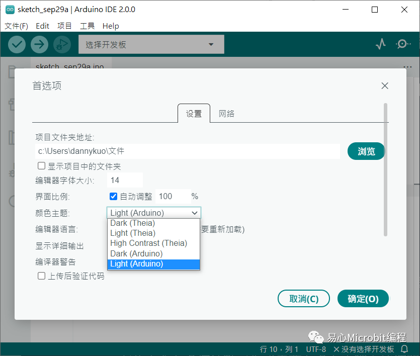
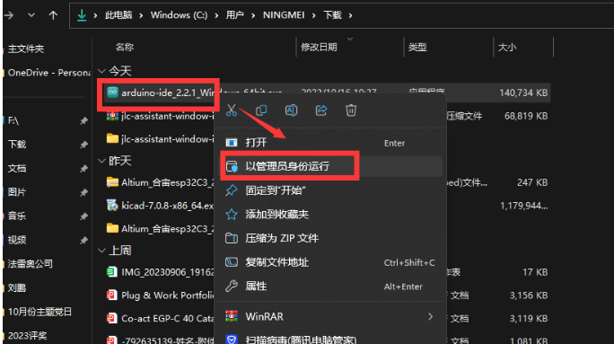
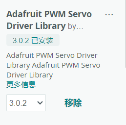
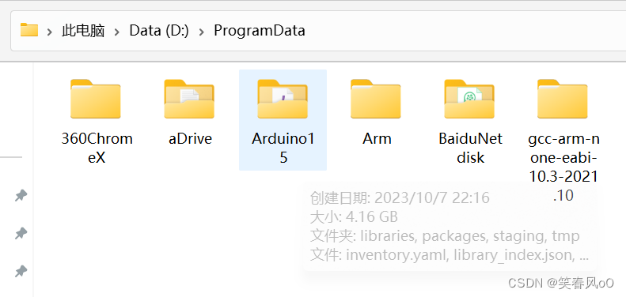

# **Arduino IDE2.0介绍**

## 一、软件概述

### 1.1 IDE介绍

‌Arduino IDE（Integrated Development Environment，集成开发环境）是专为Arduino硬件开发设计的软件工具，它简化了编程过程，使得初学者和专业人士都能轻松地开发微控制器的应用。Arduino IDE提供了一个易于使用的界面，允许用户使用基于C/C++的简化语言编写、编辑、编译和上传代码到Arduino微控制器板。‌建议在Win10 8G内存以上配置的电脑使用。

### 1.2 Arduino 2.0和1.0的区别

对许多创客而言，相信对Arduino IDE1.x并不陌生，但Arduino官方在2021年春季开始对Arduino IDE进行大改造，提出2.0版，几经内外部测试验证后，于2022年发布为正式版。新版到底有何不同？以下对此讨论。

1.同时使用Serial Monitor与SerialPlotter
过往Arduino IDE只提供Serial Monitor(串口监视器)来观看数值，而2.0版再加入一个新工具SerialPlotter(串口绘图仪)，两种工具可以同时使用。


  红框中，心电图图案点按后可以开启串口绘图仪，放大镜图案点按后可以开启串口监视器。

2.改善使用者体验
操作接口更直觉并提升各种功能的操作速度，包含串行输出的时间、加载程序的时间、编译的时间等都有所提升。

3.自动完成功能
在许多程序开发工具上都已经有自动完成功能，但1.x版一直缺乏，而今2.0版也正式提供。自动完成可以让创客撰写程序到一半时自动浮出合宜的选项，只要选择合宜的选项，比起自己手打所有文字能更快速、更不容易出错。
自动完成是依据撰写者已经打过的变量与函式，然后智能型推测后续可能会用到的指令与函式库，从而提示撰写者可以选择。另外已经打完的部份也可能会提示有打错的地方，类似字处理的拼字检查功能。

4.黑底白字
程序设计师撰写程序时要经常观看编辑画面，而白底黑字的画面容易使眼睛疲劳，所以许多程序开发的编辑器都允许改成黑底白字来减少疲劳，这个功能在2.0Beta版上已经有，但正式的2.0版重新设计了整个黑底画面，让它更具一致性、美观性，且更易于观看。



5.云端保存开发成果
有些人会在多个地点工作或需要在多台计算机上持续开发同一程序，所以需要把开发的控制程序（在Arduino的世界里将开发出的程序称为sketch)放在远程或云端以便集中存取，新的2.0版可以跟Arduino Cloud、Arduino Web Editor等云端开发环境连结，然后持续开发放置在云端上但尚未完成的程序。另外也可以先脱机工作，之后再将工作成果上传到云端上进行同步。


红框部分可以在本地端（笔电图标）、云端（地球图标)切换放置程序。

6.串口绘图仪(Serial Plotter)
这个新工具相当强大，可以同时观察Arduino开发板上多组变量的变化，以及从时间轨迹上来观察数值的消长变化，这很适合用在调校传感器或数值比较等需求场合中。


  Serial Plotteri画面图显示变量1、变量2的波动变化。

7.更新支持
程序设计师通常希望开发工具可以自动提醒有新的开发板(board)可以支持、新的函式库(library)可以支持，新的2.0版也有这样的功能，这样就不用自己再劳心劳神去查核有无新的支持可以下载，只要单击更新即可。

另外对软件技术有兴趣的创客也可以了解更多，新版的Arduino IDE2.O其实是以Eclipse Theia框架(也是一个开放原码项目)为基础所发展成的，微软知名Visual Studio Code编辑器（简称VS Code)也是使用相同的框架，所以两者的Language Server Protocoli语言服务器协议、DebuggerR除错器、Extensions延伸外挂等是类似的。

然后Arduino IDE2.O的前端是用TypeScript撰写成的，后端则多数是用Golang撰写成。

### 1.3 Arduino IDE和市面上其他软件的区别（Keil为例）

1. **目标用户群**：
   - **Arduino IDE**：主要面向初学者和爱好者，提供了简单易用的界面和功能，适合快速入门和原型开发。
   - **Keil**：通常用于专业的嵌入式系统开发，适用于需要更高级功能和更复杂项目的开发者。

2. **支持的硬件**：
   - **Arduino IDE**：专注于支持Arduino开发板，提供了简单的接口和库来快速开发基于Arduino的项目。
   - **Keil**：支持广泛的嵌入式开发板和芯片，适用于各种不同类型的嵌入式系统开发。

3. **功能和复杂性**：
   - **Arduino IDE**：功能相对简单，适合于快速原型设计和简单的项目开发。提供了易于理解的编程界面。
   - **Keil**：功能更为丰富和复杂，具有更强大的调试功能、性能优化和硬件支持。适用于开发更复杂的嵌入式系统。

4. **学习曲线**：
   - **Arduino IDE**：学习曲线较为平缓，适合初学者迅速上手。
   - **Keil**：学习曲线较陡峭，需要较多的时间和经验来熟悉和掌握其功能和特性。

5. **开发生态**：
   - **Arduino IDE**：拥有庞大的开源社区和丰富的开源项目资源，便于分享和学习。
   - **Keil**：作为专业嵌入式系统开发工具，提供了更为完善的支持和技术资源。

## 二、Arduino IDE软件的使用

### 2.1 下载Arduino IDE软件

  点击[Arduino官网(https://www.arduino.cc/en/software)]( https://www.arduino.cc/en/software)下载并安装Arduino IDE软件 。  


### 2.2 安装Arduino IDE软件

打开文件，以管理员方式运行



点击我同意接受协议


安装选项选择默认个人。点击下一步


选择合适的安装位置，一定要指定到对应文件夹，避免与其他文件混装


等待安装完成


### 2.3 如何安装软件库（Windows为例）

把扩展库安装在正确的目录下至关重要。

不然IDE编译代码时就会找不到相关的扩展库而报错（如下图）。


1.0.2版本后的Arduino IDE安装时会自动在系统。

“Documents(我的文档)”里创建名为“Arduino”的文件夹，里面还应有一个“libraries”子文件夹。

下载的库通常默认放在该文件夹内。


**（注：Windows XP系统一定注意将库文件安装到Arduino安装目录下的“libraries”文件夹内）**

还可以通过如下方法查找库文件默认安装途径并修改默认途径。

点击**“文件>首选项( File>Preferences)”**。然后浏览选择自定义的文件夹目录。

自定义下载目录后，还需要到该目录里创建一个名为**“libraries”**的子文件夹。

这个文件夹就是安装扩展库的地方。


**在这里演示两种库文件安装方法：**

**Arduino IDE自带的库管理器下载安装库文件。**

1、打开Arduino IDE软件，在上方操作栏找到“项目”菜单，打开“项目”菜单。找到“管理库”选项。


2、单击“管理库”按钮，打开“库管理器”。


3、选择需要的库，点击下载。

以PWM Servo Driver Library为例，点击需要的库，显示出安装选项。


4、点击“安装”选项，安装成功后显示如下状态。



5、在默认安装途径下查找安装的库文件。


6、关闭并重新打开Arduino IDE。

从文件>示例（File>Examples）中找到“第三方库示例”


7、在安装的库中找一个例程打开，编译该实例，若IDE没有报错，编译成功的话就说明扩展库安装成功了。


**在开源平台下载库文件的方法，以“Github”为例，我们在Github上找到需要的库文件。**

我们以Adafruit的SleepyDog库作为例子。网址链接：[[1\]](https://github.com/adafruit/Adafruit_SleepyDog)。

1、打开Github网站[[2\]](https://github.com/github)，找到需要的库文件。


2、点击下载，将开源库文件下载到计算机中。


3、将下载的库文件安装进计算机有两种方法将下载的库文件安装进Arduino：

可以通过“加载库>添加一个.ZIP库”方式直接将压缩文件加入。


也可以将下载的压缩包文件解压。


然后将解压出来的名为“Adafruit_SleepyDog-master”的文件夹移至 “Documents>Arduino>libraries”里， 并重命名为“Adafruit_SleepyDog。

（注：重命名是因为“—”符号是特殊字符）


4、关闭并重新打开Arduino IDE

从“文件>示例(File>Examples)”找到“Adafruit SleepyDog Library”下面的“BasicUsage”实例。

然后编译该实例，若IDE没有报错，编译成功的话那说明扩展库安装成功了。

### 2.4 如何自己编写软件库

本章介绍如何通过Arduino IDE中的库管理工具下载自己写的库。

先来了解一下Arduino 库的文件结构：
|-- examples //例程存放的文件夹
|-- src //库源代码存放的文件夹
|-- extras//其他文件存放的文件夹(PDF什么的)
|-- keywords.txt //关键字文件
|-- library.properties //库特性说明文件

1.examples 文件夹

examples 文件夹是用来存放例程的，例程文件是一个[Arduino工程](https://so.csdn.net/so/search?q=Arduino工程&spm=1001.2101.3001.7020)，即每一个例程放在一个文件夹中，文件夹的名字和例程的名字一样。例如有三个例程，名字分别叫one, two, three。那么在这三个例程的文件结构应为：
examples
├── one
│   └── one.ino
├── two
│   └── two.ino
└── three
    └── three.ino


2.src 文件夹

src文件夹是用来存放库源代码的文件。比如.cpp文件和.h文件。

3.extras 文件夹

extras文件夹用来放置文档或其他与库捆绑的项目。Arduino IDE 不会理会 extra文件夹的内容，该文件夹你可以随便放任何东西。但是，放在这个文件夹里的文件会增加库的大小，所以在一个只有几 kb 的库里放一个20MB的PDF可能不是一个好主意。

4.keywords.txt 文件

keywords.txt 文件的作用是用来在Arduino IDE中使一些类名、函数名等显示不同的颜色。
该文件的语法为： keyword[tab] KEYWORD_TOKENTYPE

keyword 是要用来高亮显示的关键字类名、函数名和常量名等。

[tab] 为一个tab缩进（不要是空格！）

KEYWORD_TOKENTYPE 的取值为 KEYWORD1, KEYWORD2, KEYWORD3, LITERAL1, LITERAL2。

在Arduino IDE的关键字高亮中，会识别KEYWORD1为数据类型高亮，KEYWORD2为函数高亮，KEYWORD3为结构体高亮，LITERAL1为常量。


5.library.properties文件

library.properties 文件的内容格式是一个key=value 属性列表。（注意使用UTF-8编码）

library.properties 文件中的可以用的字段有以下几种：

name - 库名。库名可使用的字符有大写英文字母（A-Z），小写英文字母（a-z），阿拉伯数字（0-9），空格（ ），下划线（_），点（.）和破折号（-）。库名以字母或数字开头。不要使用Arduino开头，这是官方给自己预留的；

version - 库版本。版本应符合semver标准。可以使用1.2.0或1.2；不能使用 r5、003、1.1c ；

author - 库的作者名字和作者的电子邮件地址（不是必须的），多个作者时可以用逗号（,）分开；

maintainer - 库维护者的姓名和电子邮件；

sentence - 用一句话描述这个库的作用；

paragraph - 用于详细描述这个库；

url - 库项目的链接，一般为该库存放的github仓库的链接；

architectures - (value默认使用 *)；

depends - 该字段为可选字段（从IDE 1.8.10/Arduino CLI 0.7.0版本开始可用）。该字段的作用是如果你编写的库依赖于Arduino中的其它库，使用逗号分隔的依赖项列表，Arduino IDE的库管理器将在安装你的库的过程中安装提供依赖的库；

dot_a_linkage - 该字段为可选字段（从Arduino IDE 1.6.0 / arduino-builder 1.0.0-beta13版本开始可用）。当该字段设备为true，将会将你的库封装为静态库文件；

includes - 该字段为可选字段（从Arduino IDE 1.6.10版本开始可用）。使用逗号分割列表，如果没有该字段将会将源目录下的所有.h 文件都包含在内；

precompiled - 该字段为可选字段（从Arduino IDE 1.8.6/arduino-builder 1.4.0版本开始可用）。对静态库和动态库进行支持。有两个支持的值：

true - 源文件总是被编译。在Arduino IDE 1.8.12/arduino-builder 1.5.2/Arduino CLI 0.8.0中该功能丢失了不支持，在Arduino IDE 1.8.13/arduino-builder 1.5.3/Arduino CLI 0.11.0中恢复了。

full - （从Arduino IDE 1.8.13/arduino-builder 1.5.3/Arduino CLI 0.11.0版本开始可用）。如果该库为正在编译的板子提供了一个预编译库，那么源文件将不会被编译。如果没有提供，源文件将被编译。可以减少编译时间。

ldflags - 该字段为可选字段（从available from Arduino IDE 1.8.6/arduino- * builder 1.4.0版本开始可用）。要添加的链接器标志。例如：ldflags=-lm。

**库的根目录文件夹**

Arduino库的根文件夹名称必须以基本字母（A-Z或a-z）或数字（0-9）开头，可以使用基本字母、数字、下划线（_）、点（.）和破折号（-）。文件夹名最大长度为63个字符。

**使你的库在Arduino IDE 库管理中可以被搜索到**

将你的库上传到github中，需要创建一个和 library.properties 文件中的version 一致的 release 或 tag。

**如何上传**

去arduino的Arduino仓库提issue ，等待管理员审核完成后将你的库添加进去就可以了。issue内容可以参考下面。提完issue，等待管理员审核完成即可，如果有问题的话管理员也会在issue里面回复你的，可以多关注一下你的issue。

## 三、示例程序怎么使用

### 3.1 内置示例程序

在Arduino IDE中，为了方便开发者学习，IDE内部集成了很多Arduino的例程，点击文件->示例可打开环境内置示例程序。Arduino自带非常多的例程，包括基础、数字、模拟、通讯、显示等。我们所用的是 Basic(基础例程的) Blink 也就是点灯 ，相当于Arduino的Hello,World。


先点击“Verify”图标，确认程序是否可编译通过：


点击上传图标，将代码下载到Arduino中去


然后你就能观察到开发板上的LED指示灯在以 1 秒为间隔不断地亮、灭。

这个时候，然后只要给开发板正确供电，开发板上的黄色指示灯依然能够以 1 秒为间隔不断地亮、灭。

程序已经上载到开发板的内部 Flash 里面，可以脱离开发环境在开发板上实际运行了。

### 3.2 自定义库的示例程序

1.Arduino的扩展库都是放在 libraries目录下的。完整路径为：C:\Users\用户名\AppData\Local\Arduino15\libraries。所以我们需要在这个目录下创建一个文件夹，比如上面的例子是esp32上led灯控制程序，于是我创建了 m_led文件夹（前面加m是为了和官方库区分开，这只是我自己的习惯而已）。然后把写好的.cpp 和 .h文件拷贝到里面去，这样就OK了。


或者（把led.h和led.cpp复制到C:\Users\41861\AppData\Local\Arduino15\packages\esp32\hardware\esp32\2.0.6\cores\esp32路径下。不推荐这种写法，因为这种方法会跟系统库文件混合在一起，不方便管理）

2、编写led.h、led.cpp文件。

3.创建一个my_led.ino文件(ardunio主文件名以.ino结尾)。在该文件中可以直接使用自定义的库了，引入自定义的库头文件 #inclue <led.h>。

跟led.cpp 、 led.h 一起有个 keywords.txt文件，这个是什么用呢？其实它没有太大的实用性，只是为了配置自定义库的语法高亮。让我们自己的库能在IDE下显示不同的颜色而已。如果不配置，Arduino IDE不能渲染出颜色的。

4.编写keywords.txt，该文件可以不写。

keywords.txt 中#开头的是注释。格式：word【tab】DESCRIPTION。

word就是你要高亮的关键字接着1 个 tab 键 ，然后就是DESCRIPTION。

DESCRIPTION可以取的值：KEYWORD1 高亮类名；KEYWORD2 高亮方法名；LITERAL1 高亮常量。注意中间使用的是 1 个tab 键隔开的。

## 四、IDE串口工具怎么使用

### 4.1 各个参数含义

波特率 (Baud Rate)：波特率表示每秒钟传输的位数。在串行通信中，发送和接收设备之间必须使用相同的波特率。常见的波特率包括9600、115200等。

数据位 (Data Bits)：数据位表示每个字节中包含的位数。通常设置为8位，但也可以是5、6、7或9位，具体取决于通信协议。

校验位 (Parity)：校验位用于在数据传输过程中检测错误。通常有无、奇校验和偶校验三种选项。
停止位 (Stop Bits)：停止位指示一个字节的结束。通常设置为1位或2位。

流控制 (Flow Control)：流控制用于控制数据传输的速率，常见的选项包括无流控制、硬件流控制 (RTS/CTS) 和软件流控制 (XON/XOFF)。

### 4.2 串口绘图仪

串行绘图仪是Arduino IDE中的工具之一。Arduino可以读取温度，湿度或任何类型的传感器数据，并将其发送到串行绘图仪。串行绘图仪从Arduino接收数据，并将数据可视化为波形。串行绘图仪不仅可以在同一图形中显示单个传感器数据，还可以显示多个传感器数据。

数据通过USB线在串行绘图仪和Arduino之间交换，USB线也用于将代码上传到Arduino。因此，要使用串行绘图仪，我们必须通过此电缆连接Arduino和PC。

在 Arduino IDE 上，单击 Serial Plotter 图标：


要打印单个图形，我们只需要发送数据并用“\r\n”字符终止它。详细来说，我们只需要使用 Serial.println（） 函数：

```
Serial.println(variable); 
```


当我们想绘制多个变量时，我们需要用"\t"或" "字符将变量彼此分开。最后一个值必须以“\r\n”字符结尾。

第一个变量

```
Serial.print(variable_first); 
```

中间变量

```
Serial.print("\t"); // or Serial.print(" ")

Serial.print(variable_nth); 
```

最后一个变量

```
Serial.print("\t"); // or Serial.print(" ") 

Serial.println(variable_last); 
```


## 五、Arduino 2.0的秘密

### 5.1 修改库文件路径

默认情况下，ArduinoIDE库文件软件包的位置在“C:\用户名\AppData\Local\Arduino15\”。分析Arduino IDE 的配置信息的 “C:\用户名\.arduinoIDE\arduino-cli.yaml ”文件可知，修改该文件directories中的“libraries”、“data”、“downloads”中的路径，就可以变更默认库文件的存储位置，进而将系统盘中的整个 Arduino15 文件夹剪切到其他目录。


将“C:\Users\用户名\AppData\Local”文件夹内的Arduino15剪切到“D:\ProgramData”文件夹内：



然后修改arduino-cli.yaml，修改后的内容如下：

```
board_manager:
    additional_urls:
        - http://arduino.esp8266.com/stable/package_esp8266com_index.json
        - https://github.com/stm32duino/BoardManagerFiles/raw/main/package_stmicroelectronics_index.json
        - https://raw.githubusercontent.com/espressif/arduino-esp32/gh-pages/package_esp32_index.json
build_cache:
    compilations_before_purge: 10
    ttl: 720h0m0s
daemon:
    port: "50051"
directories:
    builtin:
        libraries: C:\Users\用户名\AppData\Local\Arduino15\libraries
    data: d:\ProgramData\Arduino15
    downloads: D:\ProgramData\Arduino15\staging
    user: d:\Users\用户名\Documents\Arduino
library:
    enable_unsafe_install: false
locale: zh-cn
logging:
    file: ""
    format: text
    level: info
metrics:
    addr: :9090
    enabled: true
output:
    no_color: false
sketch:
    always_export_binaries: false
updater:
    enable_notification: true
```

修改完成后，打开Arduino IDE ，可以看到已经安装的库都可以正常使用了：


### 5.2 Arduino开发板路径

编译文件后可以在编译器中找到开发板文件存储路径


打开路径可以看到不同开发板对应文件夹


### 5.3 编译生成的文件路径

Arduino IDE（集成开发环境）生成HEX文件通常是在完成程序编写并上传到Arduino硬件的过程中发生的。以下是简单的步骤：

1. **打开Arduino IDE**：首先确保你已经安装了Arduino IDE，并打开它。
2. **新建或选择项目**：点击“File”菜单，选择“New”创建一个新的Arduino sketch（项目），或者导入已有的sketch。
3. **编写代码**：在“Sketch”窗口里编写你的程序，使用Arduino的API库和其他功能。
4. **编译程序**：在代码编辑完成后，点击“tools”菜单下的“upload”（上传），这会触发编译过程。IDE会检查语法错误，如果一切正常，会在后台生成二进制代码。
5. **查看生成的HEX文件**：虽然IDE本身不会直接显示生成的HEX文件，但当上传成功后，实际上已经在计算机上创建了一个.HEX文件。这个文件通常位于build目录下，例如build/firmware.hex（路径可能会因系统设置而异）。你可以通过查找这个目录找到它。
6. **保存备份**：为了安全起见，建议将生成的HEX文件手动复制或链接到其他地方，以防丢失原始程序。

### 5.4 开发板故障排查

要验证Arduino是软件问题、硬件问题还是驱动问题，可以按照以下步骤进行排查：

1. 检查硬件连接

- **物理连接**：确保Arduino板正确连接到计算机，并且连接线没有损坏。检查USB端口是否工作正常，可以尝试连接其他设备到同一个端口。
- **电源指示灯**：检查Arduino板上的电源指示灯是否亮起，确认电源供应是否正常。

2. 检查驱动程序

- **设备管理器**：在计算机的设备管理器中查看是否有未知设备或有问题的设备。如果有，尝试更新或重新安装驱动程序。
- **驱动安装**：参考Arduino IDE安装及驱动教程，确保已经安装了正确的驱动程序。对于Windows系统，可能需要手动安装驱动。
- **端口识别**：在Arduino IDE中检查是否能够识别到串行端口。如果IDE无法识别串行端口，可能是驱动问题。

3. 测试Arduino IDE

- **IDE版本**：确保使用的是最新版本的Arduino IDE，老版本的IDE可能存在兼容性问题。
- **板和端口选择**：在IDE中选择正确的板型和端口。如果选择错误，IDE可能无法与Arduino板通信。

4. 测试简单的程序

- **基础程序**：上传一个简单的程序（如Blink）到Arduino板上，检查LED是否闪烁。如果基础程序无法工作，可能是硬件问题。
- **串行通信**：使用串行监视器测试串行通信是否正常。如果无法接收到数据，可能是硬件或驱动问题。

5. 检查硬件

- **替换测试**：如果可能，尝试将Arduino板替换到另一台计算机上，或者使用另一块Arduino板替换当前的板，以排除是特定硬件的问题。
- **组件检查**：检查Arduino板上是否有可见的损坏，如烧毁的组件或焊接问题。

6. 软件问题排查

- **编译错误**：查看IDE中的编译错误信息，这可以提供关于代码问题的线索。
- **库依赖**：确保所有必需的库都已经安装，并且代码中没有引用不存在的库或函数。

## 六、常见错误

### 6.1 如何打开编译日志

当我们程序出现错误，或者端口没接好，我们需要通过查看编译日志去排查我们的错误，具体操作如下：

打开设置


勾选这俩个选项


我们打开Blink测试示例，当我们不插主板时，看看编译会提示我们什么。


点击上传，发现日志里提示我们can‘t open device“\\.\com3”:，这时候我们再插入Arduino主板，就能够顺利的上传程序了。

若程序出现了问题了，要怎么查看呢？

其实也是一样的，（假设我把36行代码后面的分号删掉），点击编译。


这就提示我们一个错误，再"}"之前没有分号，编译器也在对应的行数进行了标记。

如果提示的错误我们不知道如何解决的话，我们也可以把错误信息复制到百度，看看别人如何解决问题的。

### 6.2 如何通过编译错误定位解决问题

在使用Arduino开发板和Arduino IDE进行项目开发时，用户可能会遇到各种错误，这些错误可能源于硬件连接、软件配置或代码编写等方面的问题，以下是一些常见的Arduino报错及其解决方法：

| **错误类型**      | **错误描述**                                     | **可能原因**                                                 | **解决方法**                                                 |
| ----------------- | ------------------------------------------------ | ------------------------------------------------------------ | ------------------------------------------------------------ |
| Board not in Sync | 计算机无法与Arduino板建立通信                    | 1. 电路板类型不匹配 2. 上传代码时未按下复位按钮 3. 串口管脚0、1被占用 4. 串口不匹配 | 1. 检查并确保电路板类型与使用的一致 2. 在上传代码时按下电路板上的复位按钮 3. 断开串口管脚0、1中的一个连接线 4. 断开电路板，查看哪个端口从列表中消失，然后重新连接开发板并选择相应端口 |
| COM端口错误       | 选择的串行端口与连接的Arduino板不正确            | 1. USB数据线或开发板本身[存在](https://blog.huochengrm.cn/zmt/15089.html)问题 2. 多个设备连接到计算机 3. 驱动程序损坏或需要更新 | 1. 断开并重新连接Arduino板 2. 检查设备管理器以查看Arduino板是否在端口部分下 3. 尝试不同的USB数据线或USB端口 4. 重新启动计算机和Arduino IDE |
| 无法识别Arduino板 | Arduino板没有被电脑识别                          | 1. USB电缆连接不牢固 2. USB数据线或开发板本身有问题 3. 驱动损坏或需要更新 | 1. 验证USB电缆连接是否牢固 2. 检查设备管理器以查看Arduino板是否在端口部分下 3. 检查并更新驱动 |
| 串口正在使用中    | 尝试使用的端口当前正在被另一个应用程序或进程使用 | 1. 其他应用程序正在使用串行端口 2. USB电缆连接问题           | 1. 关闭可能正在使用串行端口的其他应用程序 2. 尝试从Arduino板上断开USB电缆，然后重新连接以释放串口 3. 使用不同的串行端口 |
| 串行监视器不工作  | 串行监视器无法显示数据或乱码                     | 1. 连接错误 2. 代码编写错误 3. 波特率设置不正确 4. 缓冲区数据过多 | 1. 检查连接是否正确 2. 确保代码包含必要的Serial.begin()和Serial.print()语句 3. 调整串行监视器中的波特率设置 4. 按“清除”按钮清除缓冲区 5. 重置Arduino |
| 编译错误          | 代码无法成功编译                                 | 1. 语法错误 2. 缺失符号或分号 3. 拼写错误 4. 缺失变量定义 5. 程序中多余的文本 | 1. 根据错误提示信息定位到出错位置并进行修正 2. 确保所有符号和分号正确无误 3. 检查拼写是否正确 4. 确保所有变量都已声明 5. 删除多余的文本 |
| 上传错误          | 代码无法成功上传至Arduino板                      | 1. 硬件连接故障 2. 选择了错误的开发板或端口 3. 草图[尺寸](https://blog.huochengrm.cn/ask/15210.html)大于电路板容量 4. 引导加载程序损坏 | 1. 检查硬件连接是否正确 2. 确保选择了正确的开发板和端口 3. 减少代码占用空间或分割代码 4. 使用外部编程器上传草图或刷新引导加载程序 |

### 6.3 如何高效提问

 开发板出现错误时，我们要提供关键信息给到其他人需求支持，以下为具体步骤：

1. 描述问题

- **清晰简洁**：用简洁明了的语言描述您遇到的问题。
- **具体细节**：包括问题发生的具体场景和条件。

2. 提供错误信息

- **错误代码**：如果IDE或程序中有错误代码或错误消息，请提供完整的错误输出。
- **截图**：如果可能，提供屏幕截图或错误信息的图片。

3. 说明您的尝试

- **已采取措施**：列出您已经尝试的步骤和方法，以及这些尝试的结果。
- **相关修改**：如果您对代码或硬件进行了修改，请详细说明。

4. 提供环境信息

- **硬件信息**：提供Arduino板的型号、连接的外围设备等。
- **软件信息**：包括操作系统、Arduino IDE的版本、安装的库和插件等。
- **驱动信息**：如果适用，提供驱动程序的版本和安装状态。

5. 分享代码

- **代码片段**：分享出现问题的代码片段，但不要过长，只包含相关部分。
- **注释**：在代码中添加注释，指出可能的问题所在或您不确定的部分。

6. 描述期望的结果

- **预期行为**：说明您的代码或硬件应该表现出什么样的行为。
- **实际行为**：描述实际发生的情况，与预期行为的差异。

### 6.4 esp32出现中文路劲导致错误

当编译器报如下错误：

```
-- Found Git: D:/.espressif/tools/idf-git/2.39.2/cmd/git.exe (found version "2.39.2.windows.1") 
-- The C compiler identification is GNU 11.2.0
-- The CXX compiler identification is GNU 11.2.0
-- The ASM compiler identification is GNU
-- Found assembler: D:/.espressif/tools/riscv32-esp-elf/esp-2022r1-11.2.0/riscv32-esp-elf/bin/riscv32-esp-elf-gcc.exe
-- Detecting C compiler ABI info
-- Detecting C compiler ABI info - done
-- Check for working C compiler: D:/.espressif/tools/riscv32-esp-elf/esp-2022r1-11.2.0/riscv32-esp-elf/bin/riscv32-esp-elf-gcc.exe - skipped
-- Detecting C compile features
-- Detecting C compile features - done
-- Detecting CXX compiler ABI info
-- Detecting CXX compiler ABI info - done
-- Check for working CXX compiler: D:/.espressif/tools/riscv32-esp-elf/esp-2022r1-11.2.0/riscv32-esp-elf/bin/riscv32-esp-elf-g++.exe - skipped
-- Detecting CXX compile features
-- Detecting CXX compile features - done
-- git rev-parse returned 'fatal: not a git repository (or any of the parent directories): .git'
-- Could not use 'git describe' to determine PROJECT_VER.
-- Building ESP-IDF components for target esp32c3
```

说明项目路径含有中文无法编译。解决方法：转换路径为纯英文，确保所有文件路径均为纯英文路径，包括工作目录、输出目录以及所有中间文件的路径。