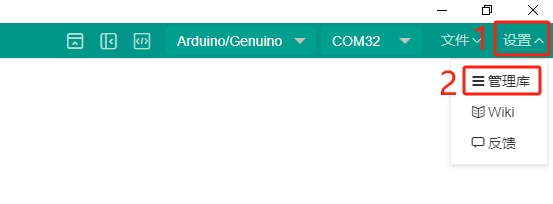
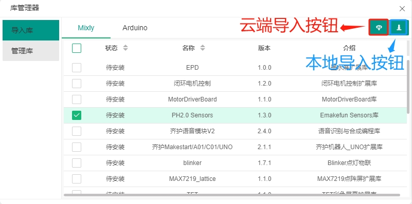
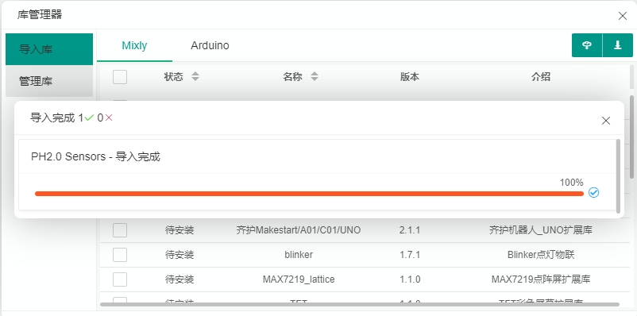
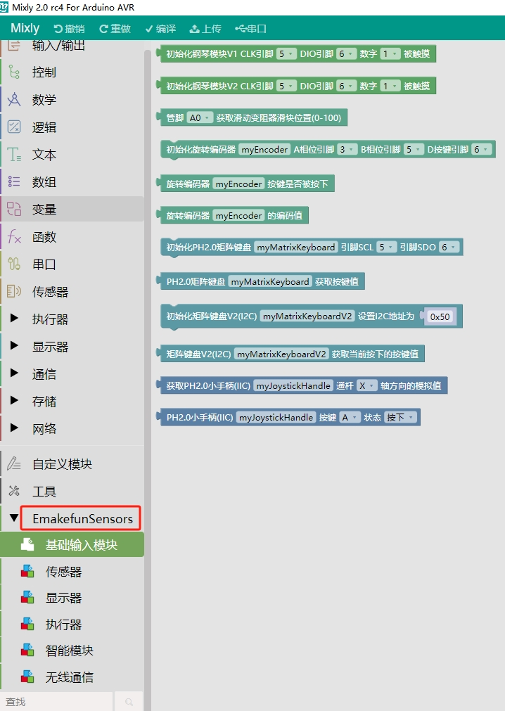

# Mixly使用方法

## 一、Mixly2.0软件下载

​        Mixly是北京师范大学教育学部创客教育实验室负责人傅骞老师及其团队开发的，是一款面向Arduino创意电子的图形化编程工具，完全免费。它完美地支持了Arduino、MicroPython等语言的编程。提供了图形化界面和代码界面对比显示的支持。Mixly还支持自定义第三方扩展库，可以拓展出丰富的功能。

[点击跳转到Mixly官网下载](https://mixly.cn/bnu-maker/mixl2.0rc)

点击上面链接，此时跳转到Mixly官网，如下图，

 [Mixly2.0 RC4百度云下载链接](https://pan.baidu.com/s/1EdBmAlYFzJ_2rULhKm2g3g?pwd=ny1n)   提取码：ny1n  

点击Mixly2.0文件夹，显示以下文件:

下载完之后，将文件解压，解压的目录不要有中文、空格等；安装目录不要太长，目录最好放到每个电脑盘的根目录。

打开解压后的文件夹，双击"一键更新.bat"文件，按照提示安装，在此不做详细描述。等安装完成，双击“Mixly.exe”打开Mixly软件，如下图：

打开界面如下，如果主板是Arduino系列，板卡选择Arduino AVR，双击点进编程页面，如下图：

| Arduino系类板卡选择                   | Arduino ESP32板卡选择                    | Python ESP32板卡选择                    |
| ------------------------------- | ------------------------------------ | ----------------------------------- |
|  |  |  |

当选择Arduino ESP32时，在双击“一键更新.bat”时，在弹出的命令框中，需要先安装Arduino ESP32，其他板卡按需安装，如下图：

也可以下载我们公司已经安装好板卡的软件，[点击下载](https://pan.baidu.com/s/1I1ScRvt-9VacLf29rUzIMw?pwd=5747)请安装在电脑盘符的根目录下。

## 二、Mixly界面介绍

- **基础模块区和库模块区：** 同种类型的积木被分在同个模块中并赋予同种颜色，每块积木代表一条控制指令。
- **功能区：** 对项目文件的创建、保存，库的导入、导出、管理，串口连接与上传程序，控制板选择进行操作的区域。
- **程序构建区：** 是放置从基础模块区和库模块区拖拽出来的积木块的地方。
- **代码区：** 拖拽出积木后，点击“代码”，可以看到你拖拽的模块对应的C语言代码。
- **缩放控制区：** 可以将软件操作界面进行缩放。
- **垃圾箱：** 用来移除不需要的积木块。

## 三、Mixly2.0导入用户库

Mixly2.0只介绍云端导入，离线导入请自行研究。

**第一步**：打开导入窗口。点击右上角”设置“按钮，选择”管理库“。如下图：

**第二步：** 选择对应的用户库。点击”云端导入“，在这里导入我们的PH2.0传感器库，如果未出现库列表，请重新一键更新米思奇软件，如下图：

导入成功如下图：

第三步：查看是否导入成功。如下图表示导入成功：

该库的分类和我们传感器的分类一一匹配。可以按照文档中心的PH2.0模块菜单栏目录找到相应的传感器块的位置。也可以通过点击“本地导入按扭”，导入本地的米思奇库。以下库为我们公司产品的库，仅支持Mixly2.0 RC4版本。

<a href="zh-cn/software/mixly/emakefun_sensor_arduino.zip" download>点击下载Arduino米思齐传感器离线库</a>

<a href="zh-cn/software/mixly/emakefun_sensors_esp32.zip" download>点击下载ESP32米思齐传感器离线库</a>

详细介绍可以通过米思奇WIKI查看，查看方法如下：

选择"Arduino AVR"板卡---->打开米思奇右上角设置按钮----->点击Wiki，即可查看详细说明。其他板卡是没有这个文档，但都是类似。

## 四、常见的米思奇问题

| 序号  | 问                                                                           | 答                                                                                                                                                                                       |
|:---:|:---------------------------------------------------------------------------:|:---------------------------------------------------------------------------------------------------------------------------------------------------------------------------------------:|
| 1   | 软件白屏不显示编程模块、缺少主板的选择项等                                                       | 把Mixly安装路径改成D:\mixly或其他盘的根目录，文件夹不能有中文、空格、符号等特殊字符。官方文件的原解压名也不行（自带了中文符号等），移动后再运行两次米思奇安装路径下的“一键更新.bat”。                                                                                    |
| 2   |                                       | 1. 检查端口是否为选择正确，若电脑未识别到端口，需要先安装对应的驱动；2.  软件选的主板和实际的主板不是同一型号；3. 如果前面两种情况都正确，可以换个软件测试，当主板时ESP32主板时，可以按住主板boot键，再按一下reset键再上传，都是同一种情况，那就是主板坏了。                                              |
| 3   |                                        | 1. 端口被占用，关掉其他串口占用的应用，如果不确定被哪里占用了，重启下电脑 2. 端口没有选对。                                                                                                                                       |
| 4   |                                     | 导入示例时，未导入示例所需要的外部库，需要导入示例所需的外部库。                                                                                                                                                        |
| 5   |                              | 选择Arduino ESP32板卡时，米思奇安装路径过长，需要将米思奇的安装包放到电脑盘符的根目录下                                                                                                                                      |
| 6   |                              | 米思奇安装路径包含中文/空格等特殊字符，需要将这些字符全部去掉                                                                                                                                                         |
| 7   |                                     | 选择Arduino ESP32板卡时，使用GD5800 MP3块报错，需要双击运行米思奇安装路径下的“一键更新.bat”文件，更新库文件。我们公司提供一个已经安装好的米思奇版本，[点击此处下载](https://pan.baidu.com/s/1I1ScRvt-9VacLf29rUzIMw?pwd=5747)                             |
| 8   |  | 编译报错，“item1”未定义，在使用这个变量或方法名的时候，和定义的保持一致。                                                                                                                                                |
| 9   | 导入第三方库时，不显示第三方库的内容                                                          | 1. 确定第三方是否适应当前安装的米思奇版本(询问开发商) 2. 本公司提供的库只适合Mixly2.0 RC4版本                                                                                                                               |
| 10  | Arduino Nano米思奇程序上传不成功                                                      | 因Arduino Nano bootloader新老版本问题导致，解决方案：1. 主板选择Arduino/Genuino Uno; 2. 主板选择Arduino Nano时，米思奇右下角会出现“配置板卡”按钮，点击该按钮，processor下拉框选择ATmega328P，如图： |
