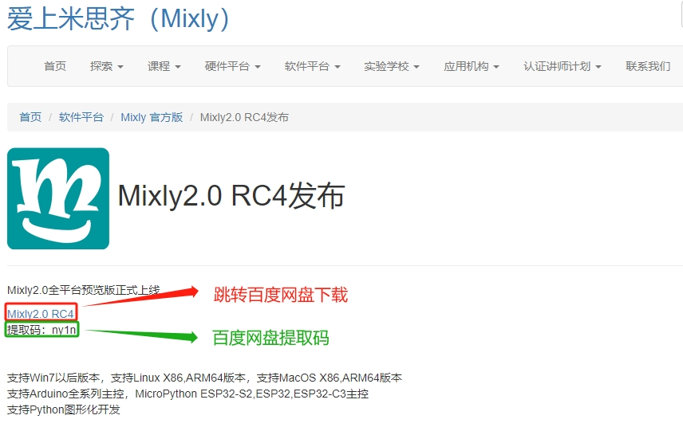
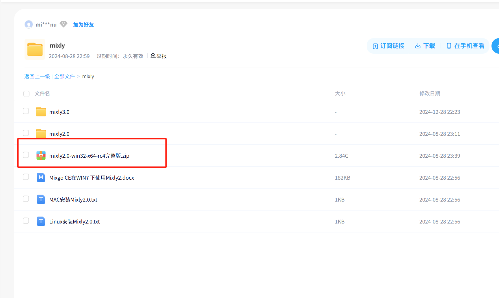
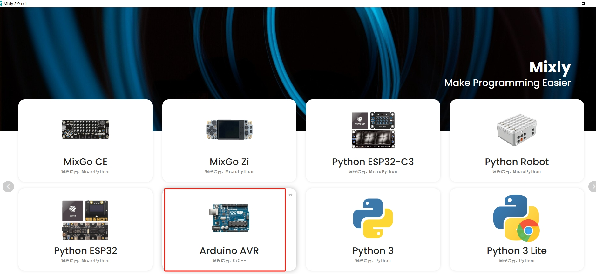
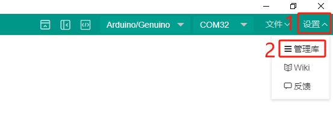
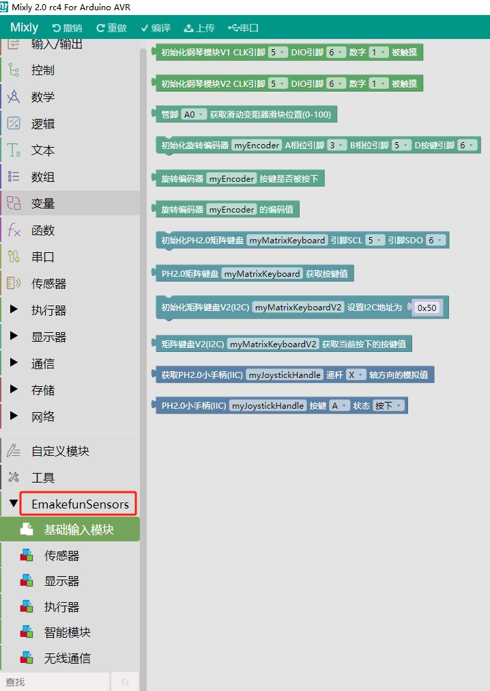

# Mixly使用方法

## 一、Mixly2.0软件下载

​        Mixly是北京师范大学教育学部创客教育实验室负责人傅骞老师及其团队开发的，是一款面向Arduino创意电子的图形化编程工具，完全免费。它完美地支持了Arduino、MicroPython等语言的编程。提供了图形化界面和代码界面对比显示的支持。Mixly还支持自定义第三方扩展库，可以拓展出丰富的功能。

[点击跳转到Mixly官网下载](https://mixly.cn/bnu-maker/mixl2.0rc)

点击上面链接，此时跳转到Mixly官网，如下图，

 [Mixly2.0 RC4百度云下载链接](https://pan.baidu.com/s/1EdBmAlYFzJ_2rULhKm2g3g?pwd=ny1n)   提取码：ny1n  

点击Mixly2.0文件夹，显示以下文件:

下载完之后，将文件解压，解压的目录不要有中文、空格等；安装目录不要太长，目录最好放到每个电脑盘的根目录。

打开解压后的文件夹，请双击"一键更新.bat"文件，按照提示安装，在此不做详细描述。等安装完成，双击“Mixly.exe”打开Mixly软件，如下图：

打开界面如下，选择Arduino AVR卡板，双击点进编程页面，如下图：

当主板为ESP32芯片时，板卡可以选择Python ESP32,也可选择Arduino ESP32。如下图

## 二、Mixly界面介绍

- **基础模块区和库模块区：** 同种类型的积木被分在同个模块中并赋予同种颜色，每块积木代表一条控制指令。
- **功能区：** 对项目文件的创建、保存，库的导入、导出、管理，串口连接与上传程序，控制板选择进行操作的区域。
- **程序构建区：** 是放置从基础模块区和库模块区拖拽出来的积木块的地方。
- **代码区：** 拖拽出积木后，点击“代码”，可以看到你拖拽的模块对应的C语言代码。
- **缩放控制区：** 可以将软件操作界面进行缩放。
- **垃圾箱：** 用来移除不需要的积木块。

## 三、Mixly2.0导入用户库

Mixly2.0只介绍云端导入，离线导入请自行研究。

**第一步**：打开导入窗口。点击右上角”设置“按钮，选择”管理库“。如下图：

**第二步：** 选择对应的用户库。点击”云端导入“，在这里导入我们的PH2.0传感器库，如下图：

导入成功如下图：

第三步：查看是否导入成功。如下图表示导入成功：

该库的分类和我们传感器的分类一一匹配。可以按照文档目录索引找到相应的传感器。

<a href="zh-cn/software/mixly/emakefun_sensor.zip" download>点击下载Arduino的传感器米思齐离线库</a>

<a href="zh-cn/software/mixly/emakefun_sensors_esp32.zip" download>点击下载ESP32米思齐传感器离线库</a>

